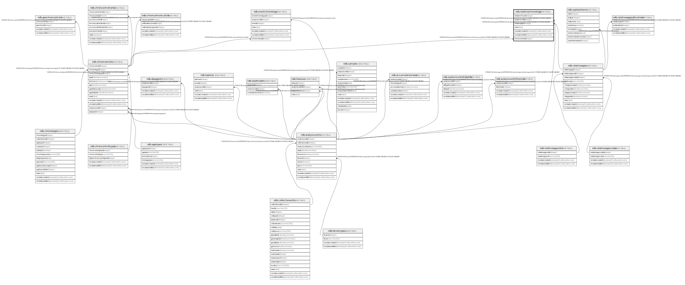

# ndb.relativechronology

## Description

This table stores relative chronologic data. Relative Ages are assigned to Analysis Units, The Relative Age data along with any possible Geochronology and Tephrachronology data are used to create a chronology.

## Columns

| # | Name            | Type                           | Default                                                         | Nullable | Children | Parents                                   | Comment                                                                           |
| - | --------------- | ------------------------------ | --------------------------------------------------------------- | -------- | -------- | ----------------------------------------- | --------------------------------------------------------------------------------- |
| 1 | relativechronid | integer                        | nextval('ndb.seq_relativechronology_relativechronid'::regclass) | false    |          |                                           | An arbitrary Relative Chronology identification number.                           |
| 2 | analysisunitid  | integer                        |                                                                 | false    |          | [ndb.analysisunits](ndb.analysisunits.md) | Analysis Unit identification number. Field links to the AnalysisUnits table.      |
| 3 | relativeageid   | integer                        |                                                                 | false    |          | [ndb.relativeages](ndb.relativeages.md)   | Relative Age identification number. Field links to the RelativeAges lookup table. |
| 4 | notes           | text                           |                                                                 | true     |          |                                           | Free form notes or comments.                                                      |
| 5 | recdatecreated  | timestamp(0) without time zone | timezone('UTC'::text, now())                                    | false    |          |                                           |                                                                                   |
| 6 | recdatemodified | timestamp(0) without time zone |                                                                 | false    |          |                                           |                                                                                   |
| 7 | chroncontrolid  | integer                        |                                                                 | true     |          | [ndb.chroncontrols](ndb.chroncontrols.md) |                                                                                   |

## Constraints

| # | Name                                | Type        | Definition                                                                                                    |
| - | ----------------------------------- | ----------- | ------------------------------------------------------------------------------------------------------------- |
| 1 | fk_relativechronology_analysisunits | FOREIGN KEY | FOREIGN KEY (analysisunitid) REFERENCES ndb.analysisunits(analysisunitid) ON UPDATE CASCADE ON DELETE CASCADE |
| 2 | rc_ccid                             | FOREIGN KEY | FOREIGN KEY (chroncontrolid) REFERENCES ndb.chroncontrols(chroncontrolid) ON UPDATE CASCADE ON DELETE CASCADE |
| 3 | fk_relativechronology_relativeages  | FOREIGN KEY | FOREIGN KEY (relativeageid) REFERENCES ndb.relativeages(relativeageid) ON UPDATE CASCADE ON DELETE CASCADE    |
| 4 | relativechronology_pkey             | PRIMARY KEY | PRIMARY KEY (relativechronid)                                                                                 |

## Indexes

| # | Name                                 | Definition                                                                                                                      |
| - | ------------------------------------ | ------------------------------------------------------------------------------------------------------------------------------- |
| 1 | relativechronology_pkey              | CREATE UNIQUE INDEX relativechronology_pkey ON ndb.relativechronology USING btree (relativechronid)                             |
| 2 | ix_analysisunitid_relativechronology | CREATE INDEX ix_analysisunitid_relativechronology ON ndb.relativechronology USING btree (analysisunitid) WITH (fillfactor='10') |
| 3 | ix_relativeageid_relativechronology  | CREATE INDEX ix_relativeageid_relativechronology ON ndb.relativechronology USING btree (relativeageid) WITH (fillfactor='10')   |

## Triggers

| # | Name                | Definition                                                                                                                                      |
| - | ------------------- | ----------------------------------------------------------------------------------------------------------------------------------------------- |
| 1 | tr_sites_modifydate | CREATE TRIGGER tr_sites_modifydate BEFORE INSERT OR UPDATE ON ndb.relativechronology FOR EACH ROW EXECUTE FUNCTION ndb.update_recdatemodified() |

## Relations

---

> Generated by [tbls](https://github.com/k1LoW/tbls)