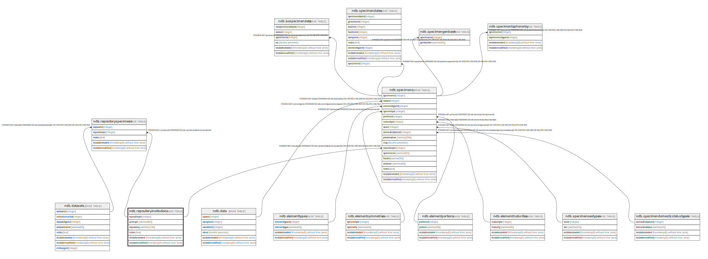

# ndb.repositoryinstitutions

## Description

A lookup table of institutions that are repositories for fossil specimens. Table is referenced by the RepositorySpecimens table.

## Columns

| # | Name            | Type                           | Default                                                          | Nullable | Children                                                                                | Parents | Comment                                                                                                                                                                                                                                                                                                                                                                                                                                                                                                                                                                                                                                                                                                                                                                                             |
| - | --------------- | ------------------------------ | ---------------------------------------------------------------- | -------- | --------------------------------------------------------------------------------------- | ------- | --------------------------------------------------------------------------------------------------------------------------------------------------------------------------------------------------------------------------------------------------------------------------------------------------------------------------------------------------------------------------------------------------------------------------------------------------------------------------------------------------------------------------------------------------------------------------------------------------------------------------------------------------------------------------------------------------------------------------------------------------------------------------------------------------- |
| 1 | repositoryid    | integer                        | nextval('ndb.seq_repositoryinstitutions_repositoryid'::regclass) | false    | [ndb.repositoryspecimens](ndb.repositoryspecimens.md) [ndb.specimens](ndb.specimens.md) |         | An arbitrary Repository identification number. Repositories include museums, university departments, and various governmental agencies.                                                                                                                                                                                                                                                                                                                                                                                                                                                                                                                                                                                                                                                             |
| 2 | acronym         | varchar(64)                    |                                                                  | false    |                                                                                         |         | A unique acronym for the repository. Many repositories have well-established acronyms (e.g. AMNH = American Museum of Natural History); however, there is no official list. Various acronyms have been used for some institutions, and in some cases the same acronym has been used for different institutions. Consequently, the database acronym may differ from the acronym used in some publications. For example, «CMNH» has been used for the Carnegie Museum of Natural History, the Cleveland Museum of Natural History, and the Cincinnati Museum of Natural History. In Neotoma, two of these institutions were assigned different acronyms, ones that have been used for them in other publications: CM – Carnegie Museum of Natural History, CLM – Cleveland Museum of Natural History. |
| 3 | repository      | varchar(128)                   |                                                                  | false    |                                                                                         |         | The full name of the repository.                                                                                                                                                                                                                                                                                                                                                                                                                                                                                                                                                                                                                                                                                                                                                                    |
| 4 | notes           | text                           |                                                                  | true     |                                                                                         |         | Free form notes or comments about the repository, especially notes about name changes, closures, and specimen transfers. In some cases, it is known that the specimens were transferred, but their current disposition may be uncertain.                                                                                                                                                                                                                                                                                                                                                                                                                                                                                                                                                            |
| 5 | recdatecreated  | timestamp(0) without time zone | timezone('UTC'::text, now())                                     | false    |                                                                                         |         |                                                                                                                                                                                                                                                                                                                                                                                                                                                                                                                                                                                                                                                                                                                                                                                                     |
| 6 | recdatemodified | timestamp(0) without time zone |                                                                  | false    |                                                                                         |         |                                                                                                                                                                                                                                                                                                                                                                                                                                                                                                                                                                                                                                                                                                                                                                                                     |

## Constraints

| # | Name                        | Type        | Definition                 |
| - | --------------------------- | ----------- | -------------------------- |
| 1 | repositoryinstitutions_pkey | PRIMARY KEY | PRIMARY KEY (repositoryid) |

## Indexes

| # | Name                        | Definition                                                                                               |
| - | --------------------------- | -------------------------------------------------------------------------------------------------------- |
| 1 | repositoryinstitutions_pkey | CREATE UNIQUE INDEX repositoryinstitutions_pkey ON ndb.repositoryinstitutions USING btree (repositoryid) |

## Triggers

| # | Name                | Definition                                                                                                                                          |
| - | ------------------- | --------------------------------------------------------------------------------------------------------------------------------------------------- |
| 1 | tr_sites_modifydate | CREATE TRIGGER tr_sites_modifydate BEFORE INSERT OR UPDATE ON ndb.repositoryinstitutions FOR EACH ROW EXECUTE FUNCTION ndb.update_recdatemodified() |

## Relations

---

> Generated by [tbls](https://github.com/k1LoW/tbls)