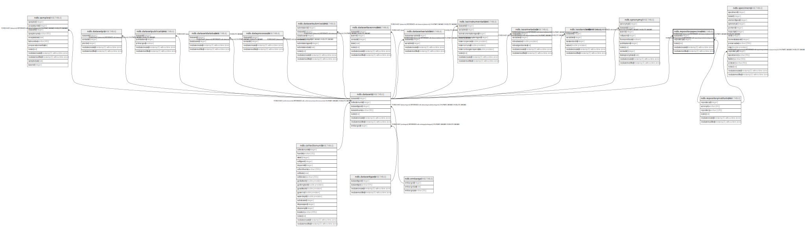

# ndb.repositoryspecimens

## Description

This table lists the repositories in which fossil specimens have been accessioned or reposited. The inventory in Neotoma is by Dataset, which is the collection of specimens from a Collection Unit. Occasionally, specimens from a single Collection Unit have been reposited at different institutions, in which case multiple records for that Dataset occur in the table.

## Columns

| # | Name            | Type                           | Default                      | Nullable | Children | Parents                                                     | Comment                                                                                   |
| - | --------------- | ------------------------------ | ---------------------------- | -------- | -------- | ----------------------------------------------------------- | ----------------------------------------------------------------------------------------- |
| 1 | datasetid       | integer                        |                              | false    |          | [ndb.datasets](ndb.datasets.md)                             | Dataset identification number. Field links to the Datasets table.                         |
| 2 | repositoryid    | integer                        |                              | false    |          | [ndb.repositoryinstitutions](ndb.repositoryinstitutions.md) | Repository identification number. Field links to the RepositoryInstitutions lookup table. |
| 3 | notes           | text                           |                              | true     |          |                                                             | Free form notes or comments about the disposition of the specimens.                       |
| 4 | recdatecreated  | timestamp(0) without time zone | timezone('UTC'::text, now()) | false    |          |                                                             |                                                                                           |
| 5 | recdatemodified | timestamp(0) without time zone |                              | false    |          |                                                             |                                                                                           |

## Constraints

| # | Name                                          | Type        | Definition                                                                                     |
| - | --------------------------------------------- | ----------- | ---------------------------------------------------------------------------------------------- |
| 1 | fk_repositoryspecimens_datasets               | FOREIGN KEY | FOREIGN KEY (datasetid) REFERENCES ndb.datasets(datasetid) ON UPDATE CASCADE ON DELETE CASCADE |
| 2 | fk_repositoryspecimens_repositoryinstitutions | FOREIGN KEY | FOREIGN KEY (repositoryid) REFERENCES ndb.repositoryinstitutions(repositoryid)                 |
| 3 | repositoryspecimens_pkey                      | PRIMARY KEY | PRIMARY KEY (datasetid, repositoryid)                                                          |

## Indexes

| # | Name                             | Definition                                                                                                              |
| - | -------------------------------- | ----------------------------------------------------------------------------------------------------------------------- |
| 1 | repositoryspecimens_pkey         | CREATE UNIQUE INDEX repositoryspecimens_pkey ON ndb.repositoryspecimens USING btree (datasetid, repositoryid)           |
| 2 | ix_datasetid_repositoryspecimens | CREATE INDEX ix_datasetid_repositoryspecimens ON ndb.repositoryspecimens USING btree (datasetid) WITH (fillfactor='10') |

## Triggers

| # | Name                | Definition                                                                                                                                       |
| - | ------------------- | ------------------------------------------------------------------------------------------------------------------------------------------------ |
| 1 | tr_sites_modifydate | CREATE TRIGGER tr_sites_modifydate BEFORE INSERT OR UPDATE ON ndb.repositoryspecimens FOR EACH ROW EXECUTE FUNCTION ndb.update_recdatemodified() |

## Relations

---

> Generated by [tbls](https://github.com/k1LoW/tbls)