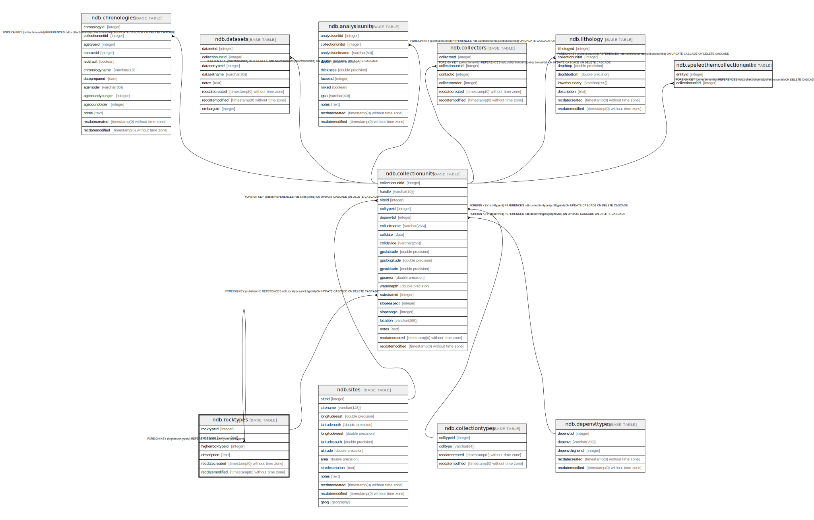

# ndb.rocktypes

## Description

## Columns

| # | Name             | Type                           | Default                                           | Nullable | Children                                                                        | Parents                           | Comment |
| - | ---------------- | ------------------------------ | ------------------------------------------------- | -------- | ------------------------------------------------------------------------------- | --------------------------------- | ------- |
| 1 | rocktypeid       | integer                        | nextval('ndb.seq_rocktypes_rocktypeid'::regclass) | false    | [ndb.collectionunits](ndb.collectionunits.md) [ndb.rocktypes](ndb.rocktypes.md) |                                   |         |
| 2 | rocktype         | varchar(64)                    |                                                   | false    |                                                                                 |                                   |         |
| 3 | higherrocktypeid | integer                        |                                                   | false    |                                                                                 | [ndb.rocktypes](ndb.rocktypes.md) |         |
| 4 | description      | text                           |                                                   | false    |                                                                                 |                                   |         |
| 5 | recdatecreated   | timestamp(0) without time zone | timezone('UTC'::text, now())                      | false    |                                                                                 |                                   |         |
| 6 | recdatemodified  | timestamp(0) without time zone |                                                   | false    |                                                                                 |                                   |         |

## Viewpoints

| Name                                  | Definition                        |
| ------------------------------------- | --------------------------------- |
| [Hierarchical Tables](viewpoint-1.md) | Tables with internal hierarchies. |

## Constraints

| # | Name                | Type        | Definition                                                          |
| - | ------------------- | ----------- | ------------------------------------------------------------------- |
| 1 | fk_higherrocktypeid | FOREIGN KEY | FOREIGN KEY (higherrocktypeid) REFERENCES ndb.rocktypes(rocktypeid) |
| 2 | rocktypes_pkey      | PRIMARY KEY | PRIMARY KEY (rocktypeid)                                            |

## Indexes

| # | Name           | Definition                                                                   |
| - | -------------- | ---------------------------------------------------------------------------- |
| 1 | rocktypes_pkey | CREATE UNIQUE INDEX rocktypes_pkey ON ndb.rocktypes USING btree (rocktypeid) |

## Triggers

| # | Name                | Definition                                                                                                                             |
| - | ------------------- | -------------------------------------------------------------------------------------------------------------------------------------- |
| 1 | tr_sites_modifydate | CREATE TRIGGER tr_sites_modifydate BEFORE INSERT OR UPDATE ON ndb.rocktypes FOR EACH ROW EXECUTE FUNCTION ndb.update_recdatemodified() |

## Relations

---

> Generated by [tbls](https://github.com/k1LoW/tbls)