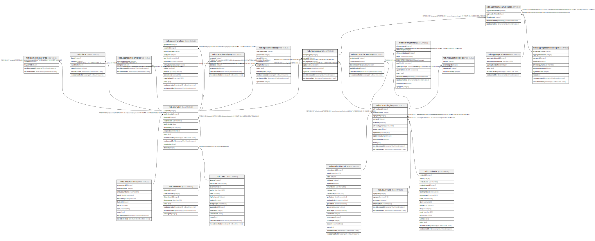

# ndb.sampleages

## Description

This table stores sample ages. Ages are assigned to a Chronology. Because there may be more than one Chronology for a Collection Unit, samples may be assigned different ages for different Chronologies. A simple example is one sample age in radiocarbon years and another in calibrated radiocarbon years. The age units are an attribute of the Chronology.

## Columns

| # | Name            | Type                           | Default                                             | Nullable | Children                                              | Parents                                 | Comment                                                                                                                                                        |
| - | --------------- | ------------------------------ | --------------------------------------------------- | -------- | ----------------------------------------------------- | --------------------------------------- | -------------------------------------------------------------------------------------------------------------------------------------------------------------- |
| 1 | age             | double precision               |                                                     | true     |                                                       |                                         | Age of the sample                                                                                                                                              |
| 2 | ageolder        | double precision               |                                                     | true     |                                                       |                                         | Older error estimate of the age.                                                                                                                               |
| 3 | ageyounger      | double precision               |                                                     | true     |                                                       |                                         | Younger error estimate of the age. The definition of this estimate is an attribute of the Chronology. Many ages do not have explicit error estimates assigned. |
| 4 | chronologyid    | integer                        |                                                     | false    |                                                       | [ndb.chronologies](ndb.chronologies.md) | Chronology identification number. Field links to the Chronologies table.                                                                                       |
| 5 | recdatecreated  | timestamp(0) without time zone | timezone('UTC'::text, now())                        | false    |                                                       |                                         |                                                                                                                                                                |
| 6 | recdatemodified | timestamp(0) without time zone |                                                     | false    |                                                       |                                         |                                                                                                                                                                |
| 7 | sampleageid     | integer                        | nextval('ndb.seq_sampleages_sampleageid'::regclass) | false    | [ndb.aggregatesampleages](ndb.aggregatesampleages.md) |                                         | An arbitrary Sample Age identification number.                                                                                                                 |
| 8 | sampleid        | integer                        |                                                     | false    |                                                       | [ndb.samples](ndb.samples.md)           | Sample identification number. Field links to the Samples table.                                                                                                |

## Viewpoints

| Name                                        | Definition                                        |
| ------------------------------------------- | ------------------------------------------------- |
| [Chronology related tables](viewpoint-5.md) | Tables related to chronology and age assignments. |

## Constraints

| # | Name                       | Type        | Definition                                                                                               |
| - | -------------------------- | ----------- | -------------------------------------------------------------------------------------------------------- |
| 1 | fk_sampleages_chronologies | FOREIGN KEY | FOREIGN KEY (chronologyid) REFERENCES ndb.chronologies(chronologyid) ON UPDATE CASCADE ON DELETE CASCADE |
| 2 | fk_sampleages_samples      | FOREIGN KEY | FOREIGN KEY (sampleid) REFERENCES ndb.samples(sampleid) ON UPDATE CASCADE ON DELETE CASCADE              |
| 3 | sampleages_pkey            | PRIMARY KEY | PRIMARY KEY (sampleageid)                                                                                |

## Indexes

| # | Name                       | Definition                                                                                                  |
| - | -------------------------- | ----------------------------------------------------------------------------------------------------------- |
| 1 | ix_chronologyid_sampleages | CREATE INDEX ix_chronologyid_sampleages ON ndb.sampleages USING btree (chronologyid) WITH (fillfactor='10') |
| 2 | ix_sampleid_sampleages     | CREATE INDEX ix_sampleid_sampleages ON ndb.sampleages USING btree (sampleid) WITH (fillfactor='10')         |
| 3 | sampleages_pkey            | CREATE UNIQUE INDEX sampleages_pkey ON ndb.sampleages USING btree (sampleageid)                             |
| 4 | smpage_idx                 | CREATE INDEX smpage_idx ON ndb.sampleages USING btree (age)                                                 |
| 5 | smpageold_idx              | CREATE INDEX smpageold_idx ON ndb.sampleages USING btree (ageolder)                                         |
| 6 | smpageyoung_idx            | CREATE INDEX smpageyoung_idx ON ndb.sampleages USING btree (ageyounger)                                     |

## Triggers

| # | Name                | Definition                                                                                                                              |
| - | ------------------- | --------------------------------------------------------------------------------------------------------------------------------------- |
| 1 | tr_sites_modifydate | CREATE TRIGGER tr_sites_modifydate BEFORE INSERT OR UPDATE ON ndb.sampleages FOR EACH ROW EXECUTE FUNCTION ndb.update_recdatemodified() |

## Relations

---

> Generated by [tbls](https://github.com/k1LoW/tbls)