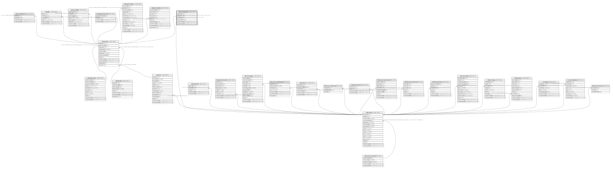

# ndb.sampleanalysts

## Description

This table lists the Sample Analysts.

## Columns

| # | Name            | Type                           | Default                                               | Nullable | Children | Parents                         | Comment                                                            |
| - | --------------- | ------------------------------ | ----------------------------------------------------- | -------- | -------- | ------------------------------- | ------------------------------------------------------------------ |
| 1 | analystid       | integer                        | nextval('ndb.seq_sampleanalysts_analystid'::regclass) | false    |          |                                 | An arbitrary Sample Analyst identification number.                 |
| 2 | sampleid        | integer                        |                                                       | false    |          | [ndb.samples](ndb.samples.md)   | Sample identification number. Field links to the Samples table.    |
| 3 | contactid       | integer                        |                                                       | false    |          | [ndb.contacts](ndb.contacts.md) | Contact identification number. Field links to the Contacts table.  |
| 4 | analystorder    | integer                        |                                                       | false    |          |                                 | Order in which Sample Analysts are listed if more than one (rare). |
| 5 | recdatecreated  | timestamp(0) without time zone | timezone('UTC'::text, now())                          | false    |          |                                 |                                                                    |
| 6 | recdatemodified | timestamp(0) without time zone |                                                       | false    |          |                                 |                                                                    |

## Constraints

| # | Name                       | Type        | Definition                                                                                  |
| - | -------------------------- | ----------- | ------------------------------------------------------------------------------------------- |
| 1 | fk_sampleanalysts_contacts | FOREIGN KEY | FOREIGN KEY (contactid) REFERENCES ndb.contacts(contactid) ON UPDATE CASCADE                |
| 2 | sampleanalysts_pkey        | PRIMARY KEY | PRIMARY KEY (analystid)                                                                     |
| 3 | fk_sampleanalysts_samples  | FOREIGN KEY | FOREIGN KEY (sampleid) REFERENCES ndb.samples(sampleid) ON UPDATE CASCADE ON DELETE CASCADE |

## Indexes

| # | Name                        | Definition                                                                                                    |
| - | --------------------------- | ------------------------------------------------------------------------------------------------------------- |
| 1 | sampleanalysts_pkey         | CREATE UNIQUE INDEX sampleanalysts_pkey ON ndb.sampleanalysts USING btree (analystid)                         |
| 2 | ix_contactid_sampleanalysts | CREATE INDEX ix_contactid_sampleanalysts ON ndb.sampleanalysts USING btree (contactid) WITH (fillfactor='10') |
| 3 | ix_sampleid_sampleanalysts  | CREATE INDEX ix_sampleid_sampleanalysts ON ndb.sampleanalysts USING btree (sampleid) WITH (fillfactor='10')   |

## Triggers

| # | Name                | Definition                                                                                                                                  |
| - | ------------------- | ------------------------------------------------------------------------------------------------------------------------------------------- |
| 1 | tr_sites_modifydate | CREATE TRIGGER tr_sites_modifydate BEFORE INSERT OR UPDATE ON ndb.sampleanalysts FOR EACH ROW EXECUTE FUNCTION ndb.update_recdatemodified() |

## Relations

---

> Generated by [tbls](https://github.com/k1LoW/tbls)