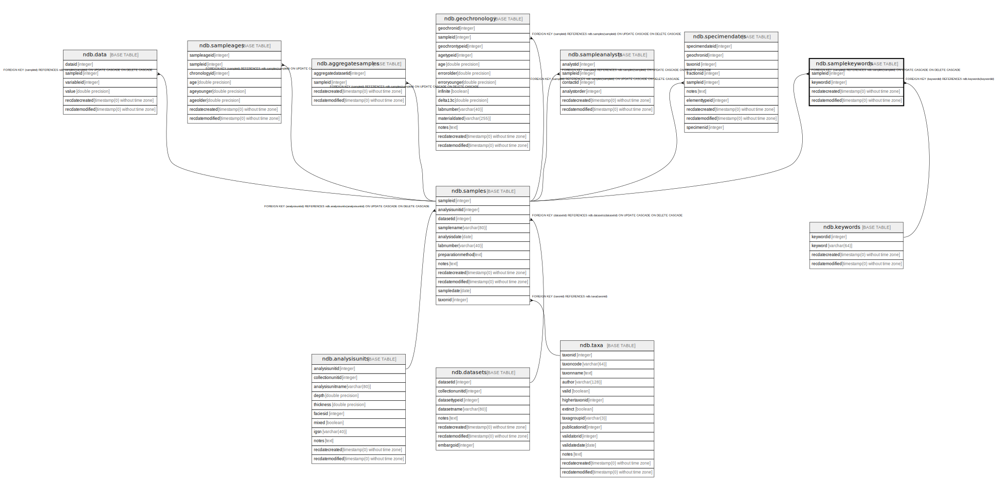

# ndb.samplekeywords

## Description

This table lists the Sample Analysts.

## Columns

| # | Name            | Type                           | Default                      | Nullable | Children | Parents                         | Comment                                                                  |
| - | --------------- | ------------------------------ | ---------------------------- | -------- | -------- | ------------------------------- | ------------------------------------------------------------------------ |
| 1 | sampleid        | integer                        |                              | false    |          | [ndb.samples](ndb.samples.md)   | Sample identification number. Field links to the Samples table.          |
| 2 | keywordid       | integer                        |                              | false    |          | [ndb.keywords](ndb.keywords.md) | Keyword identification number. Field links to the Keywords lookup table. |
| 3 | recdatecreated  | timestamp(0) without time zone | timezone('UTC'::text, now()) | false    |          |                                 |                                                                          |
| 4 | recdatemodified | timestamp(0) without time zone |                              | false    |          |                                 |                                                                          |

## Constraints

| # | Name                       | Type        | Definition                                                                                  |
| - | -------------------------- | ----------- | ------------------------------------------------------------------------------------------- |
| 1 | fk_samplekeywords_keywords | FOREIGN KEY | FOREIGN KEY (keywordid) REFERENCES ndb.keywords(keywordid)                                  |
| 2 | samplekeywords_pkey        | PRIMARY KEY | PRIMARY KEY (sampleid, keywordid)                                                           |
| 3 | fk_samplekeywords_samples  | FOREIGN KEY | FOREIGN KEY (sampleid) REFERENCES ndb.samples(sampleid) ON UPDATE CASCADE ON DELETE CASCADE |

## Indexes

| # | Name                        | Definition                                                                                                    |
| - | --------------------------- | ------------------------------------------------------------------------------------------------------------- |
| 1 | samplekeywords_pkey         | CREATE UNIQUE INDEX samplekeywords_pkey ON ndb.samplekeywords USING btree (sampleid, keywordid)               |
| 2 | ix_keywordid_samplekeywords | CREATE INDEX ix_keywordid_samplekeywords ON ndb.samplekeywords USING btree (keywordid) WITH (fillfactor='10') |
| 3 | ix_sampleid_samplekeywords  | CREATE INDEX ix_sampleid_samplekeywords ON ndb.samplekeywords USING btree (sampleid) WITH (fillfactor='10')   |

## Triggers

| # | Name                | Definition                                                                                                                                  |
| - | ------------------- | ------------------------------------------------------------------------------------------------------------------------------------------- |
| 1 | tr_sites_modifydate | CREATE TRIGGER tr_sites_modifydate BEFORE INSERT OR UPDATE ON ndb.samplekeywords FOR EACH ROW EXECUTE FUNCTION ndb.update_recdatemodified() |

## Relations

---

> Generated by [tbls](https://github.com/k1LoW/tbls)