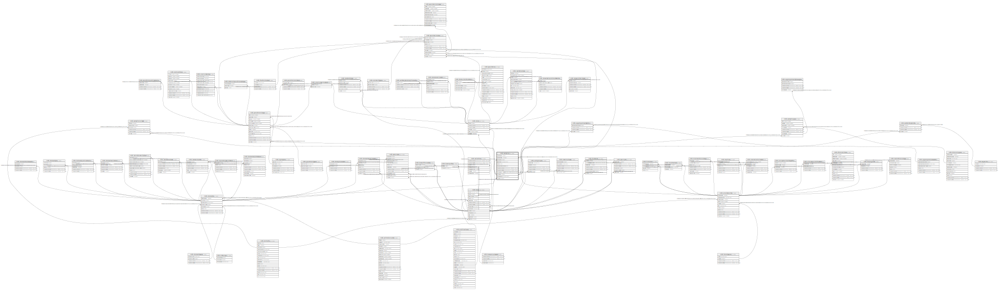

# ndb.samples

## Description

This table stores sample data. Samples belong to Analysis Units, which belong to Collection Units, which belong to Sites. Samples also belong to a Dataset, and the Dataset determines the type of sample. Thus, there could be two different samples from the same Analysis Unit, one belonging to a pollen dataset, the other to a plant macrofossil dataset.

## Columns

| #  | Name              | Type                           | Default                                       | Nullable | Children                                                                                                                                                                                                                                                                                | Parents                                   | Comment                                                                                                                                                                                                                                                |
| -- | ----------------- | ------------------------------ | --------------------------------------------- | -------- | --------------------------------------------------------------------------------------------------------------------------------------------------------------------------------------------------------------------------------------------------------------------------------------- | ----------------------------------------- | ------------------------------------------------------------------------------------------------------------------------------------------------------------------------------------------------------------------------------------------------------ |
| 1  | sampleid          | integer                        | nextval('ndb.seq_samples_sampleid'::regclass) | false    | [ndb.samplekeywords](ndb.samplekeywords.md) [ndb.data](ndb.data.md) [ndb.sampleages](ndb.sampleages.md) [ndb.aggregatesamples](ndb.aggregatesamples.md) [ndb.geochronology](ndb.geochronology.md) [ndb.sampleanalysts](ndb.sampleanalysts.md) [ndb.specimendates](ndb.specimendates.md) |                                           | An arbitrary Sample identification number.                                                                                                                                                                                                             |
| 2  | analysisunitid    | integer                        |                                               | false    |                                                                                                                                                                                                                                                                                         | [ndb.analysisunits](ndb.analysisunits.md) | Analysis Unit identification number. Field links to the AnalysisUnits table.                                                                                                                                                                           |
| 3  | datasetid         | integer                        |                                               | false    |                                                                                                                                                                                                                                                                                         | [ndb.datasets](ndb.datasets.md)           | Dataset identification number. Field links to the Datasets table.                                                                                                                                                                                      |
| 4  | samplename        | varchar(80)                    |                                               | true     |                                                                                                                                                                                                                                                                                         |                                           | Sample name if any.                                                                                                                                                                                                                                    |
| 5  | analysisdate      | date                           |                                               | true     |                                                                                                                                                                                                                                                                                         |                                           | Date of analysis.                                                                                                                                                                                                                                      |
| 6  | labnumber         | varchar(40)                    |                                               | true     |                                                                                                                                                                                                                                                                                         |                                           | Laboratory number for the sample. A special case regards geochronologic samples, for which the LabNumber is the number, if any, assigned by the submitter, not the number assigned by the radiocarbon laboratory, which is in the Geochronology table. |
| 7  | preparationmethod | text                           |                                               | true     |                                                                                                                                                                                                                                                                                         |                                           | Description, notes, or comments on preparation methods. For faunal samples, notes on screening methods or screen size are stored here.                                                                                                                 |
| 8  | notes             | text                           |                                               | true     |                                                                                                                                                                                                                                                                                         |                                           | Free form note or comments about the sample.                                                                                                                                                                                                           |
| 9  | recdatecreated    | timestamp(0) without time zone | timezone('UTC'::text, now())                  | false    |                                                                                                                                                                                                                                                                                         |                                           |                                                                                                                                                                                                                                                        |
| 10 | recdatemodified   | timestamp(0) without time zone |                                               | false    |                                                                                                                                                                                                                                                                                         |                                           |                                                                                                                                                                                                                                                        |
| 11 | sampledate        | date                           |                                               | true     |                                                                                                                                                                                                                                                                                         |                                           |                                                                                                                                                                                                                                                        |
| 12 | taxonid           | integer                        |                                               | true     |                                                                                                                                                                                                                                                                                         | [ndb.taxa](ndb.taxa.md)                   |                                                                                                                                                                                                                                                        |

## Constraints

| # | Name                     | Type        | Definition                                                                                                    |
| - | ------------------------ | ----------- | ------------------------------------------------------------------------------------------------------------- |
| 1 | fk_samples_analysisunits | FOREIGN KEY | FOREIGN KEY (analysisunitid) REFERENCES ndb.analysisunits(analysisunitid) ON UPDATE CASCADE ON DELETE CASCADE |
| 2 | fk_samples_datasets      | FOREIGN KEY | FOREIGN KEY (datasetid) REFERENCES ndb.datasets(datasetid) ON UPDATE CASCADE ON DELETE CASCADE                |
| 3 | samples_pkey             | PRIMARY KEY | PRIMARY KEY (sampleid)                                                                                        |
| 4 | fk_samples_taxa          | FOREIGN KEY | FOREIGN KEY (taxonid) REFERENCES ndb.taxa(taxonid)                                                            |

## Indexes

| # | Name                      | Definition                                                                                                |
| - | ------------------------- | --------------------------------------------------------------------------------------------------------- |
| 1 | samples_pkey              | CREATE UNIQUE INDEX samples_pkey ON ndb.samples USING btree (sampleid)                                    |
| 2 | ix_analysisunitid_samples | CREATE INDEX ix_analysisunitid_samples ON ndb.samples USING btree (analysisunitid) WITH (fillfactor='10') |
| 3 | ix_datasetid_samples      | CREATE INDEX ix_datasetid_samples ON ndb.samples USING btree (datasetid) WITH (fillfactor='10')           |
| 4 | sample_taxon_idx          | CREATE INDEX sample_taxon_idx ON ndb.samples USING btree (taxonid)                                        |

## Triggers

| # | Name                | Definition                                                                                                                           |
| - | ------------------- | ------------------------------------------------------------------------------------------------------------------------------------ |
| 1 | tr_sites_modifydate | CREATE TRIGGER tr_sites_modifydate BEFORE INSERT OR UPDATE ON ndb.samples FOR EACH ROW EXECUTE FUNCTION ndb.update_recdatemodified() |

## Relations

---

> Generated by [tbls](https://github.com/k1LoW/tbls)