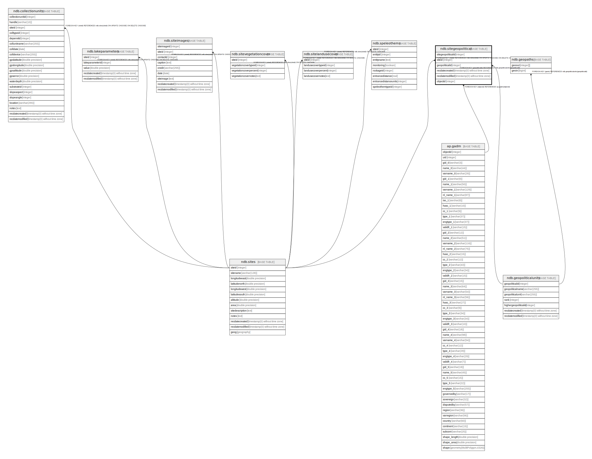

# ndb.sitegeopolitical

## Description

This table lists the GeoPolitical units in which sites occur.

## Columns

| # | Name               | Type                           | Default                                                          | Nullable | Children | Parents                                           | Comment                                                                                |
| - | ------------------ | ------------------------------ | ---------------------------------------------------------------- | -------- | -------- | ------------------------------------------------- | -------------------------------------------------------------------------------------- |
| 1 | geopoliticalid     | integer                        |                                                                  | false    |          | [ndb.geopoliticalunits](ndb.geopoliticalunits.md) | GeoPolitical identification number. Field links to the GeoPoliticalUnits lookup table. |
| 2 | objectid           | integer                        |                                                                  | true     |          | [ap.gadm](ap.gadm.md)                             |                                                                                        |
| 3 | recdatecreated     | timestamp(0) without time zone | timezone('UTC'::text, now())                                     | false    |          |                                                   |                                                                                        |
| 4 | recdatemodified    | timestamp(0) without time zone |                                                                  | false    |          |                                                   |                                                                                        |
| 5 | sitegeopoliticalid | integer                        | nextval('ndb.seq_sitegeopolitical_sitegeopoliticalid'::regclass) | false    |          |                                                   | An arbitrary Site GeoPolitical identification number.                                  |
| 6 | siteid             | integer                        |                                                                  | false    |          | [ndb.sites](ndb.sites.md)                         | Site identification number. Field links to the Sites table.                            |

## Constraints

| # | Name                                  | Type        | Definition                                                                            |
| - | ------------------------------------- | ----------- | ------------------------------------------------------------------------------------- |
| 1 | fk_objectid                           | FOREIGN KEY | FOREIGN KEY (objectid) REFERENCES ap.gadm(objectid)                                   |
| 2 | fk_sitegeopolitical_geopoliticalunits | FOREIGN KEY | FOREIGN KEY (geopoliticalid) REFERENCES ndb.geopoliticalunits(geopoliticalid)         |
| 3 | fk_sitegeopolitical_sites             | FOREIGN KEY | FOREIGN KEY (siteid) REFERENCES ndb.sites(siteid) ON UPDATE CASCADE ON DELETE CASCADE |
| 4 | sitegeopolitical_pkey                 | PRIMARY KEY | PRIMARY KEY (sitegeopoliticalid)                                                      |

## Indexes

| # | Name                               | Definition                                                                                                                  |
| - | ---------------------------------- | --------------------------------------------------------------------------------------------------------------------------- |
| 1 | ix_geopoliticalid_sitegeopolitical | CREATE INDEX ix_geopoliticalid_sitegeopolitical ON ndb.sitegeopolitical USING btree (geopoliticalid) WITH (fillfactor='10') |
| 2 | ix_siteid_sitegeopolitical         | CREATE INDEX ix_siteid_sitegeopolitical ON ndb.sitegeopolitical USING btree (siteid) WITH (fillfactor='10')                 |
| 3 | sitegeopolitical_pkey              | CREATE UNIQUE INDEX sitegeopolitical_pkey ON ndb.sitegeopolitical USING btree (sitegeopoliticalid)                          |

## Triggers

| # | Name                | Definition                                                                                                                                    |
| - | ------------------- | --------------------------------------------------------------------------------------------------------------------------------------------- |
| 1 | tr_sites_modifydate | CREATE TRIGGER tr_sites_modifydate BEFORE INSERT OR UPDATE ON ndb.sitegeopolitical FOR EACH ROW EXECUTE FUNCTION ndb.update_recdatemodified() |

## Relations

---

> Generated by [tbls](https://github.com/k1LoW/tbls)