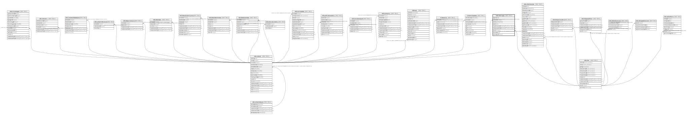

# ndb.siteimages

## Description

This table stores hyperlinks to jpeg images of sites.

## Columns

| # | Name            | Type                           | Default                                             | Nullable | Children | Parents                         | Comment                                                                 |
| - | --------------- | ------------------------------ | --------------------------------------------------- | -------- | -------- | ------------------------------- | ----------------------------------------------------------------------- |
| 1 | siteimageid     | integer                        | nextval('ndb.seq_siteimages_siteimageid'::regclass) | false    |          |                                 | An arbitrary Site Image identification number.                          |
| 2 | siteid          | integer                        |                                                     | true     |          | [ndb.sites](ndb.sites.md)       | Site identification number. Field links to the Sites table.             |
| 3 | contactid       | integer                        |                                                     | true     |          | [ndb.contacts](ndb.contacts.md) | Contact identification number for image attribution.                    |
| 4 | caption         | text                           |                                                     | true     |          |                                 | Caption for the image.                                                  |
| 5 | credit          | varchar(255)                   |                                                     | true     |          |                                 | Credit for the image. If null, the credit is formed from the ContactID. |
| 6 | date            | date                           |                                                     | true     |          |                                 | Date of photograph or image.                                            |
| 7 | siteimage       | text                           |                                                     | true     |          |                                 | Hyperlink to a URL for the image.                                       |
| 8 | recdatecreated  | timestamp(0) without time zone | timezone('UTC'::text, now())                        | false    |          |                                 |                                                                         |
| 9 | recdatemodified | timestamp(0) without time zone |                                                     | false    |          |                                 |                                                                         |

## Constraints

| # | Name                   | Type        | Definition                                                                            |
| - | ---------------------- | ----------- | ------------------------------------------------------------------------------------- |
| 1 | fk_siteimages_contacts | FOREIGN KEY | FOREIGN KEY (contactid) REFERENCES ndb.contacts(contactid) ON UPDATE CASCADE          |
| 2 | siteimages_pkey        | PRIMARY KEY | PRIMARY KEY (siteimageid)                                                             |
| 3 | fk_siteimages_sites    | FOREIGN KEY | FOREIGN KEY (siteid) REFERENCES ndb.sites(siteid) ON UPDATE CASCADE ON DELETE CASCADE |

## Indexes

| # | Name                 | Definition                                                                                      |
| - | -------------------- | ----------------------------------------------------------------------------------------------- |
| 1 | siteimages_pkey      | CREATE UNIQUE INDEX siteimages_pkey ON ndb.siteimages USING btree (siteimageid)                 |
| 2 | ix_siteid_siteimages | CREATE INDEX ix_siteid_siteimages ON ndb.siteimages USING btree (siteid) WITH (fillfactor='10') |

## Triggers

| # | Name                | Definition                                                                                                                              |
| - | ------------------- | --------------------------------------------------------------------------------------------------------------------------------------- |
| 1 | tr_sites_modifydate | CREATE TRIGGER tr_sites_modifydate BEFORE INSERT OR UPDATE ON ndb.siteimages FOR EACH ROW EXECUTE FUNCTION ndb.update_recdatemodified() |

## Relations

---

> Generated by [tbls](https://github.com/k1LoW/tbls)