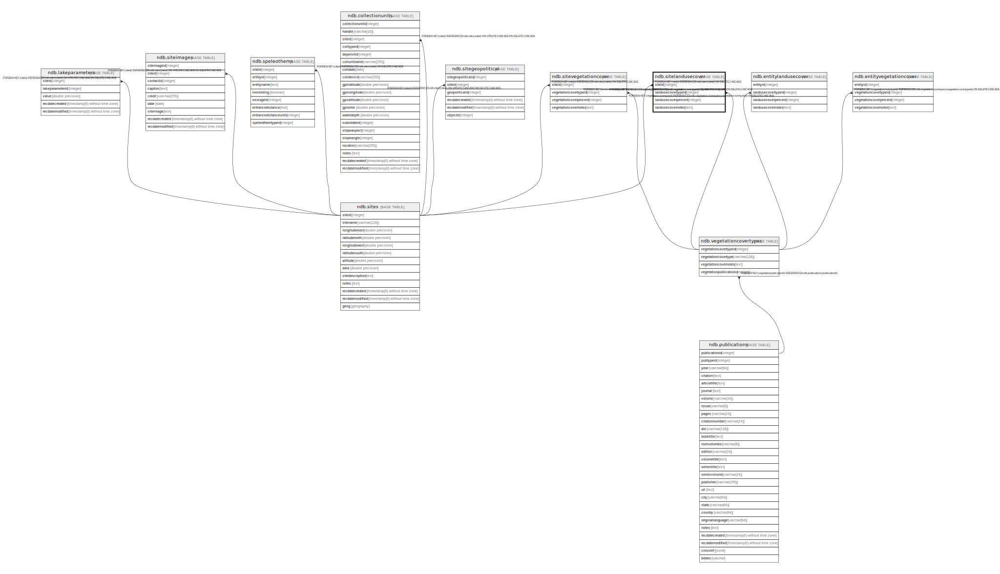

# ndb.sitelandusecover

## Description

## Columns

| # | Name                | Type    | Default | Nullable | Children | Parents                                                 | Comment |
| - | ------------------- | ------- | ------- | -------- | -------- | ------------------------------------------------------- | ------- |
| 1 | landusecovernotes   | text    |         | true     |          |                                                         |         |
| 2 | landusecoverpercent | integer |         | true     |          |                                                         |         |
| 3 | landusecovertypeid  | integer |         | true     |          | [ndb.vegetationcovertypes](ndb.vegetationcovertypes.md) |         |
| 4 | siteid              | integer |         | true     |          | [ndb.sites](ndb.sites.md)                               |         |

## Constraints

| # | Name                                     | Type        | Definition                                                                                                    |
| - | ---------------------------------------- | ----------- | ------------------------------------------------------------------------------------------------------------- |
| 1 | sitelandusecover_landusecovertypeid_fkey | FOREIGN KEY | FOREIGN KEY (landusecovertypeid) REFERENCES ndb.vegetationcovertypes(vegetationcovertypeid) ON DELETE CASCADE |
| 2 | sitelandusecover_siteid_fkey             | FOREIGN KEY | FOREIGN KEY (siteid) REFERENCES ndb.sites(siteid) ON DELETE CASCADE                                           |

## Relations

---

> Generated by [tbls](https://github.com/k1LoW/tbls)