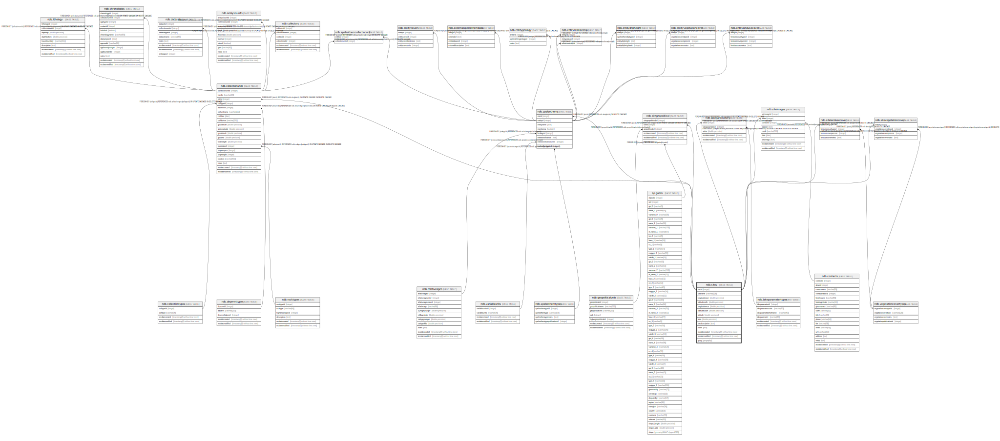

# ndb.sites

## Description

The Sites table stores information about sites or localities, including name, geographic coordinates, and description. Sites generally have an areal extent and can be circumscribed by a latitude-longitude box. However, site data ingested from legacy databases have included only point locations. The lat-long box can be used either to circumscribe the aerial extent of a site or to provide purposeful imprecision to the site location. Site location may be imprecise because the original description was vague, e.g. «a gravel bar 5 miles east of town», or because the investigators, land owner, or land management agency may not want the exact location made public, perhaps to prevent looting and vandalism. In the first case, the lat-long box can be made sufficiently large to encompass the true location and in the second case to prevent exact location.

## Columns

| #  | Name            | Type                           | Default                                   | Nullable | Children                                                                                                                                                                                                                                                                                                                  | Parents | Comment                                                                                                                                                                                                                                                                                                                                                                                                                                                                                                                                                                                                                                                                                                                                                                                                                                                                                                                                                                                |
| -- | --------------- | ------------------------------ | ----------------------------------------- | -------- | ------------------------------------------------------------------------------------------------------------------------------------------------------------------------------------------------------------------------------------------------------------------------------------------------------------------------- | ------- | -------------------------------------------------------------------------------------------------------------------------------------------------------------------------------------------------------------------------------------------------------------------------------------------------------------------------------------------------------------------------------------------------------------------------------------------------------------------------------------------------------------------------------------------------------------------------------------------------------------------------------------------------------------------------------------------------------------------------------------------------------------------------------------------------------------------------------------------------------------------------------------------------------------------------------------------------------------------------------------- |
| 1  | altitude        | double precision               |                                           | true     |                                                                                                                                                                                                                                                                                                                           |         | Altitude of a site in meters.                                                                                                                                                                                                                                                                                                                                                                                                                                                                                                                                                                                                                                                                                                                                                                                                                                                                                                                                                          |
| 2  | area            | double precision               |                                           | true     |                                                                                                                                                                                                                                                                                                                           |         | Area of a site in hectares.                                                                                                                                                                                                                                                                                                                                                                                                                                                                                                                                                                                                                                                                                                                                                                                                                                                                                                                                                            |
| 3  | geog            | geography                      |                                           | true     |                                                                                                                                                                                                                                                                                                                           |         |                                                                                                                                                                                                                                                                                                                                                                                                                                                                                                                                                                                                                                                                                                                                                                                                                                                                                                                                                                                        |
| 4  | latitudenorth   | double precision               |                                           | true     |                                                                                                                                                                                                                                                                                                                           |         | North bounding latitude for a site.                                                                                                                                                                                                                                                                                                                                                                                                                                                                                                                                                                                                                                                                                                                                                                                                                                                                                                                                                    |
| 5  | latitudesouth   | double precision               |                                           | true     |                                                                                                                                                                                                                                                                                                                           |         | South bounding latitude for a site.                                                                                                                                                                                                                                                                                                                                                                                                                                                                                                                                                                                                                                                                                                                                                                                                                                                                                                                                                    |
| 6  | longitudeeast   | double precision               |                                           | true     |                                                                                                                                                                                                                                                                                                                           |         | East bounding longitude for a site.                                                                                                                                                                                                                                                                                                                                                                                                                                                                                                                                                                                                                                                                                                                                                                                                                                                                                                                                                    |
| 7  | longitudewest   | double precision               |                                           | true     |                                                                                                                                                                                                                                                                                                                           |         | West bounding longitude for a site.                                                                                                                                                                                                                                                                                                                                                                                                                                                                                                                                                                                                                                                                                                                                                                                                                                                                                                                                                    |
| 8  | notes           | text                           |                                           | true     |                                                                                                                                                                                                                                                                                                                           |         | Free form notes or comments about the site.                                                                                                                                                                                                                                                                                                                                                                                                                                                                                                                                                                                                                                                                                                                                                                                                                                                                                                                                            |
| 9  | recdatecreated  | timestamp(0) without time zone | timezone('UTC'::text, now())              | false    |                                                                                                                                                                                                                                                                                                                           |         |                                                                                                                                                                                                                                                                                                                                                                                                                                                                                                                                                                                                                                                                                                                                                                                                                                                                                                                                                                                        |
| 10 | recdatemodified | timestamp(0) without time zone |                                           | false    |                                                                                                                                                                                                                                                                                                                           |         |                                                                                                                                                                                                                                                                                                                                                                                                                                                                                                                                                                                                                                                                                                                                                                                                                                                                                                                                                                                        |
| 11 | sitedescription | text                           |                                           | true     |                                                                                                                                                                                                                                                                                                                           |         | Free form description of a site, including such information as physiography and vegetation around the site.                                                                                                                                                                                                                                                                                                                                                                                                                                                                                                                                                                                                                                                                                                                                                                                                                                                                            |
| 12 | siteid          | integer                        | nextval('ndb.seq_sites_siteid'::regclass) | false    | [ndb.collectionunits](ndb.collectionunits.md) [ndb.lakeparameters](ndb.lakeparameters.md) [ndb.sitegeopolitical](ndb.sitegeopolitical.md) [ndb.siteimages](ndb.siteimages.md) [ndb.sitelandusecover](ndb.sitelandusecover.md) [ndb.sitevegetationcover](ndb.sitevegetationcover.md) [ndb.speleothems](ndb.speleothems.md) |         | An arbitrary Site identification number.                                                                                                                                                                                                                                                                                                                                                                                                                                                                                                                                                                                                                                                                                                                                                                                                                                                                                                                                               |
| 13 | sitename        | varchar(128)                   |                                           | true     |                                                                                                                                                                                                                                                                                                                           |         | Name of the site. Alternative names, including archaeological site numbers, are placed in square brackets, for example: New Paris #4 [Lloyd's Rock Hole] Modoc Rock Shelter [11RA501] A search of the SiteName field for any of the alternative names or for the archaeological site number will find the site. Some archaeological sites are known only by their site number. Modifiers to site names are placed in parentheses. Authors are added for generic sites names, especially for surface samples, that are duplicated in the database, for example: Site 1 (Heusser 1978) Site 1 (Delcourt et al. 1983) Site 1 (Elliot-Fisk et al. 1982) Site 1 (Whitehead and Jackson 1990) For actual site names duplicated in the database, the name is followed by the 2-letter country code and state or province, for example: Silver Lake (US:Minnesota) Silver Lake (CA:Nova Scotia) Silver Lake (US:Ohio) Silver Lake (US:Pennsylvania)  |

## Constraints

| # | Name       | Type        | Definition           |
| - | ---------- | ----------- | -------------------- |
| 1 | sites_pkey | PRIMARY KEY | PRIMARY KEY (siteid) |

## Indexes

| # | Name            | Definition                                                                            |
| - | --------------- | ------------------------------------------------------------------------------------- |
| 1 | ix_siteid_sites | CREATE INDEX ix_siteid_sites ON ndb.sites USING btree (siteid) WITH (fillfactor='10') |
| 2 | sitegeog_gix    | CREATE INDEX sitegeog_gix ON ndb.sites USING gist (geog)                              |
| 3 | sitenames_idx   | CREATE INDEX sitenames_idx ON ndb.sites USING gin (sitename gin_trgm_ops)             |
| 4 | sites_pkey      | CREATE UNIQUE INDEX sites_pkey ON ndb.sites USING btree (siteid)                      |

## Triggers

| # | Name                | Definition                                                                                                                         |
| - | ------------------- | ---------------------------------------------------------------------------------------------------------------------------------- |
| 1 | tr_sites_modifydate | CREATE TRIGGER tr_sites_modifydate BEFORE INSERT OR UPDATE ON ndb.sites FOR EACH ROW EXECUTE FUNCTION ndb.update_recdatemodified() |
| 2 | updategeopol        | CREATE TRIGGER updategeopol AFTER INSERT OR DELETE ON ndb.sites FOR EACH STATEMENT EXECUTE FUNCTION ap.updategpsites()             |
| 3 | updatelocations     | CREATE TRIGGER updatelocations AFTER INSERT OR UPDATE ON ndb.sites FOR EACH ROW EXECUTE FUNCTION ti.site_bounding()                |

## Relations

---

> Generated by [tbls](https://github.com/k1LoW/tbls)