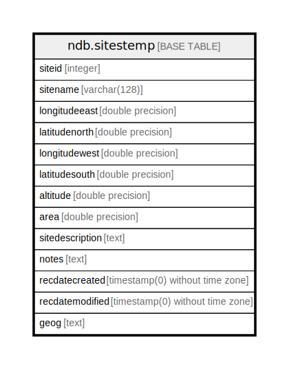

# ndb.sitestemp

## Description

## Columns

| #  | Name            | Type                           | Default                      | Nullable | Children | Parents | Comment |
| -- | --------------- | ------------------------------ | ---------------------------- | -------- | -------- | ------- | ------- |
| 1  | siteid          | integer                        |                              | false    |          |         |         |
| 2  | sitename        | varchar(128)                   |                              | true     |          |         |         |
| 3  | longitudeeast   | double precision               |                              | true     |          |         |         |
| 4  | latitudenorth   | double precision               |                              | true     |          |         |         |
| 5  | longitudewest   | double precision               |                              | true     |          |         |         |
| 6  | latitudesouth   | double precision               |                              | true     |          |         |         |
| 7  | altitude        | double precision               |                              | true     |          |         |         |
| 8  | area            | double precision               |                              | true     |          |         |         |
| 9  | sitedescription | text                           |                              | true     |          |         |         |
| 10 | notes           | text                           |                              | true     |          |         |         |
| 11 | recdatecreated  | timestamp(0) without time zone | timezone('UTC'::text, now()) | false    |          |         |         |
| 12 | recdatemodified | timestamp(0) without time zone |                              | false    |          |         |         |
| 13 | geog            | text                           |                              | true     |          |         |         |

## Constraints

| # | Name           | Type        | Definition           |
| - | -------------- | ----------- | -------------------- |
| 1 | sitestemp_pkey | PRIMARY KEY | PRIMARY KEY (siteid) |

## Indexes

| # | Name           | Definition                                                               |
| - | -------------- | ------------------------------------------------------------------------ |
| 1 | sitestemp_pkey | CREATE UNIQUE INDEX sitestemp_pkey ON ndb.sitestemp USING btree (siteid) |

## Triggers

| # | Name                | Definition                                                                                                                             |
| - | ------------------- | -------------------------------------------------------------------------------------------------------------------------------------- |
| 1 | tr_sites_modifydate | CREATE TRIGGER tr_sites_modifydate BEFORE INSERT OR UPDATE ON ndb.sitestemp FOR EACH ROW EXECUTE FUNCTION ndb.update_recdatemodified() |

## Relations

---

> Generated by [tbls](https://github.com/k1LoW/tbls)