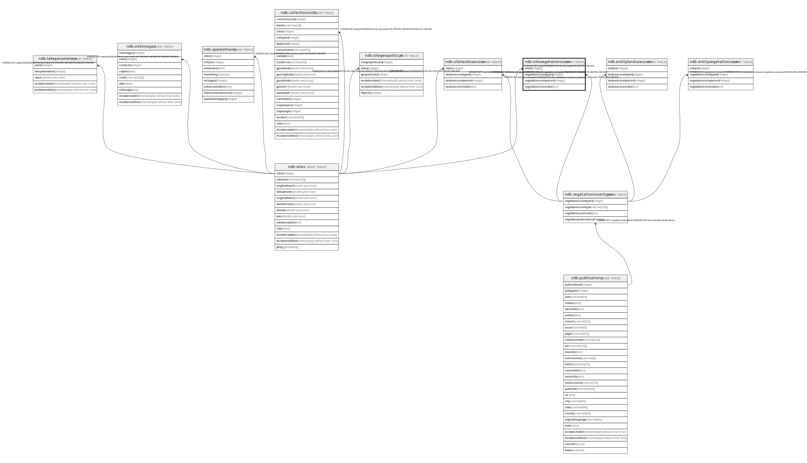

# ndb.sitevegetationcover

## Description

## Columns

| # | Name                   | Type    | Default | Nullable | Children | Parents                                                 | Comment |
| - | ---------------------- | ------- | ------- | -------- | -------- | ------------------------------------------------------- | ------- |
| 1 | siteid                 | integer |         | true     |          | [ndb.sites](ndb.sites.md)                               |         |
| 2 | vegetationcovernotes   | text    |         | true     |          |                                                         |         |
| 3 | vegetationcoverpercent | integer |         | true     |          |                                                         |         |
| 4 | vegetationcovertypeid  | integer |         | true     |          | [ndb.vegetationcovertypes](ndb.vegetationcovertypes.md) |         |

## Constraints

| # | Name                                           | Type        | Definition                                                                                                       |
| - | ---------------------------------------------- | ----------- | ---------------------------------------------------------------------------------------------------------------- |
| 1 | sitevegetationcover_siteid_fkey                | FOREIGN KEY | FOREIGN KEY (siteid) REFERENCES ndb.sites(siteid) ON DELETE CASCADE                                              |
| 2 | sitevegetationcover_vegetationcovertypeid_fkey | FOREIGN KEY | FOREIGN KEY (vegetationcovertypeid) REFERENCES ndb.vegetationcovertypes(vegetationcovertypeid) ON DELETE CASCADE |

## Relations

---

> Generated by [tbls](https://github.com/k1LoW/tbls)