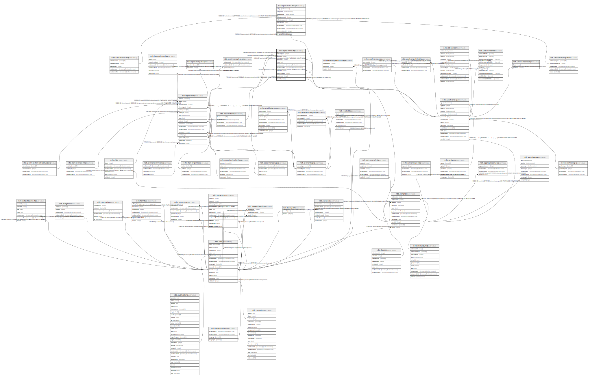

# ndb.specimendates

## Description

This table enables queries for dated specimens of individual taxa. Although the MaterialDated field in the Geochronology table may list the taxa dated, this protocol is not enforced, and the field is not linked to the taxa table.

## Columns

| #  | Name            | Type                           | Default                                                   | Nullable | Children                                        | Parents                                   | Comment                                                                       |
| -- | --------------- | ------------------------------ | --------------------------------------------------------- | -------- | ----------------------------------------------- | ----------------------------------------- | ----------------------------------------------------------------------------- |
| 1  | elementtypeid   | integer                        |                                                           | true     |                                                 | [ndb.elementtypes](ndb.elementtypes.md)   |                                                                               |
| 2  | fractionid      | integer                        |                                                           | true     |                                                 | [ndb.fractiondated](ndb.fractiondated.md) |                                                                               |
| 3  | geochronid      | integer                        |                                                           | false    |                                                 | [ndb.geochronology](ndb.geochronology.md) | Geochronologic identification number. Field links to the Geochronology table. |
| 4  | notes           | text                           |                                                           | true     |                                                 |                                           | Free form notes or comments about dated specimens.                            |
| 5  | recdatecreated  | timestamp(0) without time zone | timezone('UTC'::text, now())                              | false    |                                                 |                                           |                                                                               |
| 6  | recdatemodified | timestamp(0) without time zone |                                                           | false    |                                                 |                                           |                                                                               |
| 7  | sampleid        | integer                        |                                                           | false    |                                                 | [ndb.samples](ndb.samples.md)             | Sample ID number. Field links to the Samples table.                           |
| 8  | specimendateid  | integer                        | nextval('ndb.seq_specimendates_specimendateid'::regclass) | false    | [ndb.specimendatescal](ndb.specimendatescal.md) |                                           | An arbitrary specimen date ID                                                 |
| 9  | specimenid      | integer                        |                                                           | true     |                                                 | [ndb.specimens](ndb.specimens.md)         |                                                                               |
| 10 | taxonid         | integer                        |                                                           | false    |                                                 | [ndb.taxa](ndb.taxa.md)                   | Accepted name in Neotoma. Field links to Taxa table.                          |

## Viewpoints

| Name                                        | Definition                                        |
| ------------------------------------------- | ------------------------------------------------- |
| [Chronology related tables](viewpoint-5.md) | Tables related to chronology and age assignments. |

## Constraints

| # | Name                       | Type        | Definition                                                                                            |
| - | -------------------------- | ----------- | ----------------------------------------------------------------------------------------------------- |
| 1 | fk_specimendates_specimens | FOREIGN KEY | FOREIGN KEY (specimenid) REFERENCES ndb.specimens(specimenid) ON UPDATE CASCADE ON DELETE CASCADE     |
| 2 | sd_etyid                   | FOREIGN KEY | FOREIGN KEY (elementtypeid) REFERENCES ndb.elementtypes(elementtypeid)                                |
| 3 | sd_fcid                    | FOREIGN KEY | FOREIGN KEY (fractionid) REFERENCES ndb.fractiondated(fractionid)                                     |
| 4 | sd_gcid                    | FOREIGN KEY | FOREIGN KEY (geochronid) REFERENCES ndb.geochronology(geochronid) ON UPDATE CASCADE ON DELETE CASCADE |
| 5 | sd_smpid                   | FOREIGN KEY | FOREIGN KEY (sampleid) REFERENCES ndb.samples(sampleid) ON UPDATE CASCADE ON DELETE CASCADE           |
| 6 | sd_txid                    | FOREIGN KEY | FOREIGN KEY (taxonid) REFERENCES ndb.taxa(taxonid)                                                    |
| 7 | specimendates_pkey         | PRIMARY KEY | PRIMARY KEY (specimendateid)                                                                          |

## Indexes

| # | Name                      | Definition                                                                                                |
| - | ------------------------- | --------------------------------------------------------------------------------------------------------- |
| 1 | ix_sampleid_specimendates | CREATE INDEX ix_sampleid_specimendates ON ndb.specimendates USING btree (sampleid) WITH (fillfactor='10') |
| 2 | ix_taxonid_specimendates  | CREATE INDEX ix_taxonid_specimendates ON ndb.specimendates USING btree (taxonid) WITH (fillfactor='10')   |
| 3 | specimendates_pkey        | CREATE UNIQUE INDEX specimendates_pkey ON ndb.specimendates USING btree (specimendateid)                  |

## Triggers

| # | Name                | Definition                                                                                                                                 |
| - | ------------------- | ------------------------------------------------------------------------------------------------------------------------------------------ |
| 1 | tr_sites_modifydate | CREATE TRIGGER tr_sites_modifydate BEFORE INSERT OR UPDATE ON ndb.specimendates FOR EACH ROW EXECUTE FUNCTION ndb.update_recdatemodified() |

## Relations

---

> Generated by [tbls](https://github.com/k1LoW/tbls)