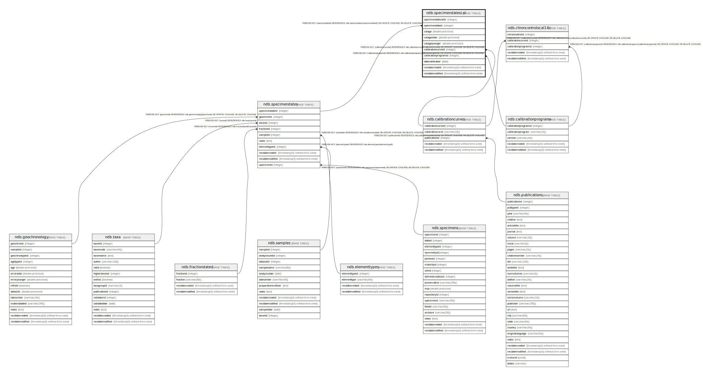

# ndb.specimendatescal

## Description

## Columns

| #  | Name                 | Type                           | Default                                                         | Nullable | Children | Parents                                               | Comment |
| -- | -------------------- | ------------------------------ | --------------------------------------------------------------- | -------- | -------- | ----------------------------------------------------- | ------- |
| 1  | calage               | double precision               |                                                                 | true     |          |                                                       |         |
| 2  | calageolder          | double precision               |                                                                 | true     |          |                                                       |         |
| 3  | calageyounger        | double precision               |                                                                 | true     |          |                                                       |         |
| 4  | calibrationcurveid   | integer                        |                                                                 | true     |          | [ndb.calibrationcurves](ndb.calibrationcurves.md)     |         |
| 5  | calibrationprogramid | integer                        |                                                                 | true     |          | [ndb.calibrationprograms](ndb.calibrationprograms.md) |         |
| 6  | datecalibrated       | date                           |                                                                 | true     |          |                                                       |         |
| 7  | recdatecreated       | timestamp(0) without time zone | timezone('UTC'::text, now())                                    | false    |          |                                                       |         |
| 8  | recdatemodified      | timestamp(0) without time zone |                                                                 | false    |          |                                                       |         |
| 9  | specimendatecalid    | integer                        | nextval('ndb.seq_specimendatescal_specimendatecalid'::regclass) | false    |          |                                                       |         |
| 10 | specimendateid       | integer                        |                                                                 | false    |          | [ndb.specimendates](ndb.specimendates.md)             |         |

## Constraints

| # | Name                                    | Type        | Definition                                                                                                                      |
| - | --------------------------------------- | ----------- | ------------------------------------------------------------------------------------------------------------------------------- |
| 1 | fk_specimendatescal_calibrationcurves   | FOREIGN KEY | FOREIGN KEY (calibrationcurveid) REFERENCES ndb.calibrationcurves(calibrationcurveid) ON UPDATE CASCADE ON DELETE CASCADE       |
| 2 | fk_specimendatescal_calibrationprograms | FOREIGN KEY | FOREIGN KEY (calibrationprogramid) REFERENCES ndb.calibrationprograms(calibrationprogramid) ON UPDATE CASCADE ON DELETE CASCADE |
| 3 | fk_specimendatescal_specimendates       | FOREIGN KEY | FOREIGN KEY (specimendateid) REFERENCES ndb.specimendates(specimendateid) ON UPDATE CASCADE ON DELETE CASCADE                   |
| 4 | specimendatescal_pkey                   | PRIMARY KEY | PRIMARY KEY (specimendatecalid)                                                                                                 |

## Indexes

| # | Name                  | Definition                                                                                        |
| - | --------------------- | ------------------------------------------------------------------------------------------------- |
| 1 | specimendatescal_pkey | CREATE UNIQUE INDEX specimendatescal_pkey ON ndb.specimendatescal USING btree (specimendatecalid) |

## Triggers

| # | Name                | Definition                                                                                                                                    |
| - | ------------------- | --------------------------------------------------------------------------------------------------------------------------------------------- |
| 1 | tr_sites_modifydate | CREATE TRIGGER tr_sites_modifydate BEFORE INSERT OR UPDATE ON ndb.specimendatescal FOR EACH ROW EXECUTE FUNCTION ndb.update_recdatemodified() |

## Relations

---

> Generated by [tbls](https://github.com/k1LoW/tbls)