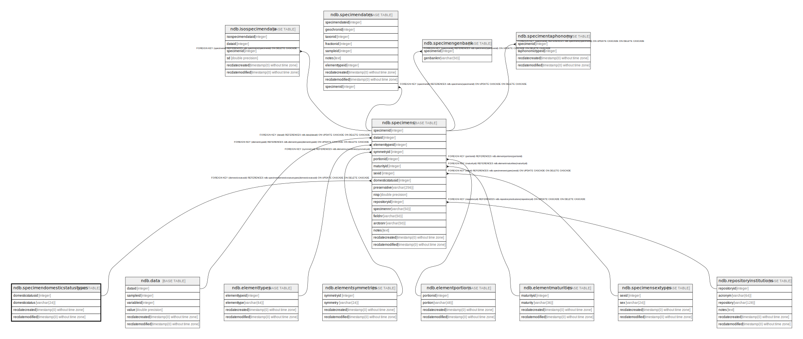

# ndb.specimendomesticstatustypes

## Description

## Columns

| # | Name             | Type                           | Default                                                                   | Nullable | Children                          | Parents | Comment |
| - | ---------------- | ------------------------------ | ------------------------------------------------------------------------- | -------- | --------------------------------- | ------- | ------- |
| 1 | domesticstatus   | varchar(24)                    |                                                                           | false    |                                   |         |         |
| 2 | domesticstatusid | integer                        | nextval('ndb.seq_specimendomesticstatustypes_domesticstatusid'::regclass) | false    | [ndb.specimens](ndb.specimens.md) |         |         |
| 3 | recdatecreated   | timestamp(0) without time zone | timezone('UTC'::text, now())                                              | false    |                                   |         |         |
| 4 | recdatemodified  | timestamp(0) without time zone |                                                                           | false    |                                   |         |         |

## Constraints

| # | Name                             | Type        | Definition                     |
| - | -------------------------------- | ----------- | ------------------------------ |
| 1 | specimendomesticstatustypes_pkey | PRIMARY KEY | PRIMARY KEY (domesticstatusid) |

## Indexes

| # | Name                             | Definition                                                                                                             |
| - | -------------------------------- | ---------------------------------------------------------------------------------------------------------------------- |
| 1 | specimendomesticstatustypes_pkey | CREATE UNIQUE INDEX specimendomesticstatustypes_pkey ON ndb.specimendomesticstatustypes USING btree (domesticstatusid) |

## Triggers

| # | Name                | Definition                                                                                                                                               |
| - | ------------------- | -------------------------------------------------------------------------------------------------------------------------------------------------------- |
| 1 | tr_sites_modifydate | CREATE TRIGGER tr_sites_modifydate BEFORE INSERT OR UPDATE ON ndb.specimendomesticstatustypes FOR EACH ROW EXECUTE FUNCTION ndb.update_recdatemodified() |

## Relations

---

> Generated by [tbls](https://github.com/k1LoW/tbls)