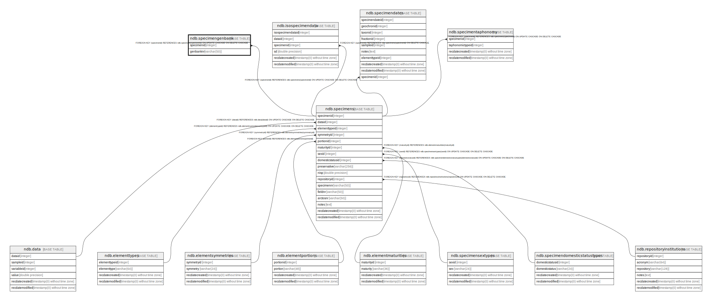

# ndb.specimengenbank

## Description

## Columns

| # | Name       | Type        | Default | Nullable | Children | Parents                           | Comment |
| - | ---------- | ----------- | ------- | -------- | -------- | --------------------------------- | ------- |
| 1 | specimenid | integer     |         | false    |          | [ndb.specimens](ndb.specimens.md) |         |
| 2 | genbanknr  | varchar(50) |         | false    |          |                                   |         |

## Constraints

| # | Name                         | Type        | Definition                                                                                        |
| - | ---------------------------- | ----------- | ------------------------------------------------------------------------------------------------- |
| 1 | specimengenbank_pkey         | PRIMARY KEY | PRIMARY KEY (specimenid, genbanknr)                                                               |
| 2 | fk_specimengenbank_specimens | FOREIGN KEY | FOREIGN KEY (specimenid) REFERENCES ndb.specimens(specimenid) ON UPDATE CASCADE ON DELETE CASCADE |

## Indexes

| # | Name                 | Definition                                                                                          |
| - | -------------------- | --------------------------------------------------------------------------------------------------- |
| 1 | specimengenbank_pkey | CREATE UNIQUE INDEX specimengenbank_pkey ON ndb.specimengenbank USING btree (specimenid, genbanknr) |

## Relations

---

> Generated by [tbls](https://github.com/k1LoW/tbls)