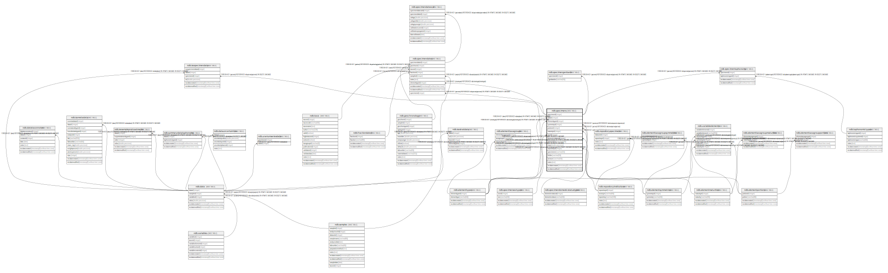

# ndb.specimens

## Description

## Columns

| #  | Name             | Type                           | Default                                           | Nullable | Children                                                                                                                                                                                | Parents                                                               | Comment |
| -- | ---------------- | ------------------------------ | ------------------------------------------------- | -------- | --------------------------------------------------------------------------------------------------------------------------------------------------------------------------------------- | --------------------------------------------------------------------- | ------- |
| 1  | specimenid       | integer                        | nextval('ndb.seq_specimens_specimenid'::regclass) | false    | [ndb.isospecimendata](ndb.isospecimendata.md) [ndb.specimendates](ndb.specimendates.md) [ndb.specimengenbank](ndb.specimengenbank.md) [ndb.specimentaphonomy](ndb.specimentaphonomy.md) |                                                                       |         |
| 2  | dataid           | integer                        |                                                   | false    |                                                                                                                                                                                         | [ndb.data](ndb.data.md)                                               |         |
| 3  | elementtypeid    | integer                        |                                                   | true     |                                                                                                                                                                                         | [ndb.elementtypes](ndb.elementtypes.md)                               |         |
| 4  | symmetryid       | integer                        |                                                   | true     |                                                                                                                                                                                         | [ndb.elementsymmetries](ndb.elementsymmetries.md)                     |         |
| 5  | portionid        | integer                        |                                                   | true     |                                                                                                                                                                                         | [ndb.elementportions](ndb.elementportions.md)                         |         |
| 6  | maturityid       | integer                        |                                                   | true     |                                                                                                                                                                                         | [ndb.elementmaturities](ndb.elementmaturities.md)                     |         |
| 7  | sexid            | integer                        |                                                   | true     |                                                                                                                                                                                         | [ndb.specimensextypes](ndb.specimensextypes.md)                       |         |
| 8  | domesticstatusid | integer                        |                                                   | true     |                                                                                                                                                                                         | [ndb.specimendomesticstatustypes](ndb.specimendomesticstatustypes.md) |         |
| 9  | preservative     | varchar(256)                   |                                                   | true     |                                                                                                                                                                                         |                                                                       |         |
| 10 | nisp             | double precision               |                                                   | true     |                                                                                                                                                                                         |                                                                       |         |
| 11 | repositoryid     | integer                        |                                                   | true     |                                                                                                                                                                                         | [ndb.repositoryinstitutions](ndb.repositoryinstitutions.md)           |         |
| 12 | specimennr       | varchar(50)                    |                                                   | true     |                                                                                                                                                                                         |                                                                       |         |
| 13 | fieldnr          | varchar(50)                    |                                                   | true     |                                                                                                                                                                                         |                                                                       |         |
| 14 | arctosnr         | varchar(50)                    |                                                   | true     |                                                                                                                                                                                         |                                                                       |         |
| 15 | notes            | text                           |                                                   | true     |                                                                                                                                                                                         |                                                                       |         |
| 16 | recdatecreated   | timestamp(0) without time zone | timezone('UTC'::text, now())                      | false    |                                                                                                                                                                                         |                                                                       |         |
| 17 | recdatemodified  | timestamp(0) without time zone |                                                   | false    |                                                                                                                                                                                         |                                                                       |         |

## Constraints

| # | Name                                | Type        | Definition                                                                                                                      |
| - | ----------------------------------- | ----------- | ------------------------------------------------------------------------------------------------------------------------------- |
| 1 | fk_specimens_data                   | FOREIGN KEY | FOREIGN KEY (dataid) REFERENCES ndb.data(dataid) ON UPDATE CASCADE ON DELETE CASCADE                                            |
| 2 | fk_specimens_elementmaturities      | FOREIGN KEY | FOREIGN KEY (maturityid) REFERENCES ndb.elementmaturities(maturityid)                                                           |
| 3 | fk_specimens_elementportions        | FOREIGN KEY | FOREIGN KEY (portionid) REFERENCES ndb.elementportions(portionid)                                                               |
| 4 | fk_specimens_elementsymmetries      | FOREIGN KEY | FOREIGN KEY (symmetryid) REFERENCES ndb.elementsymmetries(symmetryid)                                                           |
| 5 | fk_specimens_elementtypes           | FOREIGN KEY | FOREIGN KEY (elementtypeid) REFERENCES ndb.elementtypes(elementtypeid) ON UPDATE CASCADE ON DELETE CASCADE                      |
| 6 | fk_specimens_repositoryinstitutions | FOREIGN KEY | FOREIGN KEY (repositoryid) REFERENCES ndb.repositoryinstitutions(repositoryid) ON UPDATE CASCADE ON DELETE CASCADE              |
| 7 | fk_specimens_specimendomesticstatus | FOREIGN KEY | FOREIGN KEY (domesticstatusid) REFERENCES ndb.specimendomesticstatustypes(domesticstatusid) ON UPDATE CASCADE ON DELETE CASCADE |
| 8 | specimens_pkey                      | PRIMARY KEY | PRIMARY KEY (specimenid)                                                                                                        |
| 9 | fk_specimens_specimensex            | FOREIGN KEY | FOREIGN KEY (sexid) REFERENCES ndb.specimensextypes(sexid) ON UPDATE CASCADE ON DELETE CASCADE                                  |

## Indexes

| # | Name           | Definition                                                                   |
| - | -------------- | ---------------------------------------------------------------------------- |
| 1 | specimens_pkey | CREATE UNIQUE INDEX specimens_pkey ON ndb.specimens USING btree (specimenid) |

## Triggers

| # | Name                | Definition                                                                                                                             |
| - | ------------------- | -------------------------------------------------------------------------------------------------------------------------------------- |
| 1 | tr_sites_modifydate | CREATE TRIGGER tr_sites_modifydate BEFORE INSERT OR UPDATE ON ndb.specimens FOR EACH ROW EXECUTE FUNCTION ndb.update_recdatemodified() |

## Relations

---

> Generated by [tbls](https://github.com/k1LoW/tbls)