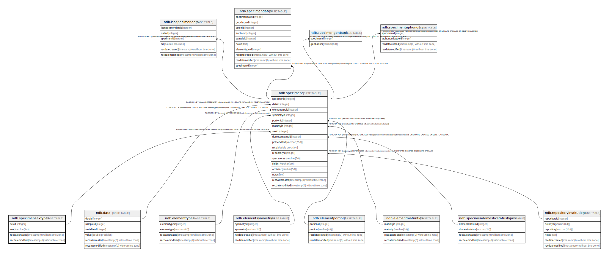

# ndb.specimensextypes

## Description

## Columns

| # | Name            | Type                           | Default                                             | Nullable | Children                          | Parents | Comment |
| - | --------------- | ------------------------------ | --------------------------------------------------- | -------- | --------------------------------- | ------- | ------- |
| 1 | recdatecreated  | timestamp(0) without time zone | timezone('UTC'::text, now())                        | false    |                                   |         |         |
| 2 | recdatemodified | timestamp(0) without time zone |                                                     | false    |                                   |         |         |
| 3 | sex             | varchar(24)                    |                                                     | false    |                                   |         |         |
| 4 | sexid           | integer                        | nextval('ndb.seq_specimensextypes_sexid'::regclass) | false    | [ndb.specimens](ndb.specimens.md) |         |         |

## Constraints

| # | Name                  | Type        | Definition          |
| - | --------------------- | ----------- | ------------------- |
| 1 | specimensextypes_pkey | PRIMARY KEY | PRIMARY KEY (sexid) |

## Indexes

| # | Name                  | Definition                                                                            |
| - | --------------------- | ------------------------------------------------------------------------------------- |
| 1 | specimensextypes_pkey | CREATE UNIQUE INDEX specimensextypes_pkey ON ndb.specimensextypes USING btree (sexid) |

## Triggers

| # | Name                | Definition                                                                                                                                    |
| - | ------------------- | --------------------------------------------------------------------------------------------------------------------------------------------- |
| 1 | tr_sites_modifydate | CREATE TRIGGER tr_sites_modifydate BEFORE INSERT OR UPDATE ON ndb.specimensextypes FOR EACH ROW EXECUTE FUNCTION ndb.update_recdatemodified() |

## Relations

---

> Generated by [tbls](https://github.com/k1LoW/tbls)