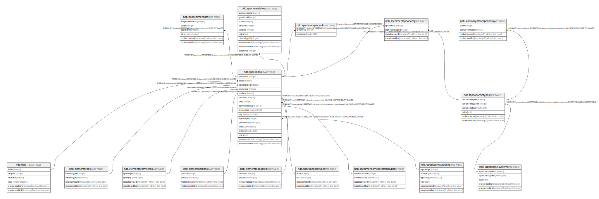

# ndb.specimentaphonomy

## Description

## Columns

| # | Name             | Type                           | Default                      | Nullable | Children | Parents                                       | Comment |
| - | ---------------- | ------------------------------ | ---------------------------- | -------- | -------- | --------------------------------------------- | ------- |
| 1 | recdatecreated   | timestamp(0) without time zone | timezone('UTC'::text, now()) | false    |          |                                               |         |
| 2 | recdatemodified  | timestamp(0) without time zone |                              | false    |          |                                               |         |
| 3 | specimenid       | integer                        |                              | false    |          | [ndb.specimens](ndb.specimens.md)             |         |
| 4 | taphonomictypeid | integer                        |                              | false    |          | [ndb.taphonomictypes](ndb.taphonomictypes.md) |         |

## Constraints

| # | Name                                 | Type        | Definition                                                                                                          |
| - | ------------------------------------ | ----------- | ------------------------------------------------------------------------------------------------------------------- |
| 1 | fk_specimentaphonomy_specimens       | FOREIGN KEY | FOREIGN KEY (specimenid) REFERENCES ndb.specimens(specimenid) ON UPDATE CASCADE ON DELETE CASCADE                   |
| 2 | fk_specimentaphonomy_taphonomictypes | FOREIGN KEY | FOREIGN KEY (taphonomictypeid) REFERENCES ndb.taphonomictypes(taphonomictypeid) ON UPDATE CASCADE ON DELETE CASCADE |
| 3 | specimentaphonomy_pkey               | PRIMARY KEY | PRIMARY KEY (specimenid, taphonomictypeid)                                                                          |

## Indexes

| # | Name                   | Definition                                                                                                     |
| - | ---------------------- | -------------------------------------------------------------------------------------------------------------- |
| 1 | specimentaphonomy_pkey | CREATE UNIQUE INDEX specimentaphonomy_pkey ON ndb.specimentaphonomy USING btree (specimenid, taphonomictypeid) |

## Triggers

| # | Name                | Definition                                                                                                                                     |
| - | ------------------- | ---------------------------------------------------------------------------------------------------------------------------------------------- |
| 1 | tr_sites_modifydate | CREATE TRIGGER tr_sites_modifydate BEFORE INSERT OR UPDATE ON ndb.specimentaphonomy FOR EACH ROW EXECUTE FUNCTION ndb.update_recdatemodified() |

## Relations

---

> Generated by [tbls](https://github.com/k1LoW/tbls)