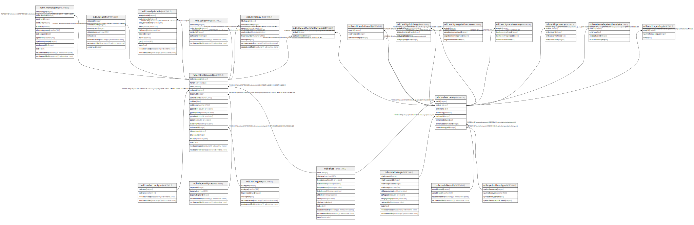

# ndb.speleothemcollectionunit

## Description

## Columns

| # | Name             | Type    | Default | Nullable | Children | Parents                                       | Comment |
| - | ---------------- | ------- | ------- | -------- | -------- | --------------------------------------------- | ------- |
| 1 | entityid         | integer |         | true     |          | [ndb.speleothems](ndb.speleothems.md)         |         |
| 2 | collectionunitid | integer |         | true     |          | [ndb.collectionunits](ndb.collectionunits.md) |         |

## Constraints

| # | Name                                           | Type        | Definition                                                                                        |
| - | ---------------------------------------------- | ----------- | ------------------------------------------------------------------------------------------------- |
| 1 | speleothemcollectionunit_collectionunitid_fkey | FOREIGN KEY | FOREIGN KEY (collectionunitid) REFERENCES ndb.collectionunits(collectionunitid) ON DELETE CASCADE |
| 2 | speleothemcollectionunit_entityid_fkey         | FOREIGN KEY | FOREIGN KEY (entityid) REFERENCES ndb.speleothems(entityid) ON DELETE CASCADE                     |

## Relations

---

> Generated by [tbls](https://github.com/k1LoW/tbls)