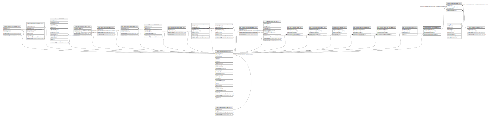

# ndb.speleothemdriptypes

## Description

## Columns

| # | Name                            | Type        | Default                                                               | Nullable | Children                                        | Parents                                 | Comment |
| - | ------------------------------- | ----------- | --------------------------------------------------------------------- | -------- | ----------------------------------------------- | --------------------------------------- | ------- |
| 1 | speleothemdriptypeid            | integer     | nextval('ndb.speleothemdriptypes_speleothemdriptypeid_seq'::regclass) | false    | [ndb.entitydripheight](ndb.entitydripheight.md) |                                         |         |
| 2 | speleothemdriptype              | varchar(50) |                                                                       | true     |                                                 |                                         |         |
| 3 | speleothemdriptypenotes         | text        |                                                                       | true     |                                                 |                                         |         |
| 4 | speleothemdriptypepublicationid | integer     |                                                                       | true     |                                                 | [ndb.publications](ndb.publications.md) |         |

## Constraints

| # | Name                                                     | Type        | Definition                                                                               |
| - | -------------------------------------------------------- | ----------- | ---------------------------------------------------------------------------------------- |
| 1 | speleothemdriptypes_speleothemdriptypepublicationid_fkey | FOREIGN KEY | FOREIGN KEY (speleothemdriptypepublicationid) REFERENCES ndb.publications(publicationid) |
| 2 | speleothemdriptypes_pkey                                 | PRIMARY KEY | PRIMARY KEY (speleothemdriptypeid)                                                       |

## Indexes

| # | Name                     | Definition                                                                                                 |
| - | ------------------------ | ---------------------------------------------------------------------------------------------------------- |
| 1 | speleothemdriptypes_pkey | CREATE UNIQUE INDEX speleothemdriptypes_pkey ON ndb.speleothemdriptypes USING btree (speleothemdriptypeid) |

## Relations

---

> Generated by [tbls](https://github.com/k1LoW/tbls)