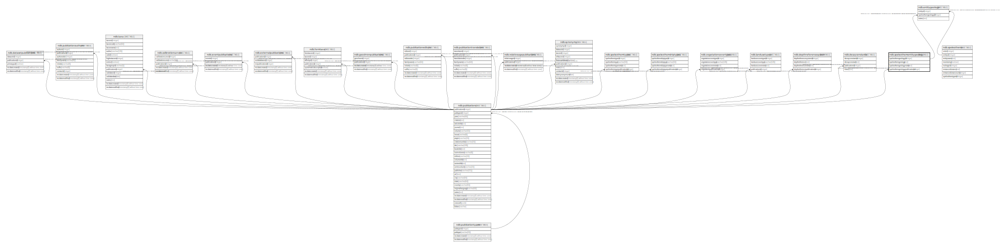

# ndb.speleothementitygeology

## Description

## Columns

| # | Name                           | Type    | Default                                                                  | Nullable | Children                                  | Parents                                 | Comment |
| - | ------------------------------ | ------- | ------------------------------------------------------------------------ | -------- | ----------------------------------------- | --------------------------------------- | ------- |
| 1 | speleothemgeologyid            | integer | nextval('ndb.speleothementitygeology_speleothemgeologyid_seq'::regclass) | false    | [ndb.entitygeology](ndb.entitygeology.md) |                                         |         |
| 2 | speleothemgeology              | text    |                                                                          | true     |                                           |                                         |         |
| 3 | speleothemgeologynotes         | text    |                                                                          | true     |                                           |                                         |         |
| 4 | speleothemgeologypublicationid | integer |                                                                          | true     |                                           | [ndb.publications](ndb.publications.md) |         |

## Constraints

| # | Name                                                        | Type        | Definition                                                                              |
| - | ----------------------------------------------------------- | ----------- | --------------------------------------------------------------------------------------- |
| 1 | speleothementitygeology_speleothemgeologypublicationid_fkey | FOREIGN KEY | FOREIGN KEY (speleothemgeologypublicationid) REFERENCES ndb.publications(publicationid) |
| 2 | speleothementitygeology_pkey                                | PRIMARY KEY | PRIMARY KEY (speleothemgeologyid)                                                       |

## Indexes

| # | Name                         | Definition                                                                                                        |
| - | ---------------------------- | ----------------------------------------------------------------------------------------------------------------- |
| 1 | speleothementitygeology_pkey | CREATE UNIQUE INDEX speleothementitygeology_pkey ON ndb.speleothementitygeology USING btree (speleothemgeologyid) |

## Relations

---

> Generated by [tbls](https://github.com/k1LoW/tbls)