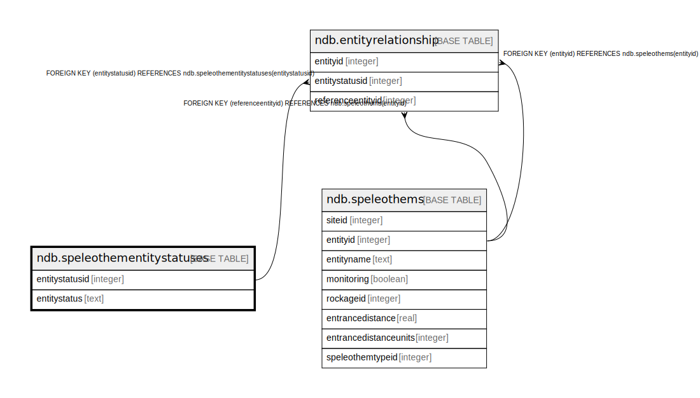

# ndb.speleothementitystatuses

## Description

## Columns

| # | Name           | Type    | Default                                                              | Nullable | Children                                            | Parents | Comment |
| - | -------------- | ------- | -------------------------------------------------------------------- | -------- | --------------------------------------------------- | ------- | ------- |
| 1 | entitystatus   | text    |                                                                      | true     |                                                     |         |         |
| 2 | entitystatusid | integer | nextval('ndb.speleothementitystatuses_entitystatusid_seq'::regclass) | false    | [ndb.entityrelationship](ndb.entityrelationship.md) |         |         |

## Constraints

| # | Name                          | Type        | Definition                   |
| - | ----------------------------- | ----------- | ---------------------------- |
| 1 | speleothementitystatuses_pkey | PRIMARY KEY | PRIMARY KEY (entitystatusid) |

## Indexes

| # | Name                          | Definition                                                                                                     |
| - | ----------------------------- | -------------------------------------------------------------------------------------------------------------- |
| 1 | speleothementitystatuses_pkey | CREATE UNIQUE INDEX speleothementitystatuses_pkey ON ndb.speleothementitystatuses USING btree (entitystatusid) |

## Relations

---

> Generated by [tbls](https://github.com/k1LoW/tbls)