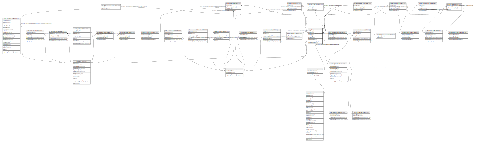

# ndb.speleothems

## Description

## Columns

| # | Name                  | Type    | Default                                           | Nullable | Children                                                                                                                                                                                                                                                                                                                                                                                                                        | Parents                                       | Comment |
| - | --------------------- | ------- | ------------------------------------------------- | -------- | ------------------------------------------------------------------------------------------------------------------------------------------------------------------------------------------------------------------------------------------------------------------------------------------------------------------------------------------------------------------------------------------------------------------------------- | --------------------------------------------- | ------- |
| 1 | siteid                | integer |                                                   | true     |                                                                                                                                                                                                                                                                                                                                                                                                                                 | [ndb.sites](ndb.sites.md)                     |         |
| 2 | entityid              | integer | nextval('ndb.speleothems_entityid_seq'::regclass) | false    | [ndb.entityrelationship](ndb.entityrelationship.md) [ndb.entitydripheight](ndb.entitydripheight.md) [ndb.entityvegetationcover](ndb.entityvegetationcover.md) [ndb.entitylandusecover](ndb.entitylandusecover.md) [ndb.entitycovers](ndb.entitycovers.md) [ndb.externalspeleothemdata](ndb.externalspeleothemdata.md) [ndb.speleothemcollectionunit](ndb.speleothemcollectionunit.md) [ndb.entitygeology](ndb.entitygeology.md) |                                               |         |
| 3 | entityname            | text    |                                                   | true     |                                                                                                                                                                                                                                                                                                                                                                                                                                 |                                               |         |
| 4 | monitoring            | boolean |                                                   | true     |                                                                                                                                                                                                                                                                                                                                                                                                                                 |                                               |         |
| 5 | rockageid             | integer |                                                   | true     |                                                                                                                                                                                                                                                                                                                                                                                                                                 | [ndb.relativeages](ndb.relativeages.md)       |         |
| 6 | entrancedistance      | real    |                                                   | true     |                                                                                                                                                                                                                                                                                                                                                                                                                                 |                                               |         |
| 7 | entrancedistanceunits | integer |                                                   | true     |                                                                                                                                                                                                                                                                                                                                                                                                                                 | [ndb.variableunits](ndb.variableunits.md)     |         |
| 8 | speleothemtypeid      | integer |                                                   | true     |                                                                                                                                                                                                                                                                                                                                                                                                                                 | [ndb.speleothemtypes](ndb.speleothemtypes.md) |         |

## Constraints

| # | Name                                   | Type        | Definition                                                                        |
| - | -------------------------------------- | ----------- | --------------------------------------------------------------------------------- |
| 1 | speleothems_rockageid_fkey             | FOREIGN KEY | FOREIGN KEY (rockageid) REFERENCES ndb.relativeages(relativeageid)                |
| 2 | speleothems_siteid_fkey                | FOREIGN KEY | FOREIGN KEY (siteid) REFERENCES ndb.sites(siteid) ON DELETE CASCADE               |
| 3 | speleothems_entrancedistanceunits_fkey | FOREIGN KEY | FOREIGN KEY (entrancedistanceunits) REFERENCES ndb.variableunits(variableunitsid) |
| 4 | speleothems_speleothemtypeid_fkey      | FOREIGN KEY | FOREIGN KEY (speleothemtypeid) REFERENCES ndb.speleothemtypes(speleothemtypeid)   |
| 5 | speleothems_pkey                       | PRIMARY KEY | PRIMARY KEY (entityid)                                                            |

## Indexes

| # | Name             | Definition                                                                     |
| - | ---------------- | ------------------------------------------------------------------------------ |
| 1 | speleothems_pkey | CREATE UNIQUE INDEX speleothems_pkey ON ndb.speleothems USING btree (entityid) |

## Relations

---

> Generated by [tbls](https://github.com/k1LoW/tbls)