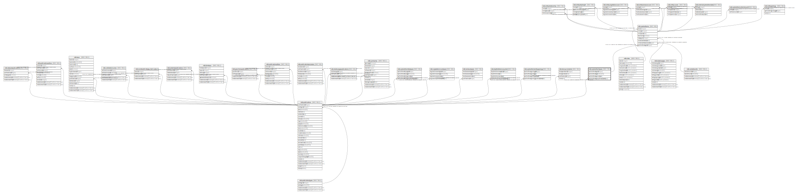

# ndb.speleothemtypes

## Description

## Columns

| # | Name                        | Type        | Default                                                       | Nullable | Children                              | Parents                                 | Comment |
| - | --------------------------- | ----------- | ------------------------------------------------------------- | -------- | ------------------------------------- | --------------------------------------- | ------- |
| 1 | speleothemtypeid            | integer     | nextval('ndb.speleothemtypes_speleothemtypeid_seq'::regclass) | false    | [ndb.speleothems](ndb.speleothems.md) |                                         |         |
| 2 | speleothemtype              | varchar(50) |                                                               | true     |                                       |                                         |         |
| 3 | speleothemtypenotes         | text        |                                                               | true     |                                       |                                         |         |
| 4 | speleothemtypepublicationid | integer     |                                                               | true     |                                       | [ndb.publications](ndb.publications.md) |         |

## Constraints

| # | Name                                             | Type        | Definition                                                                           |
| - | ------------------------------------------------ | ----------- | ------------------------------------------------------------------------------------ |
| 1 | speleothemtypes_speleothemtypepublicationid_fkey | FOREIGN KEY | FOREIGN KEY (speleothemtypepublicationid) REFERENCES ndb.publications(publicationid) |
| 2 | speleothemtypes_pkey                             | PRIMARY KEY | PRIMARY KEY (speleothemtypeid)                                                       |

## Indexes

| # | Name                 | Definition                                                                                     |
| - | -------------------- | ---------------------------------------------------------------------------------------------- |
| 1 | speleothemtypes_pkey | CREATE UNIQUE INDEX speleothemtypes_pkey ON ndb.speleothemtypes USING btree (speleothemtypeid) |

## Relations

---

> Generated by [tbls](https://github.com/k1LoW/tbls)