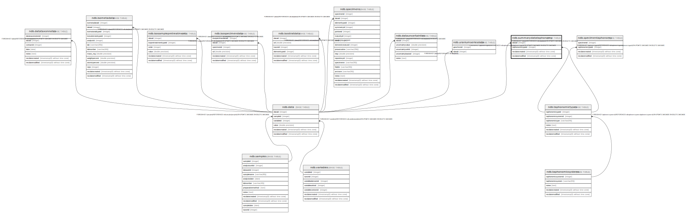

# ndb.summarydatataphonomy

## Description

## Columns

| # | Name             | Type                           | Default                      | Nullable | Children | Parents                                       | Comment |
| - | ---------------- | ------------------------------ | ---------------------------- | -------- | -------- | --------------------------------------------- | ------- |
| 1 | dataid           | integer                        |                              | false    |          | [ndb.data](ndb.data.md)                       |         |
| 2 | taphonomictypeid | integer                        |                              | false    |          | [ndb.taphonomictypes](ndb.taphonomictypes.md) |         |
| 3 | recdatecreated   | timestamp(0) without time zone | timezone('UTC'::text, now()) | false    |          |                                               |         |
| 4 | recdatemodified  | timestamp(0) without time zone |                              | false    |          |                                               |         |

## Constraints

| # | Name                                    | Type        | Definition                                                                                                          |
| - | --------------------------------------- | ----------- | ------------------------------------------------------------------------------------------------------------------- |
| 1 | fk_summarydatataphonomy_data            | FOREIGN KEY | FOREIGN KEY (dataid) REFERENCES ndb.data(dataid) ON UPDATE CASCADE ON DELETE CASCADE                                |
| 2 | summarydatataphonomy_pkey               | PRIMARY KEY | PRIMARY KEY (dataid, taphonomictypeid)                                                                              |
| 3 | fk_summarydatataphonomy_taphonomictypes | FOREIGN KEY | FOREIGN KEY (taphonomictypeid) REFERENCES ndb.taphonomictypes(taphonomictypeid) ON UPDATE CASCADE ON DELETE CASCADE |

## Indexes

| # | Name                      | Definition                                                                                                       |
| - | ------------------------- | ---------------------------------------------------------------------------------------------------------------- |
| 1 | summarydatataphonomy_pkey | CREATE UNIQUE INDEX summarydatataphonomy_pkey ON ndb.summarydatataphonomy USING btree (dataid, taphonomictypeid) |

## Triggers

| # | Name                | Definition                                                                                                                                        |
| - | ------------------- | ------------------------------------------------------------------------------------------------------------------------------------------------- |
| 1 | tr_sites_modifydate | CREATE TRIGGER tr_sites_modifydate BEFORE INSERT OR UPDATE ON ndb.summarydatataphonomy FOR EACH ROW EXECUTE FUNCTION ndb.update_recdatemodified() |

## Relations

---

> Generated by [tbls](https://github.com/k1LoW/tbls)