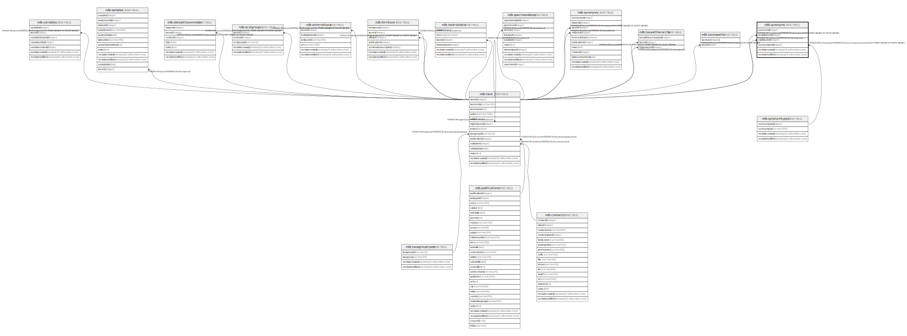

# ndb.synonyms

## Description

This table lists common synonyms for taxa in the Taxa table. No effort has been made to provide a complete taxonomic synonymy, but rather to list synonyms commonly used in recent literature.  This table is not the same as the Synonomy table, also present in Neotoma, which links a specific synonymy to a dataset

## Columns

| # | Name            | Type                           | Default                                         | Nullable | Children | Parents                                 | Comment                                                        |
| - | --------------- | ------------------------------ | ----------------------------------------------- | -------- | -------- | --------------------------------------- | -------------------------------------------------------------- |
| 1 | invalidtaxonid  | integer                        |                                                 | false    |          | [ndb.taxa](ndb.taxa.md)                 |                                                                |
| 2 | recdatecreated  | timestamp(0) without time zone | timezone('UTC'::text, now())                    | false    |          |                                         |                                                                |
| 3 | recdatemodified | timestamp(0) without time zone |                                                 | false    |          |                                         |                                                                |
| 4 | synonymid       | integer                        | nextval('ndb.seq_synonyms_synonymid'::regclass) | false    |          |                                         | An arbitrary synonym identification number.                    |
| 5 | synonymtypeid   | integer                        |                                                 | true     |          | [ndb.synonymtypes](ndb.synonymtypes.md) | Type of synonym. Field links to the SynonymTypes lookup table. |
| 6 | validtaxonid    | integer                        |                                                 | false    |          | [ndb.taxa](ndb.taxa.md)                 |                                                                |

## Constraints

| # | Name                     | Type        | Definition                                                                                                 |
| - | ------------------------ | ----------- | ---------------------------------------------------------------------------------------------------------- |
| 1 | fk_synonyms_invalidtaxa  | FOREIGN KEY | FOREIGN KEY (invalidtaxonid) REFERENCES ndb.taxa(taxonid) ON UPDATE CASCADE ON DELETE CASCADE              |
| 2 | fk_synonyms_synonymtypes | FOREIGN KEY | FOREIGN KEY (synonymtypeid) REFERENCES ndb.synonymtypes(synonymtypeid) ON UPDATE CASCADE ON DELETE CASCADE |
| 3 | fk_synonyms_validtaxa    | FOREIGN KEY | FOREIGN KEY (validtaxonid) REFERENCES ndb.taxa(taxonid)                                                    |
| 4 | synonyms_pkey            | PRIMARY KEY | PRIMARY KEY (synonymid)                                                                                    |

## Indexes

| # | Name                | Definition                                                                                         |
| - | ------------------- | -------------------------------------------------------------------------------------------------- |
| 1 | ix_taxonid_synonyms | CREATE INDEX ix_taxonid_synonyms ON ndb.synonyms USING btree (validtaxonid) WITH (fillfactor='10') |
| 2 | synonyms_pkey       | CREATE UNIQUE INDEX synonyms_pkey ON ndb.synonyms USING btree (synonymid)                          |

## Triggers

| # | Name                | Definition                                                                                                                            |
| - | ------------------- | ------------------------------------------------------------------------------------------------------------------------------------- |
| 1 | tr_sites_modifydate | CREATE TRIGGER tr_sites_modifydate BEFORE INSERT OR UPDATE ON ndb.synonyms FOR EACH ROW EXECUTE FUNCTION ndb.update_recdatemodified() |

## Relations

---

> Generated by [tbls](https://github.com/k1LoW/tbls)