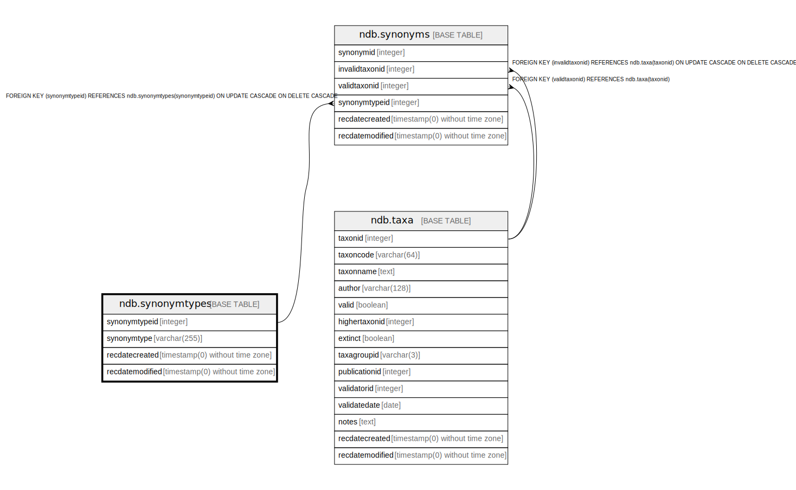

# ndb.synonymtypes

## Description

Lookup table of Synonym Types. Table is referenced by the Synonyms table.

## Columns

| # | Name            | Type                           | Default                                                 | Nullable | Children                        | Parents | Comment                                                                                                                                                                                                                                                                                                                                                                                                                                                                                                                                                                                                                                                                                                                                                                                                                                                                                                                                                                                                                                                                                                                                                                                                                                                                                                                                                                                                                                                                                                                                                                                                                                                                                                                                                                                                                                                                                                                                                                                                                                                                                                                                                                                                                                                                                                                                                                                                                                                                                                                                                                                                                                                                                                                                                                                                                                                                                                                                                                                                                                                                                                                                                                                                                                                                                                                                                                                                                                                                                                                                                                                                                                                                                                                                                                                                                                                                                                                                                                                                                                                                                                                                                                                                                                                                                                                                                                                                                                                                                                                                                                                                                                                                                                                                                                                                                                                                                                                                                                                                                                                                                                                                                                                                                                                                                                                                                                                                                                                                                                                                                                                                                                                                                                                                                                                                                                                                                                                                                                                                                                                                                                                                                        |
| - | --------------- | ------------------------------ | ------------------------------------------------------- | -------- | ------------------------------- | ------- | -------------------------------------------------------------------------------------------------------------------------------------------------------------------------------------------------------------------------------------------------------------------------------------------------------------------------------------------------------------------------------------------------------------------------------------------------------------------------------------------------------------------------------------------------------------------------------------------------------------------------------------------------------------------------------------------------------------------------------------------------------------------------------------------------------------------------------------------------------------------------------------------------------------------------------------------------------------------------------------------------------------------------------------------------------------------------------------------------------------------------------------------------------------------------------------------------------------------------------------------------------------------------------------------------------------------------------------------------------------------------------------------------------------------------------------------------------------------------------------------------------------------------------------------------------------------------------------------------------------------------------------------------------------------------------------------------------------------------------------------------------------------------------------------------------------------------------------------------------------------------------------------------------------------------------------------------------------------------------------------------------------------------------------------------------------------------------------------------------------------------------------------------------------------------------------------------------------------------------------------------------------------------------------------------------------------------------------------------------------------------------------------------------------------------------------------------------------------------------------------------------------------------------------------------------------------------------------------------------------------------------------------------------------------------------------------------------------------------------------------------------------------------------------------------------------------------------------------------------------------------------------------------------------------------------------------------------------------------------------------------------------------------------------------------------------------------------------------------------------------------------------------------------------------------------------------------------------------------------------------------------------------------------------------------------------------------------------------------------------------------------------------------------------------------------------------------------------------------------------------------------------------------------------------------------------------------------------------------------------------------------------------------------------------------------------------------------------------------------------------------------------------------------------------------------------------------------------------------------------------------------------------------------------------------------------------------------------------------------------------------------------------------------------------------------------------------------------------------------------------------------------------------------------------------------------------------------------------------------------------------------------------------------------------------------------------------------------------------------------------------------------------------------------------------------------------------------------------------------------------------------------------------------------------------------------------------------------------------------------------------------------------------------------------------------------------------------------------------------------------------------------------------------------------------------------------------------------------------------------------------------------------------------------------------------------------------------------------------------------------------------------------------------------------------------------------------------------------------------------------------------------------------------------------------------------------------------------------------------------------------------------------------------------------------------------------------------------------------------------------------------------------------------------------------------------------------------------------------------------------------------------------------------------------------------------------------------------------------------------------------------------------------------------------------------------------------------------------------------------------------------------------------------------------------------------------------------------------------------------------------------------------------------------------------------------------------------------------------------------------------------------------------------------------------------------------------------------------------------------------------------------------------------------- |
| 1 | synonymtypeid   | integer                        | nextval('ndb.seq_synonymtypes_synonymtypeid'::regclass) | false    | [ndb.synonyms](ndb.synonyms.md) |         | An arbitrary Synonym Type identification number.                                                                                                                                                                                                                                                                                                                                                                                                                                                                                                                                                                                                                                                                                                                                                                                                                                                                                                                                                                                                                                                                                                                                                                                                                                                                                                                                                                                                                                                                                                                                                                                                                                                                                                                                                                                                                                                                                                                                                                                                                                                                                                                                                                                                                                                                                                                                                                                                                                                                                                                                                                                                                                                                                                                                                                                                                                                                                                                                                                                                                                                                                                                                                                                                                                                                                                                                                                                                                                                                                                                                                                                                                                                                                                                                                                                                                                                                                                                                                                                                                                                                                                                                                                                                                                                                                                                                                                                                                                                                                                                                                                                                                                                                                                                                                                                                                                                                                                                                                                                                                                                                                                                                                                                                                                                                                                                                                                                                                                                                                                                                                                                                                                                                                                                                                                                                                                                                                                                                                                                                                                                                                                               |
| 2 | synonymtype     | varchar(255)                   |                                                         | true     |                                 |         | SynonymType: Synonym type. Below are some examples: *nomenclatural, homotypic, or objective synonym – a synonym that unambiguously refers to the same taxon, particularly one with the same description or type specimen. These synonyms are particularly common above the species level. For example, Gramineae = Poaceae, Clethrionomys gapperi = Myodes gapperi. The term «objective» is used in zoology, whereas «nomenclatural» or «homotypic» is used in botany. *taxonomic, heterotypic, or subjective synonym – a synonym typically based on a different type specimen, but which is now regarded as the same taxon as the senior synonym. For example, Iva ciliata = Iva annua. The term «subjective» is used in zoology, whereas «taxonomic» or «heterotypic» is used in botany. *genus merged into another genus – heterotypic or subjective synonym; a genus has been merged into another genus and has not been retained at a subgeneric rank. This synonymy may apply to either the generic or specific level, for example: Petalostemon = Dalea, Petalostemon purpureus = Dalea purpurea. *family merged into another family – heterotypic or subjective synonym; a family has been merged into another family and has not been retained at a subfamilial rank. For example, the Taxodiaceae has been merged with the Cupressaceae. This synonymy creates issues for data entry, because palynologically the Taxodiaceae sensu stricto is sometimes distinguishable from the Cupressaceae sensu stricto. If a pollen type was identified as «Cupressaceae/Taxodiaceae», then synonymizing to «Cupressaceae» results in no loss of information. However, synonymizing «Taxodiaceae» to «Cupressaceae» potentially does. In this case, consultation with the original literature or knowledge of the local biogeography may point to a logical name change that will retain the precision of the original identification. For example, in the southeastern United States, «Taxodiaceae» can be changed to «Taxodium» or «Taxodium-type» in most situations. If «Cupressaceae» was also identified, then it should be changed to «Cupressaceae undiff.» or possibly «Juniperus-type» if other Cupressaceae such as Chamaecyperus are unlikely. *rank change: species reduced to subspecific rank – heterotypic or subjective synonym; a species has been reduced to a subspecies or variety of another species. These synonyms may be treated in two different ways, depending on the situation or protocols of the contributing data cooperative: (1) The taxon is reduced to the subspecific rank (e.g. Alnus fruticosa = Alnus viridis subsp. fruticosa, Canis familiaris = Canis lupus familiaris), either because the fossils can be assigned to the subspecies based on morphology, as is likely the case with the domestic dog, Canis lupus familiaris, or because the subspecies can be assigned confidently based on biogeography. (2) The taxon is changed to the new taxon and the subspecific rank is dropped because the fossil is not distinguishable at the subspecific level. For example, Alnus rugosa = Alnus incana subsp. rugosa, but may simply be changed to Alnus incana because the pollen of A. incana subsp. rugosa and A. incana subsp. incana are indistinguishable morphologically. *rank change: genus reduced to subgenus – heterotypic or subjective synonym; a genus has been reduced to subgeneric rank in another family. At the generic level, this synonymy is clear from the naming conventions, e.g. Mictomys = Synaptomys (Mictomys); however, at the species level it is not, e.g. Mictomys borealis = Synaptomys borealis. *rank change: family reduced to subfamily – heterotypic or subjective synonym; a family has been reduced to subfamily rank in another family. By botanical convention the family name is retained, e.g. Pyrolaceae = Ericaceae subf. Monotropoideae; whereas by zoological convention it is not, e.g. Desmodontidae = Desmodontinae. *rank change: subspecific rank elevated to species – heterotypic or subjective synonym; a subspecies or variety has been raised to the species rank, e.g. Ephedra fragilis subsp. campylopoda = Ephedra foeminea. *rank change: subgeneric rank elevated to genus – heterotypic or subjective synonym; a subgenus or other subgeneric rank has been raised to the generic rank. At the subgeneric level, this synonymy is clear from the naming conventions, e.g. Potamogeton subg. Coleogeton = Stuckenia; however, at the species level it is not, e.g. Potamogeton pectinatus = Stuckenia pectinata. *rank change: subfamily elevated to family – heterotypic or subjective synonym; a subfamily has been raised to the family rank, e.g. Liliaceae subf. Amaryllidoideae = Amaryllidaceae, Pampatheriinae = Pampatheriidae. *rank elevated because of taxonomic uncertainty – because the precise taxonomic identification is uncertain, the rank has been raised to a level that includes the universe of possible taxa. A common cause of such uncertainty is taxonomic splitting subsequent to the original identification, in which case the originally identified taxon is now a much smaller group. For example, the genus Psoralea has been divided into several genera; the genus Psoralea still exists, but now includes a much smaller number of species. Consequently, in the database Psoralea has been synonymized with Fabaceae tribe Psoraleeae, which includes the former Psoralea sensu lato. A zoological example is Mustela sp. The genus Mustela formerly included the minks, which have now been separated into the genus Neovison. Consequently, Mustela sp. = Mustela/Neovison sp. *globally monospecific genus – although identified at the genus level, specimens assigned to this genus can be further assigned to the species level because the genus is monospecific. *globally monogeneric family – although identified at the family level, specimens assigned to this family can be further assigned to the genus level because the family is monogeneric.  |
| 3 | recdatecreated  | timestamp(0) without time zone | timezone('UTC'::text, now())                            | false    |                                 |         |                                                                                                                                                                                                                                                                                                                                                                                                                                                                                                                                                                                                                                                                                                                                                                                                                                                                                                                                                                                                                                                                                                                                                                                                                                                                                                                                                                                                                                                                                                                                                                                                                                                                                                                                                                                                                                                                                                                                                                                                                                                                                                                                                                                                                                                                                                                                                                                                                                                                                                                                                                                                                                                                                                                                                                                                                                                                                                                                                                                                                                                                                                                                                                                                                                                                                                                                                                                                                                                                                                                                                                                                                                                                                                                                                                                                                                                                                                                                                                                                                                                                                                                                                                                                                                                                                                                                                                                                                                                                                                                                                                                                                                                                                                                                                                                                                                                                                                                                                                                                                                                                                                                                                                                                                                                                                                                                                                                                                                                                                                                                                                                                                                                                                                                                                                                                                                                                                                                                                                                                                                                                                                                                                                |
| 4 | recdatemodified | timestamp(0) without time zone |                                                         | false    |                                 |         |                                                                                                                                                                                                                                                                                                                                                                                                                                                                                                                                                                                                                                                                                                                                                                                                                                                                                                                                                                                                                                                                                                                                                                                                                                                                                                                                                                                                                                                                                                                                                                                                                                                                                                                                                                                                                                                                                                                                                                                                                                                                                                                                                                                                                                                                                                                                                                                                                                                                                                                                                                                                                                                                                                                                                                                                                                                                                                                                                                                                                                                                                                                                                                                                                                                                                                                                                                                                                                                                                                                                                                                                                                                                                                                                                                                                                                                                                                                                                                                                                                                                                                                                                                                                                                                                                                                                                                                                                                                                                                                                                                                                                                                                                                                                                                                                                                                                                                                                                                                                                                                                                                                                                                                                                                                                                                                                                                                                                                                                                                                                                                                                                                                                                                                                                                                                                                                                                                                                                                                                                                                                                                                                                                |

## Constraints

| # | Name              | Type        | Definition                  |
| - | ----------------- | ----------- | --------------------------- |
| 1 | synonymtypes_pkey | PRIMARY KEY | PRIMARY KEY (synonymtypeid) |

## Indexes

| # | Name              | Definition                                                                            |
| - | ----------------- | ------------------------------------------------------------------------------------- |
| 1 | synonymtypes_pkey | CREATE UNIQUE INDEX synonymtypes_pkey ON ndb.synonymtypes USING btree (synonymtypeid) |

## Triggers

| # | Name                | Definition                                                                                                                                |
| - | ------------------- | ----------------------------------------------------------------------------------------------------------------------------------------- |
| 1 | tr_sites_modifydate | CREATE TRIGGER tr_sites_modifydate BEFORE INSERT OR UPDATE ON ndb.synonymtypes FOR EACH ROW EXECUTE FUNCTION ndb.update_recdatemodified() |

## Relations

---

> Generated by [tbls](https://github.com/k1LoW/tbls)