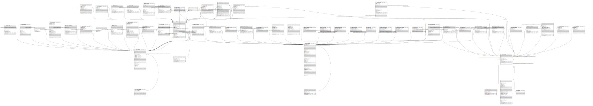

# ndb.synonymy

## Description

The synonymy table links dataset-level synonymies to particular publications or contacts.  This allows users to maintain the original taxonomic information within a table, but tie it to newer and more authoritative taxonomic information.

## Columns

| #  | Name            | Type                           | Default                                          | Nullable | Children | Parents                                 | Comment                           |
| -- | --------------- | ------------------------------ | ------------------------------------------------ | -------- | -------- | --------------------------------------- | --------------------------------- |
| 1  | synonymyid      | integer                        | nextval('ndb.seq_synonymy_synonymyid'::regclass) | false    |          |                                         |                                   |
| 2  | datasetid       | integer                        |                                                  | false    |          | [ndb.datasets](ndb.datasets.md)         | DatasetID from the Datasets table |
| 3  | taxonid         | integer                        |                                                  | false    |          | [ndb.taxa](ndb.taxa.md)                 |                                   |
| 4  | reftaxonid      | integer                        |                                                  | false    |          | [ndb.taxa](ndb.taxa.md)                 |                                   |
| 5  | fromcontributor | boolean                        |                                                  | true     |          |                                         |                                   |
| 6  | publicationid   | integer                        |                                                  | true     |          | [ndb.publications](ndb.publications.md) |                                   |
| 7  | notes           | text                           |                                                  | true     |          |                                         |                                   |
| 8  | contactid       | integer                        |                                                  | true     |          | [ndb.contacts](ndb.contacts.md)         |                                   |
| 9  | datesynonymized | date                           |                                                  | true     |          |                                         |                                   |
| 10 | recdatecreated  | timestamp(0) without time zone | timezone('UTC'::text, now())                     | false    |          |                                         |                                   |
| 11 | recdatemodified | timestamp(0) without time zone |                                                  | false    |          |                                         |                                   |

## Constraints

| # | Name                     | Type        | Definition                                                                                                 |
| - | ------------------------ | ----------- | ---------------------------------------------------------------------------------------------------------- |
| 1 | fk_synonymy_contacts     | FOREIGN KEY | FOREIGN KEY (contactid) REFERENCES ndb.contacts(contactid)                                                 |
| 2 | fk_synonymy_datasets     | FOREIGN KEY | FOREIGN KEY (datasetid) REFERENCES ndb.datasets(datasetid) ON UPDATE CASCADE ON DELETE CASCADE             |
| 3 | fk_synonymy_publications | FOREIGN KEY | FOREIGN KEY (publicationid) REFERENCES ndb.publications(publicationid) ON UPDATE CASCADE ON DELETE CASCADE |
| 4 | synonymy_pkey            | PRIMARY KEY | PRIMARY KEY (synonymyid)                                                                                   |
| 5 | fk_synonymy_taxa1        | FOREIGN KEY | FOREIGN KEY (taxonid) REFERENCES ndb.taxa(taxonid) ON UPDATE CASCADE ON DELETE CASCADE                     |
| 6 | fk_synonymy_taxa2        | FOREIGN KEY | FOREIGN KEY (reftaxonid) REFERENCES ndb.taxa(taxonid)                                                      |

## Indexes

| # | Name          | Definition                                                                 |
| - | ------------- | -------------------------------------------------------------------------- |
| 1 | synonymy_pkey | CREATE UNIQUE INDEX synonymy_pkey ON ndb.synonymy USING btree (synonymyid) |

## Triggers

| # | Name                | Definition                                                                                                                            |
| - | ------------------- | ------------------------------------------------------------------------------------------------------------------------------------- |
| 1 | tr_sites_modifydate | CREATE TRIGGER tr_sites_modifydate BEFORE INSERT OR UPDATE ON ndb.synonymy FOR EACH ROW EXECUTE FUNCTION ndb.update_recdatemodified() |

## Relations

---

> Generated by [tbls](https://github.com/k1LoW/tbls)