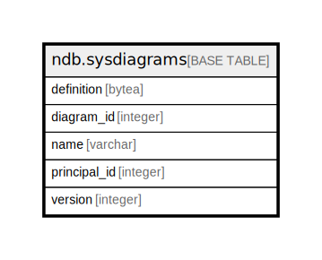

# ndb.sysdiagrams

## Description

## Columns

| # | Name         | Type    | Default                                             | Nullable | Children | Parents | Comment |
| - | ------------ | ------- | --------------------------------------------------- | -------- | -------- | ------- | ------- |
| 1 | name         | varchar |                                                     | false    |          |         |         |
| 2 | principal_id | integer |                                                     | false    |          |         |         |
| 3 | diagram_id   | integer | nextval('ndb.seq_sysdiagrams_diagram_id'::regclass) | false    |          |         |         |
| 4 | version      | integer |                                                     | true     |          |         |         |
| 5 | definition   | bytea   |                                                     | true     |          |         |         |

## Constraints

| # | Name             | Type        | Definition               |
| - | ---------------- | ----------- | ------------------------ |
| 1 | sysdiagrams_pkey | PRIMARY KEY | PRIMARY KEY (diagram_id) |

## Indexes

| # | Name             | Definition                                                                       |
| - | ---------------- | -------------------------------------------------------------------------------- |
| 1 | sysdiagrams_pkey | CREATE UNIQUE INDEX sysdiagrams_pkey ON ndb.sysdiagrams USING btree (diagram_id) |

## Relations

---

> Generated by [tbls](https://github.com/k1LoW/tbls)