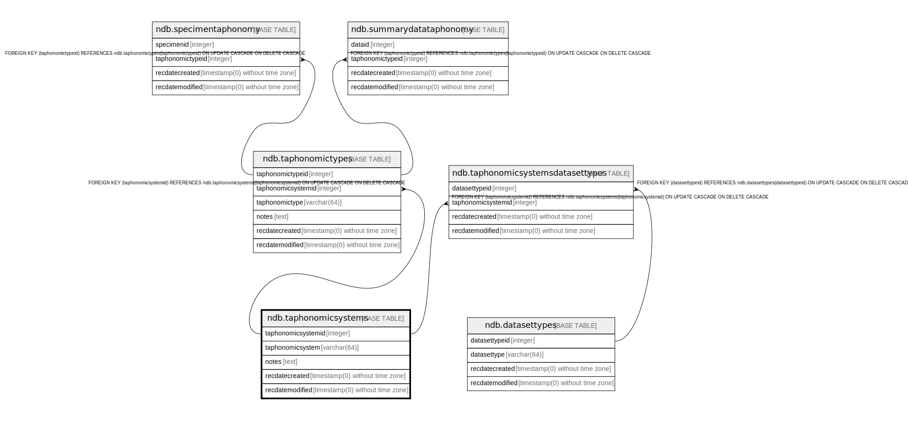

# ndb.taphonomicsystems

## Description

## Columns

| # | Name               | Type                           | Default                                                           | Nullable | Children                                                                                                                | Parents | Comment |
| - | ------------------ | ------------------------------ | ----------------------------------------------------------------- | -------- | ----------------------------------------------------------------------------------------------------------------------- | ------- | ------- |
| 1 | notes              | text                           |                                                                   | true     |                                                                                                                         |         |         |
| 2 | recdatecreated     | timestamp(0) without time zone | timezone('UTC'::text, now())                                      | false    |                                                                                                                         |         |         |
| 3 | recdatemodified    | timestamp(0) without time zone |                                                                   | false    |                                                                                                                         |         |         |
| 4 | taphonomicsystem   | varchar(64)                    |                                                                   | false    |                                                                                                                         |         |         |
| 5 | taphonomicsystemid | integer                        | nextval('ndb.seq_taphonomicsystems_taphonomicsystemid'::regclass) | false    | [ndb.taphonomicsystemsdatasettypes](ndb.taphonomicsystemsdatasettypes.md) [ndb.taphonomictypes](ndb.taphonomictypes.md) |         |         |

## Constraints

| # | Name                   | Type        | Definition                       |
| - | ---------------------- | ----------- | -------------------------------- |
| 1 | taphonomicsystems_pkey | PRIMARY KEY | PRIMARY KEY (taphonomicsystemid) |

## Indexes

| # | Name                   | Definition                                                                                           |
| - | ---------------------- | ---------------------------------------------------------------------------------------------------- |
| 1 | taphonomicsystems_pkey | CREATE UNIQUE INDEX taphonomicsystems_pkey ON ndb.taphonomicsystems USING btree (taphonomicsystemid) |

## Triggers

| # | Name                | Definition                                                                                                                                     |
| - | ------------------- | ---------------------------------------------------------------------------------------------------------------------------------------------- |
| 1 | tr_sites_modifydate | CREATE TRIGGER tr_sites_modifydate BEFORE INSERT OR UPDATE ON ndb.taphonomicsystems FOR EACH ROW EXECUTE FUNCTION ndb.update_recdatemodified() |

## Relations

---

> Generated by [tbls](https://github.com/k1LoW/tbls)