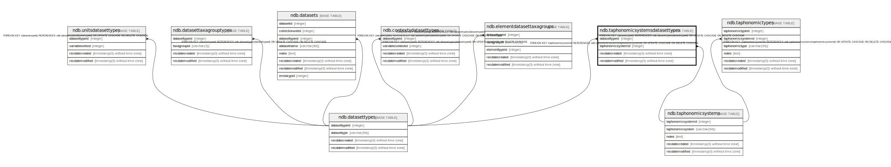

# ndb.taphonomicsystemsdatasettypes

## Description

## Columns

| # | Name               | Type                           | Default                      | Nullable | Children | Parents                                           | Comment |
| - | ------------------ | ------------------------------ | ---------------------------- | -------- | -------- | ------------------------------------------------- | ------- |
| 1 | datasettypeid      | integer                        |                              | false    |          | [ndb.datasettypes](ndb.datasettypes.md)           |         |
| 2 | taphonomicsystemid | integer                        |                              | false    |          | [ndb.taphonomicsystems](ndb.taphonomicsystems.md) |         |
| 3 | recdatecreated     | timestamp(0) without time zone | timezone('UTC'::text, now()) | false    |          |                                                   |         |
| 4 | recdatemodified    | timestamp(0) without time zone |                              | false    |          |                                                   |         |

## Constraints

| # | Name                                                           | Type        | Definition                                                                                                                |
| - | -------------------------------------------------------------- | ----------- | ------------------------------------------------------------------------------------------------------------------------- |
| 1 | fk_taphonomicsystemsdatasettypes_taphonomicsystemsdatasettypes | FOREIGN KEY | FOREIGN KEY (datasettypeid) REFERENCES ndb.datasettypes(datasettypeid) ON UPDATE CASCADE ON DELETE CASCADE                |
| 2 | fk_taphonomicsystemsdatasettypes_taphonomicsystems             | FOREIGN KEY | FOREIGN KEY (taphonomicsystemid) REFERENCES ndb.taphonomicsystems(taphonomicsystemid) ON UPDATE CASCADE ON DELETE CASCADE |
| 3 | taphonomicsystemsdatasettypes_pkey                             | PRIMARY KEY | PRIMARY KEY (datasettypeid, taphonomicsystemid)                                                                           |

## Indexes

| # | Name                               | Definition                                                                                                                                  |
| - | ---------------------------------- | ------------------------------------------------------------------------------------------------------------------------------------------- |
| 1 | taphonomicsystemsdatasettypes_pkey | CREATE UNIQUE INDEX taphonomicsystemsdatasettypes_pkey ON ndb.taphonomicsystemsdatasettypes USING btree (datasettypeid, taphonomicsystemid) |

## Triggers

| # | Name                | Definition                                                                                                                                                 |
| - | ------------------- | ---------------------------------------------------------------------------------------------------------------------------------------------------------- |
| 1 | tr_sites_modifydate | CREATE TRIGGER tr_sites_modifydate BEFORE INSERT OR UPDATE ON ndb.taphonomicsystemsdatasettypes FOR EACH ROW EXECUTE FUNCTION ndb.update_recdatemodified() |

## Relations

---

> Generated by [tbls](https://github.com/k1LoW/tbls)