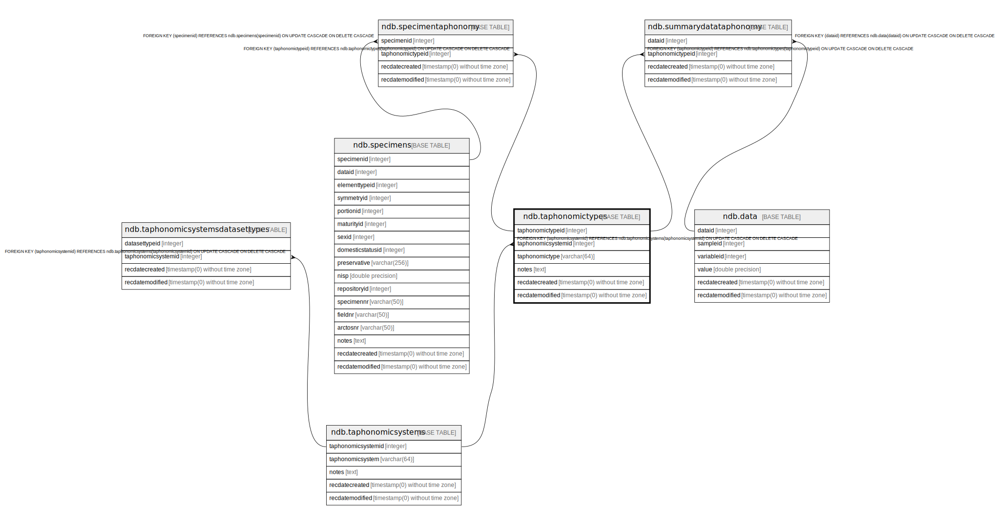

# ndb.taphonomictypes

## Description

## Columns

| # | Name               | Type                           | Default                                                       | Nullable | Children                                                                                                  | Parents                                           | Comment |
| - | ------------------ | ------------------------------ | ------------------------------------------------------------- | -------- | --------------------------------------------------------------------------------------------------------- | ------------------------------------------------- | ------- |
| 1 | notes              | text                           |                                                               | true     |                                                                                                           |                                                   |         |
| 2 | recdatecreated     | timestamp(0) without time zone | timezone('UTC'::text, now())                                  | false    |                                                                                                           |                                                   |         |
| 3 | recdatemodified    | timestamp(0) without time zone |                                                               | false    |                                                                                                           |                                                   |         |
| 4 | taphonomicsystemid | integer                        |                                                               | true     |                                                                                                           | [ndb.taphonomicsystems](ndb.taphonomicsystems.md) |         |
| 5 | taphonomictype     | varchar(64)                    |                                                               | false    |                                                                                                           |                                                   |         |
| 6 | taphonomictypeid   | integer                        | nextval('ndb.seq_taphonomictypes_taphonomictypeid'::regclass) | false    | [ndb.specimentaphonomy](ndb.specimentaphonomy.md) [ndb.summarydatataphonomy](ndb.summarydatataphonomy.md) |                                                   |         |

## Constraints

| # | Name                                 | Type        | Definition                                                                                                                |
| - | ------------------------------------ | ----------- | ------------------------------------------------------------------------------------------------------------------------- |
| 1 | fk_taphonomictypes_taphonomicsystems | FOREIGN KEY | FOREIGN KEY (taphonomicsystemid) REFERENCES ndb.taphonomicsystems(taphonomicsystemid) ON UPDATE CASCADE ON DELETE CASCADE |
| 2 | taphonomictypes_pkey                 | PRIMARY KEY | PRIMARY KEY (taphonomictypeid)                                                                                            |

## Indexes

| # | Name                 | Definition                                                                                     |
| - | -------------------- | ---------------------------------------------------------------------------------------------- |
| 1 | taphonomictypes_pkey | CREATE UNIQUE INDEX taphonomictypes_pkey ON ndb.taphonomictypes USING btree (taphonomictypeid) |

## Triggers

| # | Name                | Definition                                                                                                                                   |
| - | ------------------- | -------------------------------------------------------------------------------------------------------------------------------------------- |
| 1 | tr_sites_modifydate | CREATE TRIGGER tr_sites_modifydate BEFORE INSERT OR UPDATE ON ndb.taphonomictypes FOR EACH ROW EXECUTE FUNCTION ndb.update_recdatemodified() |

## Relations

---

> Generated by [tbls](https://github.com/k1LoW/tbls)