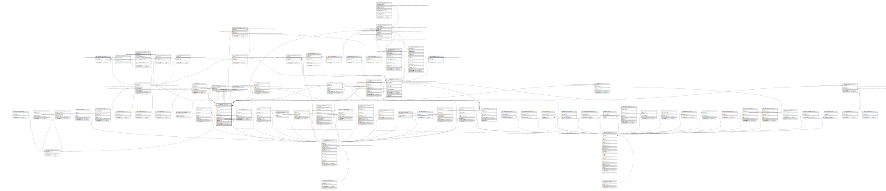

# ndb.taxa

## Description

This table lists all taxa in the database. Most taxa are biological taxa; however, some are biometric measures and some are physical parameters.

## Columns

| #  | Name            | Type                           | Default                                   | Nullable | Children                                                                                                                                                                                                                                                                                                                                                                                                                                                                                    | Parents                                     | Comment                                                                                                                                                                                                                                                                                                                                                                                                                                                                                                                                                                                                                                                                                                                                                                                                                                                                                                                                                                                                                                                                                                                                                                                                                                                                                                                                                                                                                                                                                                                                                                                                                                                                                                                                                                                                                                                                                                                                                                                                                                                                                                                                                                                                                                                                                                                                                                                                                                                                                                                                                                                                                                                                                                                                                                                                                                                                                                                                                                                                                                                                                                                                                                                                                                                                                                                                                                                                                                                                                                                                                                                                                                                                                                                                                                                                                                                                                                                                                                                                                                                                                                                                                                                                                                                        |
| -- | --------------- | ------------------------------ | ----------------------------------------- | -------- | ------------------------------------------------------------------------------------------------------------------------------------------------------------------------------------------------------------------------------------------------------------------------------------------------------------------------------------------------------------------------------------------------------------------------------------------------------------------------------------------- | ------------------------------------------- | -------------------------------------------------------------------------------------------------------------------------------------------------------------------------------------------------------------------------------------------------------------------------------------------------------------------------------------------------------------------------------------------------------------------------------------------------------------------------------------------------------------------------------------------------------------------------------------------------------------------------------------------------------------------------------------------------------------------------------------------------------------------------------------------------------------------------------------------------------------------------------------------------------------------------------------------------------------------------------------------------------------------------------------------------------------------------------------------------------------------------------------------------------------------------------------------------------------------------------------------------------------------------------------------------------------------------------------------------------------------------------------------------------------------------------------------------------------------------------------------------------------------------------------------------------------------------------------------------------------------------------------------------------------------------------------------------------------------------------------------------------------------------------------------------------------------------------------------------------------------------------------------------------------------------------------------------------------------------------------------------------------------------------------------------------------------------------------------------------------------------------------------------------------------------------------------------------------------------------------------------------------------------------------------------------------------------------------------------------------------------------------------------------------------------------------------------------------------------------------------------------------------------------------------------------------------------------------------------------------------------------------------------------------------------------------------------------------------------------------------------------------------------------------------------------------------------------------------------------------------------------------------------------------------------------------------------------------------------------------------------------------------------------------------------------------------------------------------------------------------------------------------------------------------------------------------------------------------------------------------------------------------------------------------------------------------------------------------------------------------------------------------------------------------------------------------------------------------------------------------------------------------------------------------------------------------------------------------------------------------------------------------------------------------------------------------------------------------------------------------------------------------------------------------------------------------------------------------------------------------------------------------------------------------------------------------------------------------------------------------------------------------------------------------------------------------------------------------------------------------------------------------------------------------------------------------------------------------------------------------------------------- |
| 1  | taxonid         | integer                        | nextval('ndb.seq_taxa_taxonid'::regclass) | false    | [ndb.variables](ndb.variables.md) [ndb.samples](ndb.samples.md) [ndb.taxa](ndb.taxa.md) [ndb.datasettaxonnotes](ndb.datasettaxonnotes.md) [ndb.ecolgroups](ndb.ecolgroups.md) [ndb.externaltaxa](ndb.externaltaxa.md) [ndb.formtaxa](ndb.formtaxa.md) [ndb.isostratdata](ndb.isostratdata.md) [ndb.specimendates](ndb.specimendates.md) [ndb.synonyms](ndb.synonyms.md) [ndb.synonymy](ndb.synonymy.md) [ndb.taxaalthierarchy](ndb.taxaalthierarchy.md) [ndb.taxonpaths](ndb.taxonpaths.md) |                                             | An arbitrary Taxon identification number.                                                                                                                                                                                                                                                                                                                                                                                                                                                                                                                                                                                                                                                                                                                                                                                                                                                                                                                                                                                                                                                                                                                                                                                                                                                                                                                                                                                                                                                                                                                                                                                                                                                                                                                                                                                                                                                                                                                                                                                                                                                                                                                                                                                                                                                                                                                                                                                                                                                                                                                                                                                                                                                                                                                                                                                                                                                                                                                                                                                                                                                                                                                                                                                                                                                                                                                                                                                                                                                                                                                                                                                                                                                                                                                                                                                                                                                                                                                                                                                                                                                                                                                                                                                                                      |
| 2  | taxoncode       | varchar(64)                    |                                           | false    |                                                                                                                                                                                                                                                                                                                                                                                                                                                                                             |                                             | A code for the Taxon. These codes are useful for other software or output for which the complete name is too long. Because of the very large number of taxa, codes can be duplicated for different Taxa Groups. In general, these various Taxa Groups are analyzed separately, and no duplication will occur within a dataset. However, if Taxa Groups are combined, unique codes can be generated by prefixing with the TaxaGroupID, For example: *VPL:Cle Clethra *MAM:Cle Clethrionomys A set of conventions has been established for codes. In some cases conventions differ depending on whether the organism is covered by rules of botanical nomenclature (BN) or zoological nomenclature (ZN). *Genus – Three-letter code, first letter capitalized, generally the first three unless already used. **Ace Acer **Cle Clethrionomys *Subgenus – The genus code plus a two-letter subgenus code, first letter capitalized, separated by a period. **Pin.Pi Pinus subg. Pinus **Syn.Mi Synaptomys (Mictomys) *Species – The genus code plus a two-letter, lower-case species code, separated by a period. **Ace.sa Acer saccharum **Ace.sc Acer saccharinum **Cle.ga Clethrionomys gapperi *Subspecies or variety – The species code a two-letter, lower-case subspecies code, separated by a period. **Aln.vi.si Alnus viridis subsp. Sinuata **Bis.bi.an Bison bison antiquus *Family – Six-letter code, first letter capitalized, consisting of three letters followed by «eae» (BN) or «dae» (ZN). **Roseae Rosaceae **Bovdae Bovidae *Subfamily or tribe – (BN) Family code plus two-letter subfamily code, first letter capitalized, separated by a priod. (ZN) Six-letter code, first letter capitalized, consisting of three letters followed by «nae». **Asteae.As Asteraceae subf. Asteroideae **Asteae.Cy Asteraceae tribe Cynarea **Arvnae Arvicolinae *Order – (BN) Six-letter code, first letter capitalized, consisting of three letters followed by «les». (ZN) Six-letter code, first letter capitalized, consisting of three letters, followed by the last three letters of the order name, unless the order name is ≤6 letters long, in which case the code = the order name. Zoological orders do not have a common ending. **Ercles Ericales **Artyla Artiodactyla **Rodtia Rodentia *Taxonomic levels higher than order – Six-letter code, first letter capitalized, consisting of three letters, followed by the last three letters of the order name, unless the order name is ≤6 letters long, in which case the code = the order name.. **Magida Magnoliopsida **Magyta Magnoliophyta **Mamlia Mammalia *Types – The conventional taxon code followed by «-type». **Aln.in-t Alnus incana-type **Amb-t Ambrosia-type *cf. – «cf. » is placed in the proper position. **Odc.cf.he Odocoileus cf. O. hemionus **cf.Odc.he cf. Odocoileus hemionus **cf.Odc cf. Odocoileus *aff. – «aff. » is abbreviated to «af. ». **af.Can.di aff. Canis dirus *? – «?» is placed in the proper position. **?Pro.lo ?Procyon lotor *Alternative names – A slash is placed between the conventional abbreviations for the alternative taxa. **Ost/Cpn Ostrya/Carpinus **Mstdae/Mepdae Mustelidae/Mephitidae *Undifferentiated taxa – (BN) «.ud» is added to the code. (ZN) «.sp » is added to the code. **Aln.ud Alnus undiff. **Roseae.ud Rosaceae undiff. **Mms.sp Mammuthus sp. **Taydae.sp Tayassuidae sp *Parenthetic modifiers – The conventional taxon code with an appropriate abbreviation for the modifier separated by periods. Multiple modifiers also separated by periods. *Abbreviations for pollen morphological modifiers follow Iversen and Troels-Smith (1950). **Raneae.C3 Ranunculaceae (tricolpate) **Raneae.Cperi Ranunculaceae (pericolpate) **Pineae.ves.ud Pinaceae (vesiculate) undiff. **Myteae.Csyn.psi Myrtaceae (syncolpate, psilate) **Bet.\>20µ Betula (\>20 µm) *Non-biological taxa – Use appropriate abbreviations. **bulk.dens Bulk density **LOI Loss-on-ignition **Bet.pol.diam Betula mean pollen-grain diameter  |
| 3  | taxonname       | text                           |                                           | false    |                                                                                                                                                                                                                                                                                                                                                                                                                                                                                             |                                             | Name of the taxon. Most TaxonNames are biological taxa; however, some are biometric measures and some are physical parameters. In addition, some biological taxa may have parenthetic non-Latin modifers, e.g. «Betula (\>20 µm)» for Betula pollen grains \>20 µm in diameter. In general, the names used in Neotoma are those used by the original investigator. In particular, identifications are not changed, although Dataset notes can be added to the database regarding particular identifications. However, some corrections and synonymizations are made. These include: *Misspellings are corrected. *Nomenclatural, homotypic, or objective synonyms may be applied. Because these synonyms unambiguously refer to the same taxon, no change in identification is implied. For example, the old family name for the grasses «Gramineae» is changed to «Poaceae». *Taxonomic, heterotypic, or subjective synonyms may be applied if the change does not effectively assign the specimen to a different taxon. Although two names may have been based on different type specimens, if further research has shown that these are in fact the same taxon, the name is changed to the accepted name. These synonymizations should not cause confusion. However, uncritical synonymization, although taxonomically correct, can result in loss of information, and should be avoided. For example, although a number of recent studies have shown that the Taxodiaceae should be merged with the Cupressaceae, simply synonymizing Taxodiaceae with Cupressaceae may expand the universe of taxa beyond that implied by the original investigator. For example, a palynologist in the southeastern United States may have used «Taxodiaceae» to imply «Taxodium», which is the only genus of the family that has occurred in the region since the Pliocene, but used the the family name because, palynologically, Taxodiuim cannot be differentiated from other Taxodiaceae. However, well preserved Taxodium pollen grains can be differentiated from the other Cupressaceous genera in the region, Juniperus and Chamaecyperus. Thus, the appropriate synonymization for «Taxodiaceae» in this region would be «Taxodium» or «Taxodium-type», which would retain the original taxonomic precision. On the other hand, the old «TCT» shorthand for «Taxodiaceae/Cupressaceae/Taxaceae» now becomes «Cupressaceae/Taxaceae» with no loss of information. *For alternative taxonomic designations, the order may be changed. For example, «Ostrya/Carpinus» would be substituted for «Carpinus/Ostrya».                                                                                                                                                                                                                                                                                                                                                                                                                                                                                                                                                                                                                                                                                                                                                                                                                                                                                                                                                                                                                                                                                                                                                                                                                                                                                                                                                                                                                                                                                                                                                                                                                                  |
| 4  | author          | varchar(128)                   |                                           | true     |                                                                                                                                                                                                                                                                                                                                                                                                                                                                                             |                                             | Author(s) of the name. Neither the pollen database nor FAUNMAP stored author names, so these do not currently exist in Neotoma for plant and mammal names. These databases follow standard taxonomic references (e.g. Flora of North America, Flora Europaea, Wilson and Reeder's Mammal Species of the World), which, of course, do cite the original authors. However, for beetles, the standard practice is to cite original author names; therefore, this field was added to Neotoma.                                                                                                                                                                                                                                                                                                                                                                                                                                                                                                                                                                                                                                                                                                                                                                                                                                                                                                                                                                                                                                                                                                                                                                                                                                                                                                                                                                                                                                                                                                                                                                                                                                                                                                                                                                                                                                                                                                                                                                                                                                                                                                                                                                                                                                                                                                                                                                                                                                                                                                                                                                                                                                                                                                                                                                                                                                                                                                                                                                                                                                                                                                                                                                                                                                                                                                                                                                                                                                                                                                                                                                                                                                                                                                                                                                      |
| 5  | valid           | boolean                        |                                           | true     |                                                                                                                                                                                                                                                                                                                                                                                                                                                                                             |                                             |                                                                                                                                                                                                                                                                                                                                                                                                                                                                                                                                                                                                                                                                                                                                                                                                                                                                                                                                                                                                                                                                                                                                                                                                                                                                                                                                                                                                                                                                                                                                                                                                                                                                                                                                                                                                                                                                                                                                                                                                                                                                                                                                                                                                                                                                                                                                                                                                                                                                                                                                                                                                                                                                                                                                                                                                                                                                                                                                                                                                                                                                                                                                                                                                                                                                                                                                                                                                                                                                                                                                                                                                                                                                                                                                                                                                                                                                                                                                                                                                                                                                                                                                                                                                                                                                |
| 6  | highertaxonid   | integer                        |                                           | true     |                                                                                                                                                                                                                                                                                                                                                                                                                                                                                             | [ndb.taxa](ndb.taxa.md)                     | The TaxonID of the next higher taxonomic rank, for example, the HigherTaxonID for «Bison» is the TaxonID for «Bovidae». For «cf.'s» and «-types», the next higher rank may be much higher owing to the uncertainty of the identification; the HigherTaxonID for «cf. Bison bison» is the TaxonId for «Mammalia». The HigherTaxonID implements the taxonomic hierarchy in Neotoma.                                                                                                                                                                                                                                                                                                                                                                                                                                                                                                                                                                                                                                                                                                                                                                                                                                                                                                                                                                                                                                                                                                                                                                                                                                                                                                                                                                                                                                                                                                                                                                                                                                                                                                                                                                                                                                                                                                                                                                                                                                                                                                                                                                                                                                                                                                                                                                                                                                                                                                                                                                                                                                                                                                                                                                                                                                                                                                                                                                                                                                                                                                                                                                                                                                                                                                                                                                                                                                                                                                                                                                                                                                                                                                                                                                                                                                                                              |
| 7  | extinct         | boolean                        |                                           | false    |                                                                                                                                                                                                                                                                                                                                                                                                                                                                                             |                                             | True if the taxon is extinct, False if extant.                                                                                                                                                                                                                                                                                                                                                                                                                                                                                                                                                                                                                                                                                                                                                                                                                                                                                                                                                                                                                                                                                                                                                                                                                                                                                                                                                                                                                                                                                                                                                                                                                                                                                                                                                                                                                                                                                                                                                                                                                                                                                                                                                                                                                                                                                                                                                                                                                                                                                                                                                                                                                                                                                                                                                                                                                                                                                                                                                                                                                                                                                                                                                                                                                                                                                                                                                                                                                                                                                                                                                                                                                                                                                                                                                                                                                                                                                                                                                                                                                                                                                                                                                                                                                 |
| 8  | taxagroupid     | varchar(3)                     |                                           | false    |                                                                                                                                                                                                                                                                                                                                                                                                                                                                                             | [ndb.taxagrouptypes](ndb.taxagrouptypes.md) | The TaxaGroupID facilitates rapid extraction of taxa groups that are typically grouped together for analysis. Some of these groups contain taxa in different classes or phyla. For example, vascular plants include the Spermatophyta and Pteridophyta; the herps include Reptilia and Amphibia; the testate amoebae include taxa from different phyla. Field links to the TaxaGroupTypes table.                                                                                                                                                                                                                                                                                                                                                                                                                                                                                                                                                                                                                                                                                                                                                                                                                                                                                                                                                                                                                                                                                                                                                                                                                                                                                                                                                                                                                                                                                                                                                                                                                                                                                                                                                                                                                                                                                                                                                                                                                                                                                                                                                                                                                                                                                                                                                                                                                                                                                                                                                                                                                                                                                                                                                                                                                                                                                                                                                                                                                                                                                                                                                                                                                                                                                                                                                                                                                                                                                                                                                                                                                                                                                                                                                                                                                                                               |
| 9  | publicationid   | integer                        |                                           | true     |                                                                                                                                                                                                                                                                                                                                                                                                                                                                                             | [ndb.publications](ndb.publications.md)     | Publication identification number. Field links to the Publications table.                                                                                                                                                                                                                                                                                                                                                                                                                                                                                                                                                                                                                                                                                                                                                                                                                                                                                                                                                                                                                                                                                                                                                                                                                                                                                                                                                                                                                                                                                                                                                                                                                                                                                                                                                                                                                                                                                                                                                                                                                                                                                                                                                                                                                                                                                                                                                                                                                                                                                                                                                                                                                                                                                                                                                                                                                                                                                                                                                                                                                                                                                                                                                                                                                                                                                                                                                                                                                                                                                                                                                                                                                                                                                                                                                                                                                                                                                                                                                                                                                                                                                                                                                                                      |
| 10 | validatorid     | integer                        |                                           | true     |                                                                                                                                                                                                                                                                                                                                                                                                                                                                                             | [ndb.contacts](ndb.contacts.md)             |                                                                                                                                                                                                                                                                                                                                                                                                                                                                                                                                                                                                                                                                                                                                                                                                                                                                                                                                                                                                                                                                                                                                                                                                                                                                                                                                                                                                                                                                                                                                                                                                                                                                                                                                                                                                                                                                                                                                                                                                                                                                                                                                                                                                                                                                                                                                                                                                                                                                                                                                                                                                                                                                                                                                                                                                                                                                                                                                                                                                                                                                                                                                                                                                                                                                                                                                                                                                                                                                                                                                                                                                                                                                                                                                                                                                                                                                                                                                                                                                                                                                                                                                                                                                                                                                |
| 11 | validatedate    | date                           |                                           | true     |                                                                                                                                                                                                                                                                                                                                                                                                                                                                                             |                                             |                                                                                                                                                                                                                                                                                                                                                                                                                                                                                                                                                                                                                                                                                                                                                                                                                                                                                                                                                                                                                                                                                                                                                                                                                                                                                                                                                                                                                                                                                                                                                                                                                                                                                                                                                                                                                                                                                                                                                                                                                                                                                                                                                                                                                                                                                                                                                                                                                                                                                                                                                                                                                                                                                                                                                                                                                                                                                                                                                                                                                                                                                                                                                                                                                                                                                                                                                                                                                                                                                                                                                                                                                                                                                                                                                                                                                                                                                                                                                                                                                                                                                                                                                                                                                                                                |
| 12 | notes           | text                           |                                           | true     |                                                                                                                                                                                                                                                                                                                                                                                                                                                                                             |                                             | Free form notes or comments about the Taxon.                                                                                                                                                                                                                                                                                                                                                                                                                                                                                                                                                                                                                                                                                                                                                                                                                                                                                                                                                                                                                                                                                                                                                                                                                                                                                                                                                                                                                                                                                                                                                                                                                                                                                                                                                                                                                                                                                                                                                                                                                                                                                                                                                                                                                                                                                                                                                                                                                                                                                                                                                                                                                                                                                                                                                                                                                                                                                                                                                                                                                                                                                                                                                                                                                                                                                                                                                                                                                                                                                                                                                                                                                                                                                                                                                                                                                                                                                                                                                                                                                                                                                                                                                                                                                   |
| 13 | recdatecreated  | timestamp(0) without time zone | timezone('UTC'::text, now())              | true     |                                                                                                                                                                                                                                                                                                                                                                                                                                                                                             |                                             |                                                                                                                                                                                                                                                                                                                                                                                                                                                                                                                                                                                                                                                                                                                                                                                                                                                                                                                                                                                                                                                                                                                                                                                                                                                                                                                                                                                                                                                                                                                                                                                                                                                                                                                                                                                                                                                                                                                                                                                                                                                                                                                                                                                                                                                                                                                                                                                                                                                                                                                                                                                                                                                                                                                                                                                                                                                                                                                                                                                                                                                                                                                                                                                                                                                                                                                                                                                                                                                                                                                                                                                                                                                                                                                                                                                                                                                                                                                                                                                                                                                                                                                                                                                                                                                                |
| 14 | recdatemodified | timestamp(0) without time zone |                                           | true     |                                                                                                                                                                                                                                                                                                                                                                                                                                                                                             |                                             |                                                                                                                                                                                                                                                                                                                                                                                                                                                                                                                                                                                                                                                                                                                                                                                                                                                                                                                                                                                                                                                                                                                                                                                                                                                                                                                                                                                                                                                                                                                                                                                                                                                                                                                                                                                                                                                                                                                                                                                                                                                                                                                                                                                                                                                                                                                                                                                                                                                                                                                                                                                                                                                                                                                                                                                                                                                                                                                                                                                                                                                                                                                                                                                                                                                                                                                                                                                                                                                                                                                                                                                                                                                                                                                                                                                                                                                                                                                                                                                                                                                                                                                                                                                                                                                                |

## Viewpoints

| Name                                  | Definition                                             |
| ------------------------------------- | ------------------------------------------------------ |
| [Hierarchical Tables](viewpoint-1.md) | Tables with internal hierarchies.                      |
| [Taxonomic Tables](viewpoint-2.md)    | Tables related to species, observations and specimens. |

## Constraints

| # | Name             | Type        | Definition                                                             |
| - | ---------------- | ----------- | ---------------------------------------------------------------------- |
| 1 | fk_validatorid   | FOREIGN KEY | FOREIGN KEY (validatorid) REFERENCES ndb.contacts(contactid)           |
| 2 | fk_publicationid | FOREIGN KEY | FOREIGN KEY (publicationid) REFERENCES ndb.publications(publicationid) |
| 3 | fk_highertaxonid | FOREIGN KEY | FOREIGN KEY (highertaxonid) REFERENCES ndb.taxa(taxonid)               |
| 4 | taxa_pkey        | PRIMARY KEY | PRIMARY KEY (taxonid)                                                  |
| 5 | fk_taxagroupid   | FOREIGN KEY | FOREIGN KEY (taxagroupid) REFERENCES ndb.taxagrouptypes(taxagroupid)   |

## Indexes

| # | Name                | Definition                                                                                    |
| - | ------------------- | --------------------------------------------------------------------------------------------- |
| 1 | taxa_pkey           | CREATE UNIQUE INDEX taxa_pkey ON ndb.taxa USING btree (taxonid)                               |
| 2 | ix_taxagroupid_taxa | CREATE INDEX ix_taxagroupid_taxa ON ndb.taxa USING btree (taxagroupid) WITH (fillfactor='10') |
| 3 | ix_taxonname_taxa   | CREATE INDEX ix_taxonname_taxa ON ndb.taxa USING btree (taxonname) WITH (fillfactor='10')     |
| 4 | taxonames_idx       | CREATE INDEX taxonames_idx ON ndb.taxa USING gin (taxonname gin_trgm_ops)                     |
| 5 | taxonname_btree     | CREATE INDEX taxonname_btree ON ndb.taxa USING btree (taxonname)                              |

## Triggers

| # | Name                | Definition                                                                                                                        |
| - | ------------------- | --------------------------------------------------------------------------------------------------------------------------------- |
| 1 | tr_sites_modifydate | CREATE TRIGGER tr_sites_modifydate BEFORE INSERT OR UPDATE ON ndb.taxa FOR EACH ROW EXECUTE FUNCTION ndb.update_recdatemodified() |

## Relations

---

> Generated by [tbls](https://github.com/k1LoW/tbls)