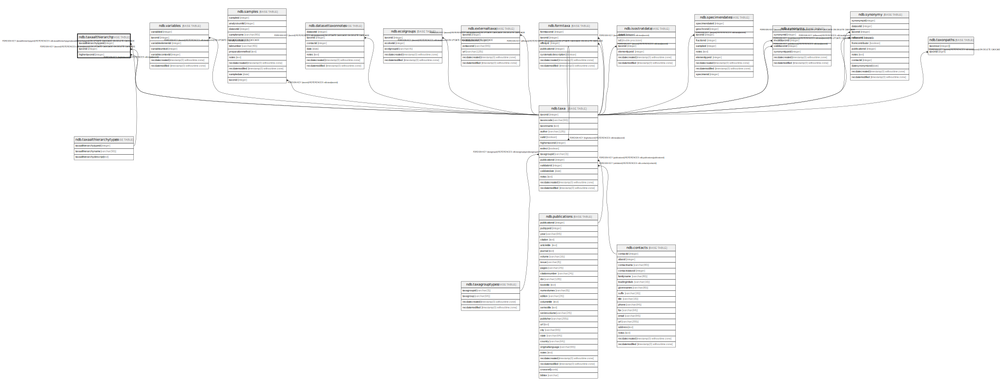

# ndb.taxaalthierarchy

## Description

## Columns

| # | Name                   | Type    | Default | Nullable | Children | Parents                                                   | Comment |
| - | ---------------------- | ------- | ------- | -------- | -------- | --------------------------------------------------------- | ------- |
| 1 | highertaxonid          | integer |         | false    |          | [ndb.taxa](ndb.taxa.md)                                   |         |
| 2 | taxaalthierarchytypeid | integer |         | false    |          | [ndb.taxaalthierarchytypes](ndb.taxaalthierarchytypes.md) |         |
| 3 | taxonid                | integer |         | false    |          | [ndb.taxa](ndb.taxa.md)                                   |         |

## Viewpoints

| Name                                  | Definition                                             |
| ------------------------------------- | ------------------------------------------------------ |
| [Hierarchical Tables](viewpoint-1.md) | Tables with internal hierarchies.                      |
| [Taxonomic Tables](viewpoint-2.md)    | Tables related to species, observations and specimens. |

## Constraints

| # | Name                                      | Type        | Definition                                                                                                                            |
| - | ----------------------------------------- | ----------- | ------------------------------------------------------------------------------------------------------------------------------------- |
| 1 | fk_taxaalthierarchy_taxa                  | FOREIGN KEY | FOREIGN KEY (taxonid) REFERENCES ndb.taxa(taxonid) ON UPDATE CASCADE ON DELETE CASCADE                                                |
| 2 | fk_taxaalthierarchy_taxa1                 | FOREIGN KEY | FOREIGN KEY (highertaxonid) REFERENCES ndb.taxa(taxonid)                                                                              |
| 3 | fk_taxaalthierarchy_taxaalthierarchytypes | FOREIGN KEY | FOREIGN KEY (taxaalthierarchytypeid) REFERENCES ndb.taxaalthierarchytypes(taxaalthierarchytypeid) ON UPDATE CASCADE ON DELETE CASCADE |
| 4 | taxaalthierarchy_pkey                     | PRIMARY KEY | PRIMARY KEY (taxaalthierarchytypeid, taxonid)                                                                                         |

## Indexes

| # | Name                  | Definition                                                                                                      |
| - | --------------------- | --------------------------------------------------------------------------------------------------------------- |
| 1 | taxaalthierarchy_pkey | CREATE UNIQUE INDEX taxaalthierarchy_pkey ON ndb.taxaalthierarchy USING btree (taxaalthierarchytypeid, taxonid) |

## Relations

---

> Generated by [tbls](https://github.com/k1LoW/tbls)