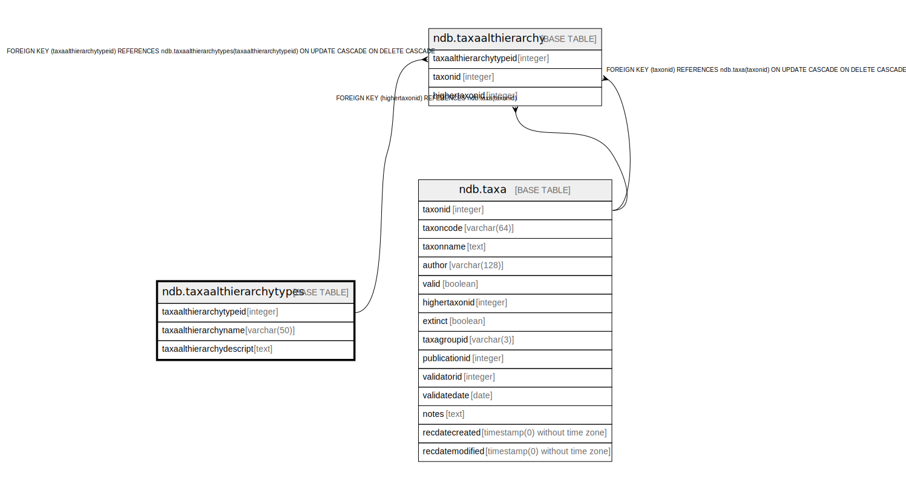

# ndb.taxaalthierarchytypes

## Description

## Columns

| # | Name                     | Type        | Default                                                                   | Nullable | Children                                        | Parents | Comment |
| - | ------------------------ | ----------- | ------------------------------------------------------------------------- | -------- | ----------------------------------------------- | ------- | ------- |
| 1 | taxaalthierarchydescript | text        |                                                                           | true     |                                                 |         |         |
| 2 | taxaalthierarchyname     | varchar(50) |                                                                           | false    |                                                 |         |         |
| 3 | taxaalthierarchytypeid   | integer     | nextval('ndb.seq_taxaalthierarchytypes_taxaalthierarchytypeid'::regclass) | false    | [ndb.taxaalthierarchy](ndb.taxaalthierarchy.md) |         |         |

## Viewpoints

| Name                               | Definition                                             |
| ---------------------------------- | ------------------------------------------------------ |
| [Taxonomic Tables](viewpoint-2.md) | Tables related to species, observations and specimens. |

## Constraints

| # | Name                       | Type        | Definition                           |
| - | -------------------------- | ----------- | ------------------------------------ |
| 1 | taxaalthierarchytypes_pkey | PRIMARY KEY | PRIMARY KEY (taxaalthierarchytypeid) |

## Indexes

| # | Name                       | Definition                                                                                                       |
| - | -------------------------- | ---------------------------------------------------------------------------------------------------------------- |
| 1 | taxaalthierarchytypes_pkey | CREATE UNIQUE INDEX taxaalthierarchytypes_pkey ON ndb.taxaalthierarchytypes USING btree (taxaalthierarchytypeid) |

## Relations

---

> Generated by [tbls](https://github.com/k1LoW/tbls)