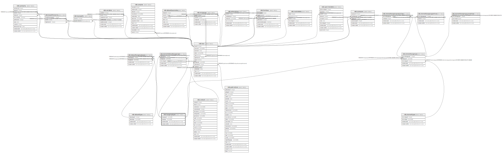

# ndb.taxagrouptypes

## Description

Lookup table for Taxa Group Types. This table is referenced by the Taxa table.

## Columns

| # | Name            | Type                           | Default                      | Nullable | Children                                                                                                                                                                                            | Parents | Comment                                                                                                                                                                                                                                                                                                                                                        |
| - | --------------- | ------------------------------ | ---------------------------- | -------- | --------------------------------------------------------------------------------------------------------------------------------------------------------------------------------------------------- | ------- | -------------------------------------------------------------------------------------------------------------------------------------------------------------------------------------------------------------------------------------------------------------------------------------------------------------------------------------------------------------- |
| 1 | recdatecreated  | timestamp(0) without time zone | timezone('UTC'::text, now()) | false    |                                                                                                                                                                                                     |         |                                                                                                                                                                                                                                                                                                                                                                |
| 2 | recdatemodified | timestamp(0) without time zone |                              | false    |                                                                                                                                                                                                     |         |                                                                                                                                                                                                                                                                                                                                                                |
| 3 | taxagroup       | varchar(64)                    |                              | false    |                                                                                                                                                                                                     |         | The taxa group. Below are some examples: TaxaGroupID TaxaGroup AVE Birds BIM Biometric variables BRY Bryophytes BTL Beetles FSH Fish HRP Reptiles and amphibians LAB Laboratory analyses MAM Mammals MOL Molluscs PHY Physical variables TES Testate amoebae VPL Vascular plants |
| 4 | taxagroupid     | varchar(3)                     |                              | false    | [ndb.datasettaxagrouptypes](ndb.datasettaxagrouptypes.md) [ndb.elementdatasettaxagroups](ndb.elementdatasettaxagroups.md) [ndb.elementtaxagroups](ndb.elementtaxagroups.md) [ndb.taxa](ndb.taxa.md) |         | A three-letter Taxa Group code.                                                                                                                                                                                                                                                                                                                                |

## Constraints

| # | Name                | Type        | Definition                |
| - | ------------------- | ----------- | ------------------------- |
| 1 | taxagrouptypes_pkey | PRIMARY KEY | PRIMARY KEY (taxagroupid) |

## Indexes

| # | Name                | Definition                                                                              |
| - | ------------------- | --------------------------------------------------------------------------------------- |
| 1 | taxagrouptypes_pkey | CREATE UNIQUE INDEX taxagrouptypes_pkey ON ndb.taxagrouptypes USING btree (taxagroupid) |

## Triggers

| # | Name                | Definition                                                                                                                                  |
| - | ------------------- | ------------------------------------------------------------------------------------------------------------------------------------------- |
| 1 | tr_sites_modifydate | CREATE TRIGGER tr_sites_modifydate BEFORE INSERT OR UPDATE ON ndb.taxagrouptypes FOR EACH ROW EXECUTE FUNCTION ndb.update_recdatemodified() |

## Relations

---

> Generated by [tbls](https://github.com/k1LoW/tbls)