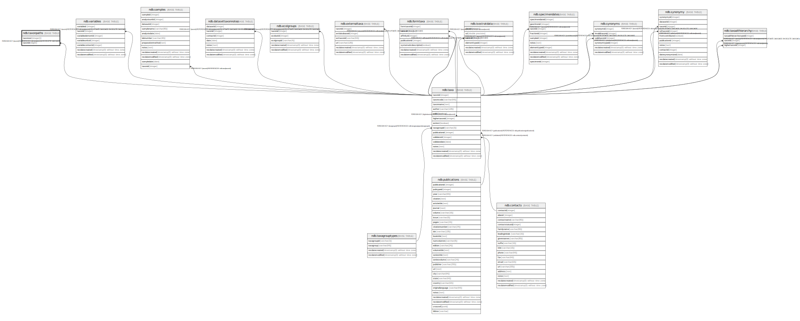

# ndb.taxonpaths

## Description

## Columns

| # | Name     | Type      | Default | Nullable | Children | Parents                 | Comment |
| - | -------- | --------- | ------- | -------- | -------- | ----------------------- | ------- |
| 1 | taxonout | integer[] |         | false    |          |                         |         |
| 2 | taxonid  | bigint    |         | false    |          | [ndb.taxa](ndb.taxa.md) |         |

## Viewpoints

| Name                               | Definition                                             |
| ---------------------------------- | ------------------------------------------------------ |
| [Taxonomic Tables](viewpoint-2.md) | Tables related to species, observations and specimens. |

## Constraints

| # | Name                    | Type        | Definition                                                           |
| - | ----------------------- | ----------- | -------------------------------------------------------------------- |
| 1 | taxonpaths_taxonid_fkey | FOREIGN KEY | FOREIGN KEY (taxonid) REFERENCES ndb.taxa(taxonid) ON DELETE CASCADE |
| 2 | taxonpaths_pkey         | PRIMARY KEY | PRIMARY KEY (taxonout, taxonid)                                      |

## Indexes

| # | Name            | Definition                                                                            |
| - | --------------- | ------------------------------------------------------------------------------------- |
| 1 | taxonpaths_pkey | CREATE UNIQUE INDEX taxonpaths_pkey ON ndb.taxonpaths USING btree (taxonout, taxonid) |

## Relations

---

> Generated by [tbls](https://github.com/k1LoW/tbls)