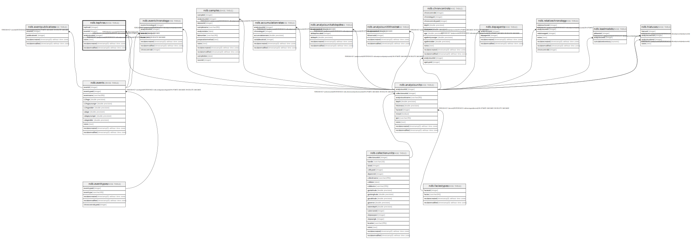

# ndb.tephras

## Description

Tephras lookup table. This table stores recognized tephras with established ages. Referenced by the Tephrachronology table.

## Columns

| # | Name            | Type                           | Default                                       | Nullable | Children | Parents                                   | Comment                                       |
| - | --------------- | ------------------------------ | --------------------------------------------- | -------- | -------- | ----------------------------------------- | --------------------------------------------- |
| 1 | tephraid        | integer                        | nextval('ndb.seq_tephras_tephraid'::regclass) | false    |          |                                           | An arbitrary Tephra identification number.    |
| 2 | eventid         | integer                        |                                               | false    |          | [ndb.events](ndb.events.md)               |                                               |
| 3 | analysisunitid  | integer                        |                                               | false    |          | [ndb.analysisunits](ndb.analysisunits.md) |                                               |
| 4 | notes           | text                           |                                               | true     |          |                                           | Free form notes or comments about the tephra. |
| 5 | recdatecreated  | timestamp(0) without time zone | timezone('UTC'::text, now())                  | false    |          |                                           |                                               |
| 6 | recdatemodified | timestamp(0) without time zone |                                               | false    |          |                                           |                                               |

## Constraints

| # | Name                     | Type        | Definition                                                                                                    |
| - | ------------------------ | ----------- | ------------------------------------------------------------------------------------------------------------- |
| 1 | fk_tephras_analysisunits | FOREIGN KEY | FOREIGN KEY (analysisunitid) REFERENCES ndb.analysisunits(analysisunitid) ON UPDATE CASCADE ON DELETE CASCADE |
| 2 | fk_tephras_events        | FOREIGN KEY | FOREIGN KEY (eventid) REFERENCES ndb.events(eventid) ON UPDATE CASCADE ON DELETE CASCADE                      |
| 3 | tephras_pkey             | PRIMARY KEY | PRIMARY KEY (tephraid)                                                                                        |

## Indexes

| # | Name         | Definition                                                             |
| - | ------------ | ---------------------------------------------------------------------- |
| 1 | tephras_pkey | CREATE UNIQUE INDEX tephras_pkey ON ndb.tephras USING btree (tephraid) |

## Triggers

| # | Name                | Definition                                                                                                                           |
| - | ------------------- | ------------------------------------------------------------------------------------------------------------------------------------ |
| 1 | tr_sites_modifydate | CREATE TRIGGER tr_sites_modifydate BEFORE INSERT OR UPDATE ON ndb.tephras FOR EACH ROW EXECUTE FUNCTION ndb.update_recdatemodified() |

## Relations

---

> Generated by [tbls](https://github.com/k1LoW/tbls)