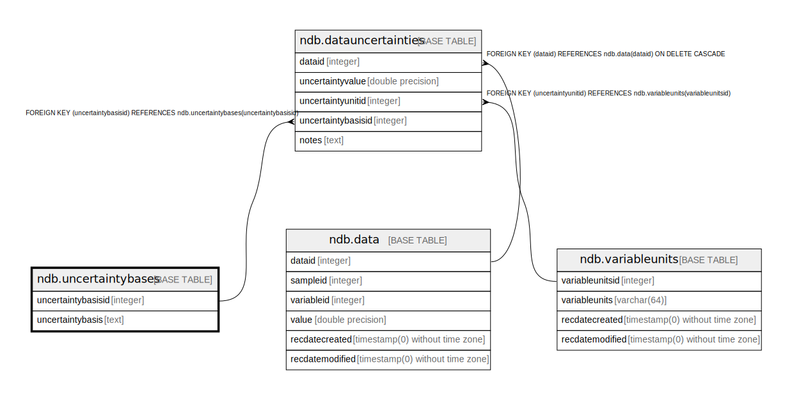

# ndb.uncertaintybases

## Description

## Columns

| # | Name               | Type    | Default                                                          | Nullable | Children                                          | Parents | Comment |
| - | ------------------ | ------- | ---------------------------------------------------------------- | -------- | ------------------------------------------------- | ------- | ------- |
| 1 | uncertaintybasis   | text    |                                                                  | true     |                                                   |         |         |
| 2 | uncertaintybasisid | integer | nextval('ndb.uncertaintybases_uncertaintybasisid_seq'::regclass) | false    | [ndb.datauncertainties](ndb.datauncertainties.md) |         |         |

## Constraints

| # | Name                  | Type        | Definition                       |
| - | --------------------- | ----------- | -------------------------------- |
| 1 | uncertaintybases_pkey | PRIMARY KEY | PRIMARY KEY (uncertaintybasisid) |
| 2 | uniquebasis           | UNIQUE      | UNIQUE (uncertaintybasis)        |

## Indexes

| # | Name                  | Definition                                                                                         |
| - | --------------------- | -------------------------------------------------------------------------------------------------- |
| 1 | uncertaintybases_pkey | CREATE UNIQUE INDEX uncertaintybases_pkey ON ndb.uncertaintybases USING btree (uncertaintybasisid) |
| 2 | uniquebasis           | CREATE UNIQUE INDEX uniquebasis ON ndb.uncertaintybases USING btree (uncertaintybasis)             |

## Relations

---

> Generated by [tbls](https://github.com/k1LoW/tbls)