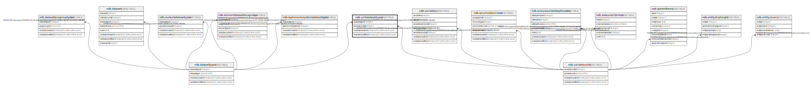

# ndb.unitsdatasettypes

## Description

Join table, associating measurement units with various datasettypes.

## Columns

| # | Name            | Type                           | Default                      | Nullable | Children | Parents                                   | Comment |
| - | --------------- | ------------------------------ | ---------------------------- | -------- | -------- | ----------------------------------------- | ------- |
| 1 | datasettypeid   | integer                        |                              | false    |          | [ndb.datasettypes](ndb.datasettypes.md)   |         |
| 2 | recdatecreated  | timestamp(0) without time zone | timezone('UTC'::text, now()) | false    |          |                                           |         |
| 3 | recdatemodified | timestamp(0) without time zone |                              | false    |          |                                           |         |
| 4 | variableunitsid | integer                        |                              | false    |          | [ndb.variableunits](ndb.variableunits.md) |         |

## Constraints

| # | Name                               | Type        | Definition                                                                                                      |
| - | ---------------------------------- | ----------- | --------------------------------------------------------------------------------------------------------------- |
| 1 | fk_unitsdatasettypes_datasettypes  | FOREIGN KEY | FOREIGN KEY (datasettypeid) REFERENCES ndb.datasettypes(datasettypeid) ON UPDATE CASCADE ON DELETE CASCADE      |
| 2 | fk_unitsdatasettypes_variableunits | FOREIGN KEY | FOREIGN KEY (variableunitsid) REFERENCES ndb.variableunits(variableunitsid) ON UPDATE CASCADE ON DELETE CASCADE |
| 3 | unitsdatasettypes_pkey             | PRIMARY KEY | PRIMARY KEY (datasettypeid, variableunitsid)                                                                    |

## Indexes

| # | Name                   | Definition                                                                                                       |
| - | ---------------------- | ---------------------------------------------------------------------------------------------------------------- |
| 1 | unitsdatasettypes_pkey | CREATE UNIQUE INDEX unitsdatasettypes_pkey ON ndb.unitsdatasettypes USING btree (datasettypeid, variableunitsid) |

## Triggers

| # | Name                | Definition                                                                                                                                     |
| - | ------------------- | ---------------------------------------------------------------------------------------------------------------------------------------------- |
| 1 | tr_sites_modifydate | CREATE TRIGGER tr_sites_modifydate BEFORE INSERT OR UPDATE ON ndb.unitsdatasettypes FOR EACH ROW EXECUTE FUNCTION ndb.update_recdatemodified() |

## Relations

---

> Generated by [tbls](https://github.com/k1LoW/tbls)