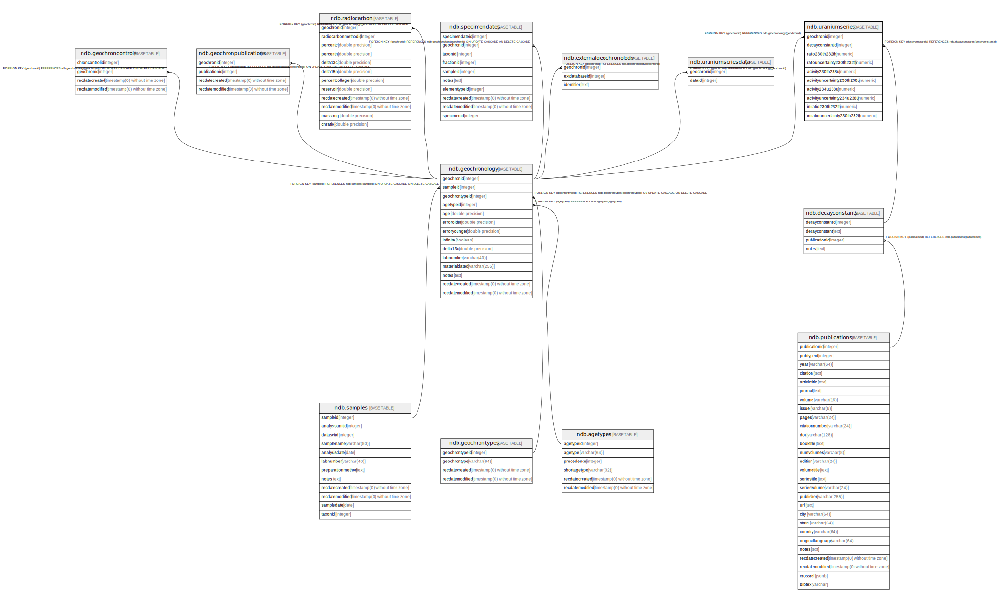

# ndb.uraniumseries

## Description

## Columns

| #  | Name                          | Type    | Default | Nullable | Children | Parents                                     | Comment |
| -- | ----------------------------- | ------- | ------- | -------- | -------- | ------------------------------------------- | ------- |
| 1  | activity230th238u             | numeric |         | true     |          |                                             |         |
| 2  | activity234u238u              | numeric |         | true     |          |                                             |         |
| 3  | activityuncertainty230th238u  | numeric |         | true     |          |                                             |         |
| 4  | activityuncertainty234u238u   | numeric |         | true     |          |                                             |         |
| 5  | decayconstantid               | integer |         | true     |          | [ndb.decayconstants](ndb.decayconstants.md) |         |
| 6  | geochronid                    | integer |         | true     |          | [ndb.geochronology](ndb.geochronology.md)   |         |
| 7  | iniratio230th232th            | numeric |         | true     |          |                                             |         |
| 8  | iniratiouncertainty230th232th | numeric |         | true     |          |                                             |         |
| 9  | ratio230th232th               | numeric |         | true     |          |                                             |         |
| 10 | ratiouncertainty230th232th    | numeric |         | true     |          |                                             |         |

## Viewpoints

| Name                                        | Definition                                        |
| ------------------------------------------- | ------------------------------------------------- |
| [Chronology related tables](viewpoint-5.md) | Tables related to chronology and age assignments. |

## Constraints

| # | Name                               | Type        | Definition                                                                   |
| - | ---------------------------------- | ----------- | ---------------------------------------------------------------------------- |
| 1 | uraniumseries_decayconstantid_fkey | FOREIGN KEY | FOREIGN KEY (decayconstantid) REFERENCES ndb.decayconstants(decayconstantid) |
| 2 | uraniumseries_geochronid_fkey      | FOREIGN KEY | FOREIGN KEY (geochronid) REFERENCES ndb.geochronology(geochronid)            |

## Relations

---

> Generated by [tbls](https://github.com/k1LoW/tbls)