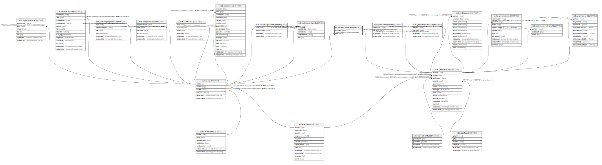

# ndb.uraniumseriesdata

## Description

## Columns

| # | Name       | Type    | Default | Nullable | Children | Parents                                   | Comment |
| - | ---------- | ------- | ------- | -------- | -------- | ----------------------------------------- | ------- |
| 1 | dataid     | integer |         | true     |          | [ndb.data](ndb.data.md)                   |         |
| 2 | geochronid | integer |         | true     |          | [ndb.geochronology](ndb.geochronology.md) |         |

## Viewpoints

| Name                                        | Definition                                        |
| ------------------------------------------- | ------------------------------------------------- |
| [Chronology related tables](viewpoint-5.md) | Tables related to chronology and age assignments. |

## Constraints

| # | Name                              | Type        | Definition                                                        |
| - | --------------------------------- | ----------- | ----------------------------------------------------------------- |
| 1 | uraniumseriesdata_dataid_fkey     | FOREIGN KEY | FOREIGN KEY (dataid) REFERENCES ndb.data(dataid)                  |
| 2 | uraniumseriesdata_geochronid_fkey | FOREIGN KEY | FOREIGN KEY (geochronid) REFERENCES ndb.geochronology(geochronid) |

## Relations

---

> Generated by [tbls](https://github.com/k1LoW/tbls)