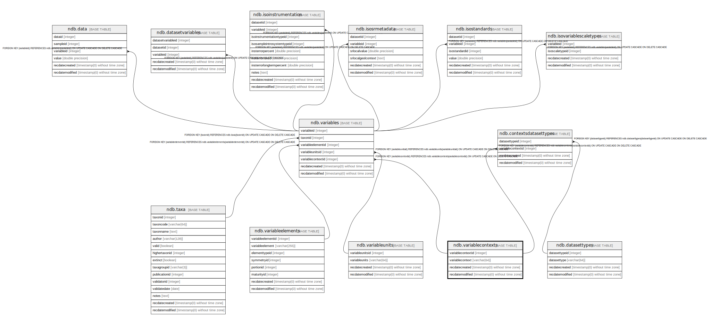

# ndb.variablecontexts

## Description

Variable Contexts lookup table. Table is referenced by the Variables table.

## Columns

| # | Name              | Type                           | Default                                                         | Nullable | Children                                                                                  | Parents | Comment                                                                                                                                                                                                                                                                                                                                                                                                                                                                                                                                                                                                                                                                                                                                                                                                                                  |
| - | ----------------- | ------------------------------ | --------------------------------------------------------------- | -------- | ----------------------------------------------------------------------------------------- | ------- | ---------------------------------------------------------------------------------------------------------------------------------------------------------------------------------------------------------------------------------------------------------------------------------------------------------------------------------------------------------------------------------------------------------------------------------------------------------------------------------------------------------------------------------------------------------------------------------------------------------------------------------------------------------------------------------------------------------------------------------------------------------------------------------------------------------------------------------------- |
| 1 | variablecontextid | integer                        | nextval('ndb.seq_variablecontexts_variablecontextid'::regclass) | false    | [ndb.variables](ndb.variables.md) [ndb.contextsdatasettypes](ndb.contextsdatasettypes.md) |         | An arbitrary Variable Context identification number.                                                                                                                                                                                                                                                                                                                                                                                                                                                                                                                                                                                                                                                                                                                                                                                     |
| 2 | variablecontext   | varchar(64)                    |                                                                 | false    |                                                                                           |         | Depositional context. Examples are: *anachronic – specimen older than the primary deposit, e.g. a Paleozoic spore in a Holocene deposit; may be redeposited from the catchment or may be derived from long distance, e.g. Tertiary pollen grains in Quaternary sediments with no local Tertiary source. A Pleistocene specimen in a Holocene archaeological deposit, possibly resulting from aboriginal fossil collecting, would also be anachronic. *intrusive – specimen generally younger younger than the primary deposit, e.g. a domestic pig in an otherwise Pleistocene deposit in North America. *redeposited – specimen older than the primary deposit and assumed to have been redeposited from a local source by natural causes. *articulated – articulated skeleton *clump – clump, esp. of pollen grains  |
| 3 | recdatecreated    | timestamp(0) without time zone | timezone('UTC'::text, now())                                    | false    |                                                                                           |         |                                                                                                                                                                                                                                                                                                                                                                                                                                                                                                                                                                                                                                                                                                                                                                                                                                          |
| 4 | recdatemodified   | timestamp(0) without time zone |                                                                 | false    |                                                                                           |         |                                                                                                                                                                                                                                                                                                                                                                                                                                                                                                                                                                                                                                                                                                                                                                                                                                          |

## Constraints

| # | Name                  | Type        | Definition                      |
| - | --------------------- | ----------- | ------------------------------- |
| 1 | variablecontexts_pkey | PRIMARY KEY | PRIMARY KEY (variablecontextid) |

## Indexes

| # | Name                  | Definition                                                                                        |
| - | --------------------- | ------------------------------------------------------------------------------------------------- |
| 1 | variablecontexts_pkey | CREATE UNIQUE INDEX variablecontexts_pkey ON ndb.variablecontexts USING btree (variablecontextid) |

## Triggers

| # | Name                | Definition                                                                                                                                    |
| - | ------------------- | --------------------------------------------------------------------------------------------------------------------------------------------- |
| 1 | tr_sites_modifydate | CREATE TRIGGER tr_sites_modifydate BEFORE INSERT OR UPDATE ON ndb.variablecontexts FOR EACH ROW EXECUTE FUNCTION ndb.update_recdatemodified() |

## Relations

---

> Generated by [tbls](https://github.com/k1LoW/tbls)