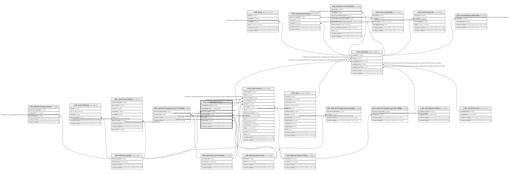

# ndb.variableelements

## Description

Lookup table of Variable Elements. Table is referenced by the Variables table.

## Columns

| # | Name              | Type                           | Default                                                         | Nullable | Children                          | Parents                                           | Comment                                                                                                                                                                                                                                                                                                                                                                                                                                                                                                                                                                                                                                                                                                                                                                                                                                                                                                                                                                |
| - | ----------------- | ------------------------------ | --------------------------------------------------------------- | -------- | --------------------------------- | ------------------------------------------------- | ---------------------------------------------------------------------------------------------------------------------------------------------------------------------------------------------------------------------------------------------------------------------------------------------------------------------------------------------------------------------------------------------------------------------------------------------------------------------------------------------------------------------------------------------------------------------------------------------------------------------------------------------------------------------------------------------------------------------------------------------------------------------------------------------------------------------------------------------------------------------------------------------------------------------------------------------------------------------- |
| 1 | variableelementid | integer                        | nextval('ndb.seq_variableelements_variableelementid'::regclass) | false    | [ndb.variables](ndb.variables.md) |                                                   | An arbitrary Variable Element identification number.                                                                                                                                                                                                                                                                                                                                                                                                                                                                                                                                                                                                                                                                                                                                                                                                                                                                                                                   |
| 2 | variableelement   | varchar(255)                   |                                                                 | true     |                                   |                                                   | The element, part, or organ of the taxon identified. For plants, these include pollen, spores, and various macrofossil organs, such as «seed», «twig», «cone», and «cone bract». Thus, Betula pollen and Betula seeds are two different Variables. For mammals, Elements include the bone or tooth identified, e.g. «tibia». «tibia, distal, left», «M2, lower, left». Some more unusual elements are Neotoma fecal pellets and Erethizon dorsata quills. If no element is indicated for mammalian fauna, then the genric element «bone/tooth» is assigned. Elements were not assigned in FAUNMAP, so all Variables ingested from FAUNMAP were assigned the «bone/tooth» element. Physical Variables may also have elements. For example, the Loss-on-ignition Variables have «Loss-on-ignition» as a Taxon, and temperature of analysis as an element, e.g. «500°C», «900°C». Charcoal Variables have the size fragments as elements, e.g. «75-100 µm», «100-125 µm». |
| 3 | elementtypeid     | integer                        |                                                                 | true     |                                   | [ndb.elementtypes](ndb.elementtypes.md)           |                                                                                                                                                                                                                                                                                                                                                                                                                                                                                                                                                                                                                                                                                                                                                                                                                                                                                                                                                                        |
| 4 | symmetryid        | integer                        |                                                                 | true     |                                   | [ndb.elementsymmetries](ndb.elementsymmetries.md) |                                                                                                                                                                                                                                                                                                                                                                                                                                                                                                                                                                                                                                                                                                                                                                                                                                                                                                                                                                        |
| 5 | portionid         | integer                        |                                                                 | true     |                                   | [ndb.elementportions](ndb.elementportions.md)     |                                                                                                                                                                                                                                                                                                                                                                                                                                                                                                                                                                                                                                                                                                                                                                                                                                                                                                                                                                        |
| 6 | maturityid        | integer                        |                                                                 | true     |                                   | [ndb.elementmaturities](ndb.elementmaturities.md) |                                                                                                                                                                                                                                                                                                                                                                                                                                                                                                                                                                                                                                                                                                                                                                                                                                                                                                                                                                        |
| 7 | recdatecreated    | timestamp(0) without time zone | timezone('UTC'::text, now())                                    | false    |                                   |                                                   |                                                                                                                                                                                                                                                                                                                                                                                                                                                                                                                                                                                                                                                                                                                                                                                                                                                                                                                                                                        |
| 8 | recdatemodified   | timestamp(0) without time zone |                                                                 | false    |                                   |                                                   |                                                                                                                                                                                                                                                                                                                                                                                                                                                                                                                                                                                                                                                                                                                                                                                                                                                                                                                                                                        |

## Constraints

| # | Name                                  | Type        | Definition                                                                                                |
| - | ------------------------------------- | ----------- | --------------------------------------------------------------------------------------------------------- |
| 1 | fk_variableelements_elementmaturities | FOREIGN KEY | FOREIGN KEY (maturityid) REFERENCES ndb.elementmaturities(maturityid) ON UPDATE CASCADE ON DELETE CASCADE |
| 2 | fk_variableelements_elementportions   | FOREIGN KEY | FOREIGN KEY (portionid) REFERENCES ndb.elementportions(portionid) ON UPDATE CASCADE ON DELETE CASCADE     |
| 3 | fk_variableelements_elementsymmetries | FOREIGN KEY | FOREIGN KEY (symmetryid) REFERENCES ndb.elementsymmetries(symmetryid) ON UPDATE CASCADE ON DELETE CASCADE |
| 4 | fk_variableelements_elementtypes      | FOREIGN KEY | FOREIGN KEY (elementtypeid) REFERENCES ndb.elementtypes(elementtypeid)                                    |
| 5 | variableelements_pkey                 | PRIMARY KEY | PRIMARY KEY (variableelementid)                                                                           |

## Indexes

| # | Name                  | Definition                                                                                        |
| - | --------------------- | ------------------------------------------------------------------------------------------------- |
| 1 | variableelements_pkey | CREATE UNIQUE INDEX variableelements_pkey ON ndb.variableelements USING btree (variableelementid) |

## Triggers

| # | Name                | Definition                                                                                                                                    |
| - | ------------------- | --------------------------------------------------------------------------------------------------------------------------------------------- |
| 1 | tr_sites_modifydate | CREATE TRIGGER tr_sites_modifydate BEFORE INSERT OR UPDATE ON ndb.variableelements FOR EACH ROW EXECUTE FUNCTION ndb.update_recdatemodified() |

## Relations

---

> Generated by [tbls](https://github.com/k1LoW/tbls)