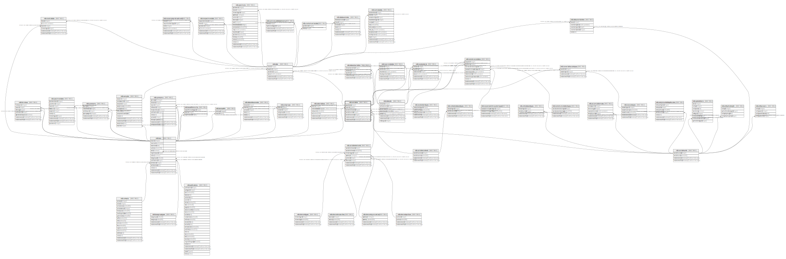

# ndb.variables

## Description

This table lists Variables, which always consist of a Taxon and Units of measurement. Variables can also have Elements, Contexts, and Modifications. Thus, the same taxon with different measurement units (e.g. present/absent, NISP, MNI) are different Variables.

## Columns

| # | Name              | Type                           | Default                                           | Nullable | Children                                                                                                                                                                                                                                                                | Parents                                         | Comment                                                                                   |
| - | ----------------- | ------------------------------ | ------------------------------------------------- | -------- | ----------------------------------------------------------------------------------------------------------------------------------------------------------------------------------------------------------------------------------------------------------------------- | ----------------------------------------------- | ----------------------------------------------------------------------------------------- |
| 1 | recdatecreated    | timestamp(0) without time zone | timezone('UTC'::text, now())                      | false    |                                                                                                                                                                                                                                                                         |                                                 |                                                                                           |
| 2 | recdatemodified   | timestamp(0) without time zone |                                                   | false    |                                                                                                                                                                                                                                                                         |                                                 |                                                                                           |
| 3 | taxonid           | integer                        |                                                   | false    |                                                                                                                                                                                                                                                                         | [ndb.taxa](ndb.taxa.md)                         | Taxon identification number. Field links to the Taxa table.                               |
| 4 | variablecontextid | integer                        |                                                   | true     |                                                                                                                                                                                                                                                                         | [ndb.variablecontexts](ndb.variablecontexts.md) | Variable Context identification number. Field links to the VariableContexts lookup table. |
| 5 | variableelementid | integer                        |                                                   | true     |                                                                                                                                                                                                                                                                         | [ndb.variableelements](ndb.variableelements.md) | Variable Element identification number. Field links to the VariableElements lookup table. |
| 6 | variableid        | integer                        | nextval('ndb.seq_variables_variableid'::regclass) | false    | [ndb.data](ndb.data.md) [ndb.datasetvariables](ndb.datasetvariables.md) [ndb.isoinstrumentation](ndb.isoinstrumentation.md) [ndb.isosrmetadata](ndb.isosrmetadata.md) [ndb.isostandards](ndb.isostandards.md) [ndb.isovariablescaletypes](ndb.isovariablescaletypes.md) |                                                 | An arbitrary Variable identification number.                                              |
| 7 | variableunitsid   | integer                        |                                                   | true     |                                                                                                                                                                                                                                                                         | [ndb.variableunits](ndb.variableunits.md)       | Variable Units identification number. Field links to the VariableUnits lookup table.      |

## Constraints

| # | Name                          | Type        | Definition                                                                                                             |
| - | ----------------------------- | ----------- | ---------------------------------------------------------------------------------------------------------------------- |
| 1 | fk_variables_taxa             | FOREIGN KEY | FOREIGN KEY (taxonid) REFERENCES ndb.taxa(taxonid) ON UPDATE CASCADE ON DELETE CASCADE                                 |
| 2 | fk_variables_variablecontexts | FOREIGN KEY | FOREIGN KEY (variablecontextid) REFERENCES ndb.variablecontexts(variablecontextid) ON UPDATE CASCADE ON DELETE CASCADE |
| 3 | fk_variables_variableelements | FOREIGN KEY | FOREIGN KEY (variableelementid) REFERENCES ndb.variableelements(variableelementid) ON UPDATE CASCADE ON DELETE CASCADE |
| 4 | fk_variables_variableunits    | FOREIGN KEY | FOREIGN KEY (variableunitsid) REFERENCES ndb.variableunits(variableunitsid) ON UPDATE CASCADE ON DELETE CASCADE        |
| 5 | variables_pkey                | PRIMARY KEY | PRIMARY KEY (variableid)                                                                                               |
| 6 | variables_unique              | UNIQUE      | UNIQUE (taxonid, variableelementid, variableunitsid, variablecontextid)                                                |

## Indexes

| # | Name                 | Definition                                                                                                                         |
| - | -------------------- | ---------------------------------------------------------------------------------------------------------------------------------- |
| 1 | ix_taxonid_variables | CREATE INDEX ix_taxonid_variables ON ndb.variables USING btree (taxonid) WITH (fillfactor='10')                                    |
| 2 | variableel           | CREATE INDEX variableel ON ndb.variables USING btree (taxonid, variableelementid, variableunitsid)                                 |
| 3 | variables_pkey       | CREATE UNIQUE INDEX variables_pkey ON ndb.variables USING btree (variableid)                                                       |
| 4 | variables_unique     | CREATE UNIQUE INDEX variables_unique ON ndb.variables USING btree (taxonid, variableelementid, variableunitsid, variablecontextid) |

## Triggers

| # | Name                | Definition                                                                                                                             |
| - | ------------------- | -------------------------------------------------------------------------------------------------------------------------------------- |
| 1 | tr_sites_modifydate | CREATE TRIGGER tr_sites_modifydate BEFORE INSERT OR UPDATE ON ndb.variables FOR EACH ROW EXECUTE FUNCTION ndb.update_recdatemodified() |

## Relations

---

> Generated by [tbls](https://github.com/k1LoW/tbls)