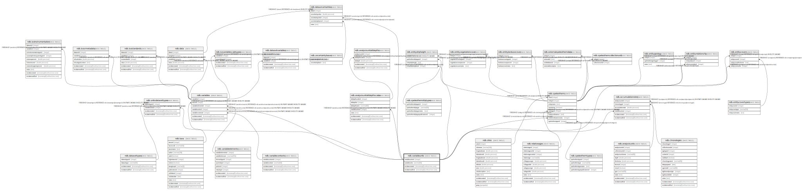

# ndb.variableunits

## Description

Lookup table of Variable Units. Table is referenced by the Variables table.

## Columns

| # | Name            | Type                           | Default                                                    | Nullable | Children                                                                                                                                                                                                                                                                                                                                                                                  | Parents | Comment                                                                                                                                                                                                                                                                                                                                                                                                                                                                                      |
| - | --------------- | ------------------------------ | ---------------------------------------------------------- | -------- | ----------------------------------------------------------------------------------------------------------------------------------------------------------------------------------------------------------------------------------------------------------------------------------------------------------------------------------------------------------------------------------------- | ------- | -------------------------------------------------------------------------------------------------------------------------------------------------------------------------------------------------------------------------------------------------------------------------------------------------------------------------------------------------------------------------------------------------------------------------------------------------------------------------------------------- |
| 1 | variableunitsid | integer                        | nextval('ndb.seq_variableunits_variableunitsid'::regclass) | false    | [ndb.unitsdatasettypes](ndb.unitsdatasettypes.md) [ndb.variables](ndb.variables.md) [ndb.accumulationrates](ndb.accumulationrates.md) [ndb.analysisunitaltdepthscales](ndb.analysisunitaltdepthscales.md) [ndb.datauncertainties](ndb.datauncertainties.md) [ndb.speleothems](ndb.speleothems.md) [ndb.entitydripheight](ndb.entitydripheight.md) [ndb.entitycovers](ndb.entitycovers.md) |         | An arbitrary Variable Units identification number.                                                                                                                                                                                                                                                                                                                                                                                                                                           |
| 2 | variableunits   | varchar(64)                    |                                                            | false    |                                                                                                                                                                                                                                                                                                                                                                                           |         | The units of measurement. For fauna, these are «present/absent», «NISP» (Number of Individual Specimens), and «MNI» (Minimum Number of Individuals). For pollen, these are «NISP» (pollen counts) and «percent». Units for plant macrofossils include «present/absent» and «NISP», as well as a number of quantitative concentration measurements and semi-quantitative abundance measurements such as «1-5 scale». Examples of charcoal measurement units are «fragments/ml» and «µm^2/ml». |
| 3 | recdatecreated  | timestamp(0) without time zone | timezone('UTC'::text, now())                               | false    |                                                                                                                                                                                                                                                                                                                                                                                           |         |                                                                                                                                                                                                                                                                                                                                                                                                                                                                                              |
| 4 | recdatemodified | timestamp(0) without time zone |                                                            | false    |                                                                                                                                                                                                                                                                                                                                                                                           |         |                                                                                                                                                                                                                                                                                                                                                                                                                                                                                              |

## Constraints

| # | Name               | Type        | Definition                    |
| - | ------------------ | ----------- | ----------------------------- |
| 1 | variableunits_pkey | PRIMARY KEY | PRIMARY KEY (variableunitsid) |

## Indexes

| # | Name               | Definition                                                                                |
| - | ------------------ | ----------------------------------------------------------------------------------------- |
| 1 | variableunits_pkey | CREATE UNIQUE INDEX variableunits_pkey ON ndb.variableunits USING btree (variableunitsid) |

## Triggers

| # | Name                | Definition                                                                                                                                 |
| - | ------------------- | ------------------------------------------------------------------------------------------------------------------------------------------ |
| 1 | tr_sites_modifydate | CREATE TRIGGER tr_sites_modifydate BEFORE INSERT OR UPDATE ON ndb.variableunits FOR EACH ROW EXECUTE FUNCTION ndb.update_recdatemodified() |

## Relations

---

> Generated by [tbls](https://github.com/k1LoW/tbls)