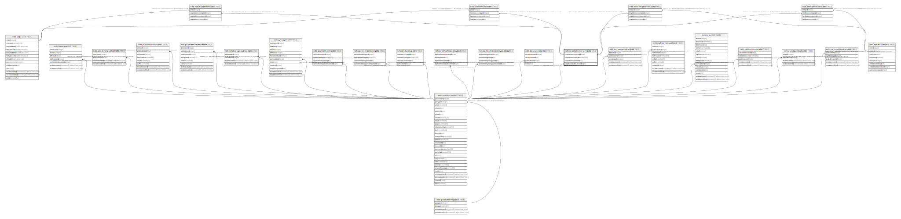

# ndb.vegetationcovertypes

## Description

## Columns

| # | Name                    | Type         | Default                                                                 | Nullable | Children                                                                                                                                                                                                            | Parents                                 | Comment |
| - | ----------------------- | ------------ | ----------------------------------------------------------------------- | -------- | ------------------------------------------------------------------------------------------------------------------------------------------------------------------------------------------------------------------- | --------------------------------------- | ------- |
| 1 | vegetationcovertypeid   | integer      | nextval('ndb.vegetationcovertypes_vegetationcovertypeid_seq'::regclass) | false    | [ndb.sitevegetationcover](ndb.sitevegetationcover.md) [ndb.sitelandusecover](ndb.sitelandusecover.md) [ndb.entityvegetationcover](ndb.entityvegetationcover.md) [ndb.entitylandusecover](ndb.entitylandusecover.md) |                                         |         |
| 2 | vegetationcovertype     | varchar(128) |                                                                         | true     |                                                                                                                                                                                                                     |                                         |         |
| 3 | vegetationcovernotes    | text         |                                                                         | true     |                                                                                                                                                                                                                     |                                         |         |
| 4 | vegetationpublicationid | integer      |                                                                         | true     |                                                                                                                                                                                                                     | [ndb.publications](ndb.publications.md) |         |

## Constraints

| # | Name                                              | Type        | Definition                                                                       |
| - | ------------------------------------------------- | ----------- | -------------------------------------------------------------------------------- |
| 1 | vegetationcovertypes_vegetationpublicationid_fkey | FOREIGN KEY | FOREIGN KEY (vegetationpublicationid) REFERENCES ndb.publications(publicationid) |
| 2 | vegetationcovertypes_pkey                         | PRIMARY KEY | PRIMARY KEY (vegetationcovertypeid)                                              |
| 3 | vegetationcovertypes_vegetationcovertype_key      | UNIQUE      | UNIQUE (vegetationcovertype)                                                     |

## Indexes

| # | Name                                         | Definition                                                                                                                     |
| - | -------------------------------------------- | ------------------------------------------------------------------------------------------------------------------------------ |
| 1 | vegetationcovertypes_pkey                    | CREATE UNIQUE INDEX vegetationcovertypes_pkey ON ndb.vegetationcovertypes USING btree (vegetationcovertypeid)                  |
| 2 | vegetationcovertypes_vegetationcovertype_key | CREATE UNIQUE INDEX vegetationcovertypes_vegetationcovertype_key ON ndb.vegetationcovertypes USING btree (vegetationcovertype) |

## Relations

---

> Generated by [tbls](https://github.com/k1LoW/tbls)